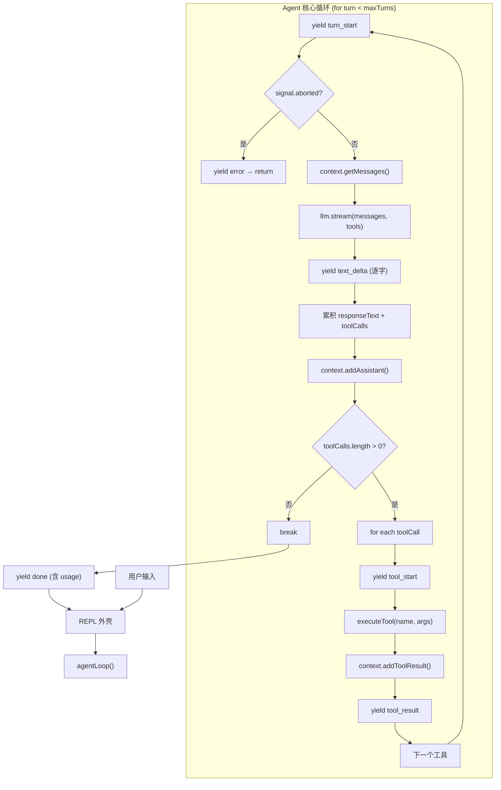

# 第一章：Agent 核心循环

> *"The entire secret of an AI coding agent is one pattern"*
> *—— AI 编程代理的全部秘密只有一个模式*

---

## 一、学习分析

### 1.1 核心模式：所有 Agent 的不变量

分析三个参考项目后，发现无论实现多复杂，底层都是同一个模式：

```typescript
while (stopReason === "tool_use") {
    const response = await llm.call(messages, tools);
    const toolCalls = extractToolCalls(response);
    if (toolCalls.length === 0) break;
    const results = await executeTools(toolCalls);
    messages.push(...results);
}
```

这个模式由三个组件构成：

| 组件 | 职责 | 不变量 |
|------|------|--------|
| **messages** | Agent 的"记忆"，累积全部对话历史 | 只增不减（除非压缩） |
| **LLM 调用** | 推理引擎，决定下一步行动 | 输入 messages + tools，输出 response |
| **工具执行** | 与真实世界交互的接口 | 输入参数，输出结果字符串 |

### 1.2 三种循环实现风格

#### 风格 A：同步迭代式（learn-claude-code）

```typescript
// 从 learn-claude-code s01 提取的模式（转写为 TS）
function agentLoop(messages: Message[]): void {
    while (true) {
        const response = client.messages.create({
            model: MODEL, system: SYSTEM,
            messages, tools: TOOLS, max_tokens: 8000,
        });
        messages.push({ role: "assistant", content: response.content });

        if (response.stop_reason !== "tool_use") return;

        const results: ToolResult[] = [];
        for (const block of response.content) {
            if (block.type === "tool_use") {
                const output = runBash(block.input.command);
                results.push({
                    type: "tool_result",
                    tool_use_id: block.id,
                    content: output,
                });
            }
        }
        messages.push({ role: "user", content: results });
    }
}
```

**特点**：~20 行核心逻辑，同步阻塞，无流式输出，`messages` 原地修改。

**优势**：极简、直觉清晰、零抽象开销。

**劣势**：无流式体验、UI 层和逻辑层强耦合、无法中途取消。

#### 风格 B：事件驱动迭代式（agent-kit 当前实现）

```typescript
// 从 agent-kit src/agent/agent.ts 提取的模式
async *run(userMessage: string): AsyncGenerator<AgentEvent> {
    contextManager.addUserMessage(userMessage);
    yield AgentEvent.start(modelId);

    while (turnCount < maxTurns) {
        turnCount++;
        const messages = contextManager.getMessages();
        let responseText = "";
        const toolCalls: ToolCall[] = [];

        // 流式消费 LLM 响应
        for await (const event of llmClient.chatCompletion(messages, toolSchemas, profile)) {
            if (event.type === "TEXT_DELTA") {
                responseText += event.text;
                yield AgentEvent.textDelta(event.text);       // 逐字输出
            }
            if (event.type === "TOOL_CALL_COMPLETE") {
                toolCalls.push(event.toolCall);
            }
        }
        contextManager.addAssistantMessage(responseText, toolCalls);

        if (toolCalls.length === 0) break;                    // 模型不再调用工具 → 退出

        const shouldStop = await this.executeTools(toolCalls); // Phase 2 占位
        if (shouldStop) break;
    }
    yield AgentEvent.end(turnCount, usage);
}
```

**特点**：`AsyncGenerator` + 事件协议，迭代式循环，`maxTurns` 安全阀。

**优势**：流式输出、Agent/UI 解耦、可扩展的事件协议、安全阀保护。

**劣势**：工具执行还是占位符、没有中间件切面。

#### 风格 C：递归 AsyncGenerator 式（Kode-Agent 生产级）

```typescript
// 从 Kode-Agent src/app/query.ts 提取的模式
async function* queryCore(
    messages: Message[],
    systemPrompt: string[],
    context: Record<string, string>,
    toolUseContext: ToolUseContext,
): AsyncGenerator<Message, void> {
    // ── 中间件切面 ────────────────────
    const { messages: compacted } = await checkAutoCompact(messages);
    const notifications = shell.flushBashNotifications();
    await runUserPromptSubmitHooks(toolUseContext);
    const fullSystemPrompt = formatSystemPromptWithContext(systemPrompt, context);
    injectReminders(messages, reminders);

    // ── LLM 调用 ─────────────────────
    const assistantMessage = await queryLLM(messages, fullSystemPrompt, tools);

    // ── 无工具调用 → 停止钩子 → 返回
    const toolUseBlocks = extractToolUseBlocks(assistantMessage);
    if (toolUseBlocks.length === 0) {
        await runStopHooks(toolUseContext);
        yield assistantMessage;
        return;
    }

    // ── 有工具调用 → 并发执行 → 收集结果
    yield assistantMessage;
    const toolQueue = new ToolUseQueue({ tools, toolUseContext });
    for (const toolUse of toolUseBlocks) {
        toolQueue.addTool(toolUse);
    }
    const toolResults: Message[] = [];
    for await (const msg of toolQueue.getRemainingResults()) {
        yield msg;
        toolResults.push(msg);
    }

    // ── 递归：带着新消息重新进入 queryCore
    yield* queryCore(
        [...messages, assistantMessage, ...toolResults],
        systemPrompt, context, toolUseContext,
    );
}
```

**特点**：递归 + `yield*` 委托，每次递归入口是天然的中间件切面。

**优势**：中间件注入自然、并发工具执行、完整生命周期钩子。

**劣势**：调用栈 O(n)、调试复杂、递归深度受限。

### 1.3 关键设计决策分析

#### (1) 退出条件：谁来决定"停"？

三个项目一致：**模型决定停止**。代码不做任何"应该停了"的判断。

```typescript
// 退出条件永远是"模型没有发出工具调用"
if (toolCalls.length === 0) break;
```

唯一的代码侧保护是 **安全阀**（maxTurns），防止模型死循环：

```typescript
while (turnCount < maxTurns) { ... }
```

**设计启示**：Agent 循环的退出逻辑应该极简。不要在代码中添加"任务完成检测"——这是模型的工作。

#### (2) 消息累积：内存 vs 持久化

| 项目 | 消息存储 | 持久化 |
|------|---------|--------|
| learn-claude-code | 内存数组（原地修改） | 无 |
| agent-kit | `ContextManager` 内部数组 | 无（TODO） |
| Kode-Agent | 内存数组 + JSONL 追加写入 | 每条消息实时写入日志文件 |

**设计启示**：消息的主存储一定是内存数组（性能优先），但应该有一个可选的持久化层（JSONL 追加日志），用于会话恢复和调试。

#### (3) Agent/UI 解耦方式

| 项目 | 解耦方式 | UI 技术 |
|------|---------|---------|
| learn-claude-code | 无解耦，`print()` 直接输出 | readline |
| agent-kit | `AgentEvent` 事件协议 + `AsyncGenerator` | readline |
| Kode-Agent | `Message` 类型 + `yield` + React 状态 | Ink (React for terminal) |

**设计启示**：事件协议是最佳解耦方式。Agent 不应该知道 UI 长什么样，只管 `yield` 事件。

#### (4) 流式输出的实现

```typescript
// 流式的关键：AsyncGenerator 的 yield
async *run(): AsyncGenerator<AgentEvent> {
    for await (const chunk of llmStream) {
        yield { type: "TEXT_DELTA", text: chunk.text };  // 每个 chunk 立即传给消费者
    }
}

// 消费者
for await (const event of agent.run(input)) {
    process.stdout.write(event.text);  // 逐字显示
}
```

**设计启示**：`AsyncGenerator` 是 TypeScript 中 Agent 流式输出的最佳原语——惰性求值、背压控制、可取消。

#### (5) 递归 vs 迭代

| 维度 | 迭代 | 递归 |
|------|------|------|
| 简单性 | 直觉清晰 | 需理解 `yield*` 委托 |
| 中间件注入 | 循环体内显式调用 | 每次递归入口天然切面 |
| 调用栈 | O(1) | O(n)，n = 工具调用轮数 |
| 调试 | 断点在循环内 | 断点在递归链中 |
| 流式 | 每轮内流式 | 整条递归链天然流式 |

**设计启示**：迭代式更适合大多数场景。递归的中间件优势可以通过在循环体开头显式调用 `beforeTurn()` 钩子来替代。

### 1.4 Claude Code 的 tt 函数：六阶段架构

Southbridge AI 的逆向分析揭示了 Claude Code 主循环 `tt` 函数的完整内部结构——一个六阶段 AsyncGenerator，每个阶段有明确的职责和耗时预期：

```typescript
async function* tt(
    currentMessages: CliMessage[],
    baseSystemPromptString: string,
    currentGitContext: GitContext,
    currentClaudeMdContents: ClaudeMdContent[],
    permissionGranterFn: PermissionGranter,
    toolUseContext: ToolUseContext,
    activeStreamingToolUse?: ToolUseBlock,
    loopState: { turnId: string; turnCounter: number; compacted?: boolean; isResuming?: boolean }
): AsyncGenerator<CliMessage>
```

| 阶段 | 职责 | 典型耗时 |
|------|------|----------|
| Phase 1: Context Preparation | 自动压缩检查、token 计数 | ~50-200ms |
| Phase 2: System Prompt Assembly | 动态拼装 base + CLAUDE.md + git + tools | ~10-50ms |
| Phase 3: LLM Stream Init | 初始化流式调用、创建消息累加器 | ~0ms |
| Phase 4: Stream Event Processing | 实时处理 SSE 事件的状态机 | ~2000-10000ms |
| Phase 5: Tool Execution | 并行只读 / 串行写入 | ~100-30000ms/工具 |
| Phase 6: Recursion or Completion | 带结果递归调用自身，或结束 | ~0ms |

**关键洞察**：Phase 4 是一个精细的**流式事件状态机**——逐个处理 `message_start`、`content_block_start`、`content_block_delta`、`content_block_stop`、`message_stop` 事件，同时维护文本累加器、工具输入 JSON 缓冲区、thinking 内容缓冲区等多个状态变量。

### 1.5 错误恢复策略

Claude Code 实现了分类的错误恢复机制，而不是简单地将错误返回给模型：

```typescript
// 从 Southbridge 分析中推断的错误恢复分类
const recoveryStrategies = {
    rate_limit:       handleRateLimit,       // 多提供商回退
    context_overflow: handleContextOverflow,  // 降级 + 压缩
    tool_error:       handleToolError,        // 格式化后返回模型
    network_error:    handleNetworkError,     // 指数退避重试
    permission_denied: handlePermissionDenied, // 请求用户授权
};
```

| 错误类型 | 恢复策略 |
|----------|----------|
| Rate limit | 多提供商回退链：Anthropic → Bedrock → Vertex |
| 上下文溢出 | 先降低 `max_tokens`（×0.7）→ 仍失败则强制压缩 → 用压缩后的消息重试 |
| 工具错误 | 将 stdout/stderr 格式化为 tool_result 返回给模型，附带上下文提示和建议 |
| 网络错误 | 指数退避重试 |
| 权限拒绝 | 弹出用户审批 → 记录规则 → 重试 |

**设计启示**：Agent 的错误处理不应该只是 try-catch + 返回错误字符串。对于可恢复的系统级错误（rate limit、网络），应该在循环层面自动处理，只把不可恢复的业务错误传递给模型。

### 1.6 流式背压管理

长时间运行的流式输出需要背压控制——当 UI 处理速度跟不上 LLM 产出速度时：

```typescript
// Claude Code 的背压策略（从 Southbridge 推断）
class StreamBackpressureController {
    private queue: StreamEvent[] = [];
    private pressure = { high: 1000, critical: 5000 };

    async handleEvent(event: StreamEvent) {
        this.queue.push(event);
        if (this.queue.length > this.pressure.critical) {
            // 只保留错误和完成事件
            this.queue = this.queue.filter(e =>
                e.type === "error" || e.type === "message_stop"
            );
        } else if (this.queue.length > this.pressure.high) {
            // 丢弃文本增量，保留结构事件
            this.queue = this.queue.filter(e =>
                e.type !== "content_block_delta" || e.delta.type !== "text_delta"
            );
        }
    }
}
```

**设计启示**：`AsyncGenerator` 的 `yield` 本身有天然背压（消费者不拉取则生产者暂停），但当多个并发流汇聚时需要显式的背压策略。关键原则：**结构事件（工具调用、错误）优先于内容事件（文本增量）**。

### 1.7 消息格式与协议

不同 LLM 提供商的消息格式有差异，但核心结构一致：

```typescript
// OpenAI 格式（agent-kit 使用）
type MessageDict =
    | { role: "system";    content: string }
    | { role: "user";      content: string }
    | { role: "assistant"; content: string | null; tool_calls?: ToolCallDict[] }
    | { role: "tool";      content: string; tool_call_id: string };

// Anthropic 格式（Kode-Agent 内部使用）
type AnthropicMessage =
    | { role: "user";      content: string | ContentBlock[] }
    | { role: "assistant"; content: ContentBlock[] };
// 工具结果嵌在 user 消息的 content 数组中:
// { type: "tool_result", tool_use_id: "xxx", content: "output" }
```

**关键差异**：
- OpenAI 将工具结果作为独立的 `role: "tool"` 消息
- Anthropic 将工具结果包装在 `role: "user"` 消息的 content 数组中

**设计启示**：内部使用一种统一格式，在发送给 LLM 前通过适配器转换。

### 1.5 系统 Prompt 在循环中的角色

三个项目的 system prompt 策略差异很大：

**极简策略**（learn-claude-code）：
```typescript
const SYSTEM = `You are a coding agent at ${cwd}. Use bash to solve tasks. Act, don't explain.`;
```
一行话，三个指令：身份、环境、行为。

**结构化分段策略**（agent-kit）：
```typescript
const systemPrompt = [
    `# Identity\nYou are agent-kit, a powerful terminal-based AI assistant.`,
    `# Environment\n- Date: ${date}\n- OS: ${os}\n- CWD: ${cwd}`,
    config.developerInstructions ? `# Project Instructions\n${...}` : null,
    `# Guidelines\n- Prefer doing over explaining\n- Keep responses tight`,
].filter(Boolean).join("\n\n");
```
按职责分段，条件注入。

**动态多层策略**（Kode-Agent）：
```typescript
// 每次 LLM 调用时动态重组装
const { systemPrompt, reminders } = formatSystemPromptWithContext(base, context, agentId);
systemPrompt.push(...planModeAdditions);
systemPrompt.push(...hookAdditions);
systemPrompt.push(...outputStyleAdditions);
// reminder 注入到最后一条用户消息前
injectReminders(messages, reminders);
```
每次调用可能产生不同的 prompt，支持模式切换和钩子注入。

**Claude Code 的 Prompt 引导循环行为**：
```
## Doing tasks
1. Use TodoWrite tool to plan
2. Search extensively (parallel + sequential)
3. Implement changes using tools
4. Verify via tests / lint / typecheck
```
这段 prompt **不改变循环代码**，但通过引导模型的决策来控制循环的行为模式——"规划→搜索→实现→验证"的序列完全由 prompt 驱动。

**设计启示**：prompt 应该分段可组合，且在每次 LLM 调用前有机会动态注入上下文。但初始版本可以用静态 prompt 起步。

---

## 二、思考提炼

### 2.1 核心设计原则

从三个项目中提炼出 Agent 循环的核心设计原则：

**原则 1：循环是唯一的核心，一切皆在循环之上叠加**

learn-claude-code 的 12 个课时从未改变循环本身——每一课只是在循环周围添加新机制（工具分发、Todo、子代理、压缩...）。循环是不变量。

**原则 2：模型是决策者，代码是执行者**

代码不决定"下一步做什么"或"何时停止"。这些都是模型通过 `tool_use` 块和 `stop_reason` 来控制的。代码只负责忠实执行。

**原则 3：事件协议是 Agent 与外部世界的唯一接口**

Agent 不应该直接 `console.log`，而是 `yield` 事件。消费者（TUI、Web UI、测试框架）各自决定如何处理。

**原则 4：流式是刚需，不是可选**

用户需要看到 Agent "在思考"。没有流式输出的 Agent CLI 体验很差。`AsyncGenerator` 是 TS 中实现流式的最佳原语。

**原则 5：安全阀是必需的**

`maxTurns` 防止模型死循环，这是唯一一个代码侧的"策略"。

### 2.2 最优架构选择

综合分析后的判断：

| 设计维度 | 最优选择 | 理由 |
|----------|---------|------|
| 循环方式 | **迭代式** | 简单可调试，中间件可通过显式钩子实现 |
| 输出方式 | **AsyncGenerator 事件流** | 流式 + 解耦 + 可组合 |
| 消息管理 | **独立 ContextManager 类** | 封装格式转换，隔离 LLM API 差异 |
| 系统 Prompt | **分段可组合 + 每轮动态注入** | 初始静态，预留动态扩展点 |
| 工具执行 | **先串行，扩展点预留并发** | 串行易调试，并发是后续优化 |
| 持久化 | **可选的 JSONL 追加日志** | 主循环不依赖，但支持会话恢复 |
| 安全机制 | **maxTurns + AbortController** | 防死循环 + 支持用户中断 |

### 2.3 事件协议设计

从三个项目中提炼最优的事件类型集：

```typescript
enum AgentEventType {
    // 生命周期
    TURN_START    = "turn_start",     // 新一轮开始
    TURN_END      = "turn_end",       // 一轮结束

    // 文本流
    TEXT_DELTA    = "text_delta",     // 流式文本片段
    TEXT_DONE     = "text_done",      // 完整文本

    // 工具
    TOOL_START    = "tool_start",    // 开始执行工具
    TOOL_RESULT   = "tool_result",   // 工具执行完成

    // 状态
    ERROR         = "error",         // 错误
    DONE          = "done",          // Agent 完成（含 token 统计）
}
```

Kode-Agent 的 `Message` 类型太重（耦合了 Anthropic SDK 类型），learn-claude-code 没有事件概念，agent-kit 的 `AgentEvent` 最接近最优设计但缺少 `TURN_START/TURN_END`。

---

## 三、最优设计方案

以下是综合三个项目优点后的独立参考实现。

### 3.1 类型定义

```typescript
// ── 消息类型 ──────────────────────────────────────────────────

interface Message {
    role: "system" | "user" | "assistant" | "tool";
    content: string | null;
    toolCalls?: ToolCallInfo[];     // assistant 消息携带的工具调用
    toolCallId?: string;            // tool 消息关联的调用 ID
}

interface ToolCallInfo {
    id: string;
    name: string;
    args: Record<string, unknown>;
}

// ── 工具类型 ──────────────────────────────────────────────────

interface ToolSchema {
    name: string;
    description: string;
    parameters: Record<string, unknown>;  // JSON Schema
}

interface ToolExecutor {
    (name: string, args: Record<string, unknown>): Promise<string>;
}

// ── 事件类型 ──────────────────────────────────────────────────

type AgentEvent =
    | { type: "turn_start";  turnIndex: number }
    | { type: "text_delta";  text: string }
    | { type: "text_done";   text: string }
    | { type: "tool_start";  toolName: string; args: Record<string, unknown> }
    | { type: "tool_result"; toolName: string; output: string }
    | { type: "error";       message: string }
    | { type: "done";        turns: number; usage?: TokenUsage };

interface TokenUsage {
    promptTokens: number;
    completionTokens: number;
    totalTokens: number;
}

// ── LLM 客户端接口 ────────────────────────────────────────────

interface LLMStreamEvent {
    type: "text_delta" | "tool_call_delta" | "tool_call_done" | "message_done" | "error";
    text?: string;
    toolCall?: ToolCallInfo;
    usage?: TokenUsage;
    error?: string;
}

interface LLMClient {
    stream(
        messages: Message[],
        tools: ToolSchema[] | null,
        signal?: AbortSignal,
    ): AsyncIterable<LLMStreamEvent>;
}

// ── Agent 配置 ─────────────────────────────────────────────────

interface AgentConfig {
    maxTurns: number;           // 安全阀，默认 50
    systemPrompt: string;       // 系统 prompt
    tools: ToolSchema[];        // 工具定义
    executeTool: ToolExecutor;  // 工具执行器
    llm: LLMClient;            // LLM 客户端
}
```

### 3.2 上下文管理器

```typescript
class ContextManager {
    private messages: Message[] = [];
    private systemPrompt: string;

    constructor(systemPrompt: string) {
        this.systemPrompt = systemPrompt;
    }

    addUser(content: string): void {
        this.messages.push({ role: "user", content });
    }

    addAssistant(content: string | null, toolCalls?: ToolCallInfo[]): void {
        this.messages.push({ role: "assistant", content, toolCalls });
    }

    addToolResult(toolCallId: string, content: string): void {
        this.messages.push({ role: "tool", content, toolCallId });
    }

    /**
     * 返回完整消息列表，每次调用时动态前置 system prompt。
     * system prompt 不存储在 messages 中，便于动态更新。
     */
    getMessages(): Message[] {
        return [
            { role: "system", content: this.systemPrompt },
            ...this.messages,
        ];
    }

    updateSystemPrompt(prompt: string): void {
        this.systemPrompt = prompt;
    }

    clear(): void {
        this.messages = [];
    }

    get length(): number {
        return this.messages.length;
    }
}
```

**设计要点**：
- `systemPrompt` 不存入 `messages` 数组，在 `getMessages()` 时动态前置——便于后续实现 prompt 动态注入
- `addToolResult()` 使用 OpenAI 风格的 `role: "tool"` 消息，如果需要适配 Anthropic 格式，在发送前转换
- 后续扩展点：token 计数、自动压缩检查、持久化钩子

### 3.3 Agent 核心循环

```typescript
async function* agentLoop(
    userMessage: string,
    config: AgentConfig,
    context: ContextManager,
    signal?: AbortSignal,
): AsyncGenerator<AgentEvent> {
    context.addUser(userMessage);

    let totalUsage: TokenUsage | undefined;

    for (let turn = 0; turn < config.maxTurns; turn++) {
        // ── 扩展点：每轮开始前的钩子 ─────────────────
        // 未来在此插入：autoCompact(context), flushNotifications(), beforeTurnHook()
        yield { type: "turn_start", turnIndex: turn };

        if (signal?.aborted) {
            yield { type: "error", message: "Aborted by user" };
            break;
        }

        // ── 流式调用 LLM ──────────────────────────────
        const messages = context.getMessages();
        const tools = config.tools.length > 0 ? config.tools : null;

        let responseText = "";
        const toolCalls: ToolCallInfo[] = [];

        // ── 错误恢复：分类处理可恢复/不可恢复错误 ──
        let retryCount = 0;
        const maxRetries = 3;
        let streamSuccess = false;

        while (!streamSuccess && retryCount <= maxRetries) {
            try {
                for await (const event of config.llm.stream(messages, tools, signal)) {
                    switch (event.type) {
                        case "text_delta":
                            responseText += event.text!;
                            yield { type: "text_delta", text: event.text! };
                            break;

                        case "tool_call_done":
                            if (event.toolCall) toolCalls.push(event.toolCall);
                            break;

                        case "message_done":
                            if (event.usage) {
                                totalUsage = totalUsage
                                    ? addUsage(totalUsage, event.usage)
                                    : event.usage;
                            }
                            break;

                        case "error":
                            yield { type: "error", message: event.error ?? "LLM error" };
                            yield { type: "done", turns: turn + 1, usage: totalUsage };
                            return;
                    }
                }
                streamSuccess = true;
            } catch (err: any) {
                const recovery = classifyError(err);
                if (recovery === "retry" && retryCount < maxRetries) {
                    retryCount++;
                    const delay = Math.min(1000 * 2 ** retryCount, 30_000);
                    yield { type: "error", message: `Retrying (${retryCount}/${maxRetries}) after ${delay}ms...` };
                    await sleep(delay);
                    responseText = "";
                    toolCalls.length = 0;
                    continue;
                }
                if (recovery === "compact" && context.length > 4) {
                    yield { type: "error", message: "Context overflow, compacting..." };
                    // 扩展点：context.compact() 在第四章实现
                    continue;
                }
                yield { type: "error", message: err.message ?? String(err) };
                yield { type: "done", turns: turn + 1, usage: totalUsage };
                return;
            }
        }

        // ── 保存 assistant 消息到上下文 ───────────────
        context.addAssistant(
            responseText || null,
            toolCalls.length > 0 ? toolCalls : undefined,
        );

        if (responseText) {
            yield { type: "text_done", text: responseText };
        }

        // ── 无工具调用 → Agent 完成 ──────────────────
        if (toolCalls.length === 0) break;

        // ── 执行工具 → 结果回填 → 继续循环 ──────────
        for (const tc of toolCalls) {
            yield { type: "tool_start", toolName: tc.name, args: tc.args };

            let output: string;
            try {
                output = await config.executeTool(tc.name, tc.args);
            } catch (err: any) {
                output = `Error: ${err.message ?? String(err)}`;
            }

            context.addToolResult(tc.id, output);
            yield { type: "tool_result", toolName: tc.name, output };
        }

        // ── 扩展点：每轮结束后的钩子 ─────────────────
        // 未来在此插入：afterTurnHook(), persistMessage()
    }

    yield { type: "done", turns: context.length, usage: totalUsage };
}

function addUsage(a: TokenUsage, b: TokenUsage): TokenUsage {
    return {
        promptTokens: a.promptTokens + b.promptTokens,
        completionTokens: a.completionTokens + b.completionTokens,
        totalTokens: a.totalTokens + b.totalTokens,
    };
}

type ErrorRecovery = "retry" | "compact" | "fatal";

function classifyError(err: any): ErrorRecovery {
    const msg = String(err.message ?? err).toLowerCase();
    const status = err.status ?? err.statusCode;

    if (status === 429 || msg.includes("rate limit")) return "retry";
    if (status === 503 || msg.includes("overloaded"))  return "retry";
    if (msg.includes("econnreset") || msg.includes("timeout")) return "retry";

    if (msg.includes("context") && msg.includes("long"))   return "compact";
    if (msg.includes("token") && msg.includes("exceed"))    return "compact";
    if (status === 413)                                      return "compact";

    return "fatal";
}

const sleep = (ms: number) => new Promise(r => setTimeout(r, ms));
```

**设计要点**：

1. **纯函数式**：`agentLoop` 是一个独立的 `AsyncGenerator` 函数，不是类方法。接收所有依赖作为参数，便于测试和组合。

2. **迭代式 + 显式钩子位**：选择迭代而非递归。在循环的开头和结尾预留了扩展点注释，未来可以插入自动压缩、后台通知、持久化等中间件。

3. **AbortController 支持**：通过 `signal` 参数支持用户中断，每轮开始前检查。

4. **工具串行执行**：当前逐个执行工具。后续可升级为并发执行（安全工具并行、危险工具串行的 ToolQueue 模式）。

5. **错误隔离**：工具执行错误不终止循环，而是将错误信息作为 `tool_result` 回填——让模型决定如何应对。

6. **分类错误恢复**（新增）：参考 Claude Code 的 `tt` 函数策略，将错误分为三类——`retry`（rate limit / 网络超时，指数退避重试）、`compact`（上下文溢出，触发压缩后重试）、`fatal`（不可恢复，终止循环）。这避免了简单的"遇错即停"设计。

### 3.4 REPL 外壳

```typescript
import * as readline from "readline";

async function repl(config: AgentConfig): Promise<void> {
    const context = new ContextManager(config.systemPrompt);
    const abortController = new AbortController();

    const rl = readline.createInterface({
        input: process.stdin,
        output: process.stdout,
    });

    process.on("SIGINT", () => {
        abortController.abort();
        rl.close();
        process.exit(0);
    });

    console.log("Agent ready. Type /exit to quit.\n");

    const prompt = (): Promise<string | null> =>
        new Promise((resolve) => {
            rl.question("> ", (answer) => resolve(answer ?? null));
        });

    while (true) {
        const input = await prompt();
        if (input === null || input.trim() === "/exit") break;
        if (!input.trim()) continue;

        // 斜杠命令
        if (input.startsWith("/")) {
            if (input === "/clear") {
                context.clear();
                console.log("Context cleared.\n");
            }
            continue;
        }

        // Agent 循环 — 消费事件流
        for await (const event of agentLoop(input, config, context, abortController.signal)) {
            switch (event.type) {
                case "text_delta":
                    process.stdout.write(event.text);
                    break;
                case "text_done":
                    process.stdout.write("\n");
                    break;
                case "tool_start":
                    console.log(`\n🔧 ${event.toolName}(${JSON.stringify(event.args)})`);
                    break;
                case "tool_result":
                    console.log(`   → ${event.output.slice(0, 200)}`);
                    break;
                case "error":
                    console.error(`\n❌ ${event.message}`);
                    break;
                case "done":
                    if (event.usage) {
                        console.log(
                            `\n[tokens: ${event.usage.promptTokens}+${event.usage.completionTokens}=${event.usage.totalTokens}]`
                        );
                    }
                    break;
            }
        }
        console.log();
    }

    rl.close();
}
```

**设计要点**：REPL 只做两件事——获取用户输入、消费 `AgentEvent` 流。所有智能都在 `agentLoop` 中。

### 3.5 完整流程图



### 3.6 扩展路线图

当前设计是**最小闭环**。后续各章会在此基础上逐步扩展：

| 阶段 | 扩展内容 | 插入位置 |
|------|---------|---------|
| 第二章 | 工具注册表 + 内置工具 | `config.tools` + `config.executeTool` |
| 第三章 | 动态 Prompt 组装 | `context.getMessages()` 前 |
| 第四章 | 自动压缩 + Todo 外部记忆 | 循环开头的 `beforeTurn` 扩展点 |
| 第五章 | 权限检查 | `executeTool` 前插入 |
| 第六章 | 多模型适配器 | `config.llm` 的实现层 |
| 第七章 | 子代理 | 新增 `task` 工具，内部创建新的 `agentLoop` |

每个扩展都不修改核心循环的结构——只往扩展点中注入新逻辑。这正是 learn-claude-code 12 课传达的核心理念：**循环不变，能力叠加**。

---

## 四、关键源码索引

| 文件 | 关键行 | 说明 |
|------|--------|------|
| `origin/learn-claude-code-main/agents/s01_agent_loop.py` | 67-87 | 最简 Agent 循环原型 |
| `origin/learn-claude-code-main/docs/zh/s01-the-agent-loop.md` | 全文 | Agent 循环中文教程 |
| `src/agent/agent.ts` | 20-101 | agent-kit 当前的 Agent.run() |
| `src/agent/events.ts` | 全文 | agent-kit 事件类型定义 |
| `src/agent/session.ts` | 8-32 | agent-kit 系统 prompt 构建 |
| `src/context/manager.ts` | 全文 | agent-kit 上下文管理器 |
| `origin/Kode-Agent-main/src/app/query.ts` | 477-520 | Kode-Agent query() 入口 |
| `origin/Kode-Agent-main/src/app/query.ts` | 522-826 | Kode-Agent queryCore() 递归核心 |
| `origin/Kode-Agent-main/src/app/ask.ts` | 27-102 | Kode-Agent ask() 桥接函数 |
