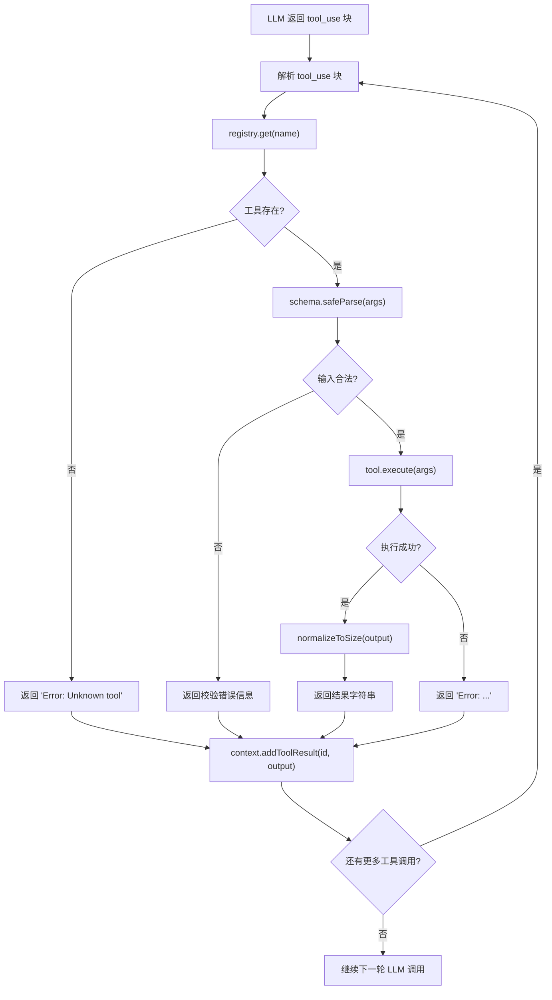

# 第二章：工具系统

> *"加一个工具，只加一个 handler"*
> *—— 循环不变，工具叠加*

---

## 一、学习分析

### 1.1 工具系统的本质

工具是 Agent 与真实世界交互的唯一通道。没有工具，LLM 只能输出文本；有了工具，LLM 就能读文件、写代码、执行命令、搜索网络。

工具系统由四个层次构成：

```
┌───────────────────────────────────────────┐
│  Layer 4: 并发调度（ToolUseQueue）         │  哪些工具可以并行？
├───────────────────────────────────────────┤
│  Layer 3: 权限与校验                       │  允许执行吗？输入合法吗？
├───────────────────────────────────────────┤
│  Layer 2: 注册与发现（Registry）           │  有哪些工具可用？
├───────────────────────────────────────────┤
│  Layer 1: 工具定义（Tool Interface）       │  一个工具长什么样？
└───────────────────────────────────────────┘
```

### 1.2 三种工具定义模式

#### 模式 A：字典分发（learn-claude-code）

最简模式——工具定义和处理函数分开，用字典做路由：

```typescript
// 转写自 learn-claude-code s02 的模式
const TOOLS: ToolSchema[] = [
    {
        name: "bash",
        description: "Run a shell command.",
        input_schema: {
            type: "object",
            properties: { command: { type: "string" } },
            required: ["command"],
        },
    },
    {
        name: "read_file",
        description: "Read file contents.",
        input_schema: {
            type: "object",
            properties: {
                path: { type: "string" },
                limit: { type: "integer" },
            },
            required: ["path"],
        },
    },
    // ...更多工具定义
];

// 分发映射：工具名 -> 处理函数
const TOOL_HANDLERS: Record<string, (...args: any[]) => string> = {
    bash:       (args) => runBash(args.command),
    read_file:  (args) => runRead(args.path, args.limit),
    write_file: (args) => runWrite(args.path, args.content),
    edit_file:  (args) => runEdit(args.path, args.old_text, args.new_text),
};

// 循环中调用
for (const block of toolUseBlocks) {
    const handler = TOOL_HANDLERS[block.name];
    const output = handler ? handler(block.input) : `Unknown tool: ${block.name}`;
    results.push({ type: "tool_result", tool_use_id: block.id, content: output });
}
```

**优势**：极简、零抽象、添加工具只需加一行映射。

**劣势**：schema 和 handler 分离（容易不同步）、没有校验/权限/元数据。

#### 模式 B：统一工具接口（Kode-Agent）

每个工具是一个实现了完整 `Tool` 接口的对象：

```typescript
// 从 Kode-Agent src/core/tools/tool.ts 提取的核心接口
interface Tool<TInput extends z.ZodTypeAny = z.ZodTypeAny, TOutput = any> {
    name: string;
    description?: string | ((input?: z.infer<TInput>) => Promise<string>);
    inputSchema: TInput;                                    // Zod schema → 自动生成 JSON Schema

    prompt: () => Promise<string>;                          // 注入到 system prompt 的使用说明
    isEnabled: () => Promise<boolean>;                      // 是否可用
    isReadOnly: (input?: z.infer<TInput>) => boolean;       // 只读操作？
    isConcurrencySafe: (input?: z.infer<TInput>) => boolean; // 可并行？
    needsPermissions: (input?: z.infer<TInput>) => boolean;  // 需要权限确认？

    validateInput?: (input: z.infer<TInput>, context?: ToolUseContext) => Promise<ValidationResult>;

    call: (
        input: z.infer<TInput>,
        context: ToolUseContext,
    ) => AsyncGenerator<
        | { type: "result"; data: TOutput; resultForAssistant?: string | any[] }
        | { type: "progress"; content: any },
        void, unknown
    >;

    renderResultForAssistant: (output: TOutput) => string | any[];
    renderToolUseMessage: (input: z.infer<TInput>, options: { verbose: boolean }) => string | React.ReactElement | null;
}
```

**以 BashTool 为例**：

```typescript
// 从 Kode-Agent BashTool.tsx 提取的定义模式
const inputSchema = z.strictObject({
    command: z.string().describe("The command to execute"),
    timeout: z.number().optional().describe("Optional timeout in milliseconds (max 600000)"),
    description: z.string().optional().describe("5-10 word description"),
});

const BashTool: Tool<typeof inputSchema, BashOutput> = {
    name: "Bash",
    inputSchema,
    async prompt() { return getBashToolPrompt(); },  // 返回几百行的使用说明
    isReadOnly(input) { return isBashCommandReadOnly(input?.command ?? ""); },
    isConcurrencySafe(input) { return this.isReadOnly(input); },
    needsPermissions() { return true; },
    async isEnabled() { return true; },

    async validateInput({ command, timeout }) {
        if (command.startsWith("cd ")) return { result: false, message: "Use absolute paths instead of cd" };
        if (timeout && timeout > 600000) return { result: false, message: "Timeout max 600s" };
        return { result: true };
    },

    async *call({ command, timeout }, context) {
        // 1. 检查危险命令
        // 2. 沙箱规划
        // 3. LLM 安全门（可选）
        // 4. 执行命令
        // 5. yield progress 事件（进度条/心跳）
        // 6. yield result 事件
        yield { type: "result", data: { stdout, stderr, interrupted: false } };
    },

    renderResultForAssistant({ stdout, stderr }) {
        return formatOutput(stdout, stderr);  // 截断到适合 LLM 的长度
    },
    renderToolUseMessage({ command }) { return `$ ${command}`; },
};
```

**优势**：类型安全（Zod）、元数据丰富（权限/并发/只读标记）、流式进度、校验和渲染逻辑自包含。

**劣势**：抽象重、每个工具几百行代码。

#### 模式 C：YAML 声明式（Claude Code 逆向）

Claude Code 的工具定义是声明式的 YAML，核心是 `description` 和 `input_schema`：

```yaml
# 从 claude-code-reverse results/tools/Edit.tool.yaml 提取
name: Edit
description: >-
  Performs exact string replacements in files.
  Usage:
  - You must use Read tool at least once before editing.
  - The edit will FAIL if old_string is not unique in the file.
  - Use replace_all for renaming strings across the file.
input_schema:
  type: object
  properties:
    file_path:
      type: string
      description: The absolute path to the file to modify
    old_string:
      type: string
      description: The text to replace
    new_string:
      type: string
      description: The text to replace it with
    replace_all:
      type: boolean
      default: false
  required: [file_path, old_string, new_string]
```

**关键洞察**：工具的 `description` 字段本质上就是**给模型看的 prompt**。它不仅描述功能，还包含使用约束、最佳实践、反模式警告。这是 prompt 工程在工具层面的应用。

### 1.3 工具注册与发现

#### Kode-Agent 的注册方式

```typescript
// src/tools/index.ts — 静态工具列表
const getAllTools = (): Tool[] => [
    TaskTool, BashTool, FileReadTool, FileEditTool,
    FileWriteTool, GlobTool, GrepTool, TodoWriteTool,
    WebSearchTool, WebFetchTool, NotebookEditTool,
    // ...共 23 个内置工具
];

// 运行时合并 MCP 动态工具 + 过滤已禁用
const getTools = async (): Promise<Tool[]> => {
    const tools = [...getAllTools(), ...(await getMCPTools())];
    const isEnabled = await Promise.all(tools.map(t => t.isEnabled()));
    return tools.filter((_, i) => isEnabled[i]);
};

// 只读工具子集（用于 plan 模式）
const getReadOnlyTools = async (): Promise<Tool[]> => {
    return getAllTools().filter(t => t.isReadOnly());
};
```

**设计特点**：
- 静态列表 + 动态扩展（MCP）
- `isEnabled()` 运行时过滤
- `isReadOnly()` 按模式过滤（plan 模式只暴露只读工具）
- `memoize` 缓存避免重复初始化

#### learn-claude-code 的注册方式

```typescript
// 字典即注册表
const TOOL_HANDLERS: Record<string, Function> = {
    bash: runBash,
    read_file: runRead,
    // 添加工具 = 添加一行
};
```

没有 registry 的概念，字典本身就是注册表。

### 1.4 并发执行控制

Kode-Agent 的 `ToolUseQueue` 实现了一个精巧的并发控制模式：

```typescript
// 从 Kode-Agent ToolUseQueue 提取的核心逻辑
class ToolUseQueue {
    private tools: QueueEntry[] = [];

    addTool(toolUse: ToolUseBlock) {
        const isConcurrencySafe = tool.isConcurrencySafe(parsedInput);
        this.tools.push({ ...toolUse, status: "queued", isConcurrencySafe });
        this.processQueue();
    }

    private canExecuteTool(isConcurrencySafe: boolean): boolean {
        const executing = this.tools.filter(t => t.status === "executing");
        // 可以执行当且仅当：
        // 1. 没有正在执行的工具，或
        // 2. 当前工具是并发安全的，且所有正在执行的工具也是并发安全的
        return (
            executing.length === 0 ||
            (isConcurrencySafe && executing.every(t => t.isConcurrencySafe))
        );
    }

    private async processQueue() {
        for (const entry of this.tools) {
            if (entry.status !== "queued") continue;
            if (this.canExecuteTool(entry.isConcurrencySafe)) {
                await this.executeTool(entry);
            } else if (!entry.isConcurrencySafe) {
                break;  // 非安全工具形成屏障，阻止后续排队
            }
        }
    }
}
```

**屏障模式**的执行顺序示例：

```
LLM 返回: [Read(a.ts), Read(b.ts), Bash(npm test), Read(c.ts)]

执行顺序：
  ┌─ Read(a.ts) ──┐
  │                │  ← 并行（都是 concurrencySafe）
  ├─ Read(b.ts) ──┤
  │                │
  └────────────────┘
  │
  ▼
  Bash(npm test)       ← 屏障（非 concurrencySafe，串行）
  │
  ▼
  Read(c.ts)           ← 屏障后继续
```

### 1.5 Claude Code 的 15 个工具完整目录

从逆向工程的 YAML 中提取的完整工具目录：

| 类别 | 工具名 | 参数 | 只读 | 关键约束 |
|------|--------|------|------|----------|
| **文件系统** | Read | `file_path`, `offset?`, `limit?` | 是 | 支持图片/PDF/notebook；默认读 2000 行 |
| | Write | `file_path`, `content` | 否 | 必须先 Read 再 Write；不要主动创建 .md |
| | Edit | `file_path`, `old_string`, `new_string`, `replace_all?` | 否 | old_string 必须唯一；必须先 Read |
| | MultiEdit | `file_path`, `edits[]` | 否 | 原子操作：全成功或全失败；edits 按顺序执行 |
| | Glob | `pattern`, `path?` | 是 | 按修改时间排序；开放搜索用 Task |
| | LS | `path`, `ignore[]?` | 是 | 绝对路径；优先用 Glob/Grep |
| **搜索** | Grep | `pattern`, `path?`, `glob?`, `output_mode?`, 上下文参数 | 是 | 基于 ripgrep；默认 `files_with_matches` 模式 |
| **执行** | Bash | `command`, `timeout?`, `description?` | 视命令 | 禁止 `find/grep/cat/ls`；120s 默认超时；30K 字符截断 |
| **笔记本** | NotebookRead | `notebook_path`, `cell_id?` | 是 | 绝对路径 |
| | NotebookEdit | `notebook_path`, `cell_id?`, `new_source`, `cell_type?`, `edit_mode?` | 否 | 模式：replace/insert/delete |
| **网络** | WebFetch | `url`, `prompt` | 是 | 自动 HTTP→HTTPS；15 分钟缓存；用小模型处理内容 |
| | WebSearch | `query`, `allowed_domains?`, `blocked_domains?` | 是 | 仅限美国；注意日期 |
| **Agent** | Task | `description`, `prompt`, `subagent_type` | 是 | 无状态子代理；结果对用户不可见需主动转述 |
| | TodoWrite | `todos[]` (content, status, priority, id) | 否 | 最多 1 个 in_progress；实时更新 |
| | ExitPlanMode | `plan` | 否 | 仅用于代码实现规划，不用于研究 |

### 1.6 工具 Prompt 工程

Claude Code 的工具 description 不只是功能描述——它是详细的**使用手册**。以 Bash 工具为例，其 description 长达 ~200 行，包含：

1. **前置检查**：执行前先用 LS 验证目录存在
2. **路径引用规则**：含空格路径必须双引号
3. **禁止命令**：禁止 `find/grep/cat/head/tail/ls`（必须用专用工具替代）
4. **Git 工作流**：详细的 commit 和 PR 创建流程
5. **输出限制**：30K 字符截断

这些都是写给模型看的——模型根据这些约束来决定如何使用工具。

工具之间还有**交叉引用**：
- Read 的 description 说"对 .ipynb 文件使用 NotebookRead"
- Bash 的 description 说"禁止 grep，使用 Grep 工具"
- Edit 的 description 说"必须先 Read 再 Edit"

这构成了一个**工具使用的依赖图**：

```
Edit → 依赖 → Read
Write → 依赖 → Read
Bash → 禁止替代 ← Grep/Glob/Read/LS
开放搜索 → 推荐 → Task (子代理)
.ipynb → 重定向 → NotebookRead/NotebookEdit
```

### 1.7 工具执行流程

Kode-Agent 的完整工具执行管线：

```typescript
// 从 Kode-Agent runToolUse() 提取的执行链
async function* runToolUse(
    toolUse: ToolUseBlock,
    canUseTool: CanUseToolFn,
    toolUseContext: ToolUseContext,
): AsyncGenerator<Message, void> {
    // 1. 工具名解析（别名映射）
    const resolvedName = resolveToolNameAlias(toolUse.name);

    // 2. 查找工具定义
    const tool = toolDefinitions.find(t => t.name === resolvedName);
    if (!tool) { yield errorMessage("Unknown tool"); return; }

    // 3. 输入校验（Zod schema）
    const parsed = tool.inputSchema.safeParse(toolUse.input);
    if (!parsed.success) { yield errorMessage(parsed.error.message); return; }

    // 4. 自定义校验（validateInput）
    if (tool.validateInput) {
        const validation = await tool.validateInput(parsed.data, context);
        if (!validation.result) { yield errorMessage(validation.message); return; }
    }

    // 5. 权限检查
    if (tool.needsPermissions(parsed.data)) {
        const allowed = await canUseTool(tool, parsed.data, context);
        if (!allowed) { yield rejectedMessage(); return; }
    }

    // 6. 前置钩子
    await runPreToolUseHooks(tool, parsed.data, context);

    // 7. 执行（AsyncGenerator 流式）
    for await (const event of tool.call(parsed.data, context)) {
        if (event.type === "progress") yield progressMessage(event);
        if (event.type === "result") yield resultMessage(tool, event);
    }

    // 8. 后置钩子
    await runPostToolUseHooks(tool, result, context);
}
```

### 1.8 流式 JSON 解析器（Streaming JSON Parser）

Claude Code 面临一个核心挑战：LLM 流式输出工具调用时，`tool_use.input` 是逐 token 到达的 JSON 片段。在 JSON 完整之前无法 `JSON.parse`，但某些场景（如实时显示 bash 命令）需要提前提取部分字段。

```typescript
// Southbridge 分析揭示的流式 JSON 解析器设计
class StreamingJsonParser {
    private buffer = "";
    private depth = 0;
    private inString = false;
    private escape = false;

    feed(chunk: string): { partial: Record<string, unknown> | null; complete: boolean } {
        this.buffer += chunk;

        for (const char of chunk) {
            if (this.escape) { this.escape = false; continue; }
            if (char === "\\") { this.escape = true; continue; }
            if (char === '"' && !this.escape) { this.inString = !this.inString; continue; }
            if (this.inString) continue;
            if (char === "{" || char === "[") this.depth++;
            if (char === "}" || char === "]") this.depth--;
        }

        if (this.depth === 0 && this.buffer.trim()) {
            try {
                return { partial: JSON.parse(this.buffer), complete: true };
            } catch { /* 继续等待更多输入 */ }
        }

        // 尝试部分解析（补全右大括号）
        try {
            const patched = this.buffer + "}".repeat(this.depth);
            return { partial: JSON.parse(patched), complete: false };
        } catch {
            return { partial: null, complete: false };
        }
    }

    reset(): void {
        this.buffer = "";
        this.depth = 0;
        this.inString = false;
        this.escape = false;
    }
}
```

**应用场景**：当用户调用 `bash` 工具时，在 JSON 完整之前就能提取 `command` 字段用于权限预检和 UI 实时显示，提升交互体验。

### 1.9 normalizeToSize：智能输出截断

工具执行结果可能非常大（如 `bash` 输出几万行日志），直接返回给模型会浪费 token 甚至导致上下文溢出。Claude Code 实现了智能截断：

```typescript
function normalizeToSize(
    text: string,
    maxChars: number = 30_000,
    strategy: "head" | "tail" | "headtail" | "smart" = "smart"
): string {
    if (text.length <= maxChars) return text;

    const truncationNotice = `\n\n[... truncated ${text.length - maxChars} characters ...]\n\n`;

    switch (strategy) {
        case "head":
            return text.slice(0, maxChars) + truncationNotice;

        case "tail":
            return truncationNotice + text.slice(-maxChars);

        case "headtail": {
            const half = Math.floor((maxChars - truncationNotice.length) / 2);
            return text.slice(0, half) + truncationNotice + text.slice(-half);
        }

        case "smart": {
            // 智能策略：错误信息倾向 tail，列表输出倾向 headtail
            const hasError = /error|exception|failed|traceback/i.test(text.slice(-2000));
            if (hasError) {
                // 错误通常在末尾——保留更多尾部
                const headSize = Math.floor(maxChars * 0.2);
                const tailSize = maxChars - headSize - truncationNotice.length;
                return text.slice(0, headSize) + truncationNotice + text.slice(-tailSize);
            }
            // 默认 headtail
            const half = Math.floor((maxChars - truncationNotice.length) / 2);
            return text.slice(0, half) + truncationNotice + text.slice(-half);
        }
    }
}
```

**设计启示**：截断不是简单的 `slice(0, N)`。`smart` 策略根据内容语义（是否包含错误信息）动态调整头尾比例——这对模型理解错误并修复至关重要。

### 1.10 BashTool 沙箱实现

Claude Code 在 macOS 上使用 `sandbox-exec` 实现 bash 命令沙箱化，这是一个被忽视但关键的安全设计：

```typescript
// 从 Kode-Agent BashTool 提取的沙箱模式
interface SandboxConfig {
    allowNetworkAccess: boolean;
    allowedWritePaths: string[];     // 可写目录白名单
    allowedReadPaths: string[];      // 可读目录白名单
    denyPaths: string[];             // 明确禁止的路径
    maxExecutionTime: number;        // 超时（ms）
    maxOutputSize: number;           // 最大输出字节数
}

async function executeSandboxedBash(
    command: string,
    config: SandboxConfig,
    cwd: string,
): Promise<{ stdout: string; stderr: string; exitCode: number }> {
    const sandboxProfile = generateMacOSSandboxProfile(config);

    const proc = spawn("sandbox-exec", ["-p", sandboxProfile, "bash", "-c", command], {
        cwd,
        timeout: config.maxExecutionTime,
        maxBuffer: config.maxOutputSize,
    });

    // 流式收集输出 + 超时控制...
    return collectOutput(proc);
}

function generateMacOSSandboxProfile(config: SandboxConfig): string {
    // Apple Sandbox Profile Language (SBPL)
    return `
(version 1)
(deny default)
(allow process-exec)
(allow file-read* (subpath "${config.allowedReadPaths.join('" "')})"))
(allow file-write* (subpath "${config.allowedWritePaths.join('" "')}"))
${config.allowNetworkAccess ? "(allow network*)" : "(deny network*)"}
${config.denyPaths.map(p => `(deny file* (subpath "${p}"))`).join("\n")}
    `.trim();
}
```

**关键细节**：
- macOS 专用 `sandbox-exec` + SBPL 语法，Linux 下可用 `nsjail` 或 `firejail` 替代
- 写路径白名单通常只包含项目目录和 `/tmp`
- 读路径包含项目目录、系统库、编程语言运行时
- 明确禁止 `~/.ssh`、`~/.aws`、`~/.gnupg` 等敏感目录

### 1.11 Shell 解析器与 JSON 嵌入

Claude Code 的 BashTool 需要解析复杂的 shell 命令来提取被操作的文件路径（用于权限检查）。一个独特的挑战是 LLM 有时在 shell 命令中嵌入 JSON 对象（如 `curl -d '{"key":"value"}'`），传统 shell 解析器会被这种嵌套引号搞混：

```typescript
// 哨兵字符串方案：用唯一标记替换 JSON 片段
function parseShellCommandSafely(command: string): ParsedCommand {
    const jsonRegex = /'\{[^']*\}'/g;
    const sentinels: Map<string, string> = new Map();
    let sanitized = command;

    // 1. 用哨兵替换所有单引号包裹的 JSON
    let match: RegExpExecArray | null;
    while ((match = jsonRegex.exec(command)) !== null) {
        const sentinel = `__JSON_SENTINEL_${sentinels.size}__`;
        sentinels.set(sentinel, match[0]);
        sanitized = sanitized.replace(match[0], sentinel);
    }

    // 2. 安全解析去掉 JSON 后的 shell 命令
    const parsed = shellParse(sanitized);

    // 3. 还原哨兵为原始 JSON
    return restoreSentinels(parsed, sentinels);
}
```

### 1.12 WeakRef 文件缓存

Claude Code 的 `ReadFileState` 使用 `WeakRef` 实现内存友好的文件缓存——当内存紧张时 GC 可以自动回收：

```typescript
class ReadFileCache {
    private cache = new Map<string, WeakRef<{ content: string; mtime: number }>>();
    private registry = new FinalizationRegistry<string>((key) => {
        this.cache.delete(key);
    });

    get(path: string, currentMtime: number): string | null {
        const ref = this.cache.get(path);
        if (!ref) return null;

        const entry = ref.deref();
        if (!entry || entry.mtime !== currentMtime) {
            this.cache.delete(path);
            return null;
        }
        return entry.content;
    }

    set(path: string, content: string, mtime: number): void {
        const entry = { content, mtime };
        this.cache.set(path, new WeakRef(entry));
        this.registry.register(entry, path);
    }
}
```

**设计优势**：
- 无需手动设置缓存大小上限，GC 根据内存压力自动淘汰
- `FinalizationRegistry` 确保 `WeakRef` 被回收后 Map 中的 key 也被清理
- `mtime` 检查确保不会返回过期内容

---

## 二、思考提炼

### 2.1 核心设计原则

**原则 1：工具接口统一，但不过度抽象**

Kode-Agent 的 `Tool` 接口有 15+ 个方法——这对生产级系统是必要的（权限、并发、渲染），但对最小可行 Agent 是过度设计。learn-claude-code 的字典模式又太简陋。

最优平衡：**5-7 个核心属性** + 可选扩展。

**原则 2：Schema 和 Handler 不能分离**

learn-claude-code 的 `TOOLS` 数组和 `TOOL_HANDLERS` 字典是分离的——schema 写错了 handler 不会报错。Kode-Agent 通过 Zod + TypeScript 泛型解决了这个问题。

最优方案：**schema 和 handler 定义在同一个对象中**，用 Zod 做运行时校验 + 类型推断。

**原则 3：工具的 description 就是 prompt**

Claude Code 的实践证明：工具 description 的质量直接决定模型使用工具的正确率。好的 description 包含：
- 功能说明（做什么）
- 使用约束（什么时候用/不用）
- 参数说明（每个参数的含义和格式）
- 交叉引用（与其他工具的关系）

**原则 4：只读标记是安全的基础**

`isReadOnly` 不仅用于权限系统（只读操作可以自动放行），还用于并发控制（只读操作可以安全并行）。这是一个"一个标记解决两个问题"的优雅设计。

**原则 5：工具执行应该是流式的**

Kode-Agent 的 `call()` 返回 `AsyncGenerator`，可以 yield `progress` 和 `result`。这让用户在长时间运行的工具（如 `npm install`）期间看到进度。

但对于最小可行版本，简单的 `async (args) => string` 就够了。

### 2.2 最优工具分类

从 Claude Code 的 15 个工具中提炼出 Agent 的最小工具集和扩展层级：

**Tier 1：最小可行 (4 个)**
- `bash` — 命令执行（Agent 的"手"）
- `read_file` — 文件读取
- `write_file` — 文件写入
- `edit_file` — 文件编辑（精确替换）

**Tier 2：高效搜索 (2 个)**
- `glob` — 按文件名模式搜索
- `grep` — 按内容搜索

**Tier 3：Agent 能力 (2 个)**
- `task` — 子代理委派
- `todo_write` — 任务规划跟踪

**Tier 4：外部交互 (2 个)**
- `web_fetch` — 获取网页内容
- `web_search` — 搜索引擎

### 2.3 并发策略选择

| 策略 | 适用场景 | 复杂度 |
|------|---------|--------|
| 全串行 | 最小可行版本 | 最低 |
| 按 `isReadOnly` 分组并行 | 多数场景 | 中等 |
| ToolUseQueue 屏障模式 | 生产级 | 最高 |

推荐：**先全串行启动**，后续升级为按 `isReadOnly` 分组并行。

---

## 三、最优设计方案

### 3.1 工具接口

```typescript
import { z } from "zod";

// ── 工具定义接口 ──────────────────────────────────────────────

interface ToolDef<TSchema extends z.ZodTypeAny = z.ZodTypeAny> {
    name: string;
    description: string;                                  // 给模型看的使用说明
    schema: TSchema;                                      // Zod schema（自动生成 JSON Schema）
    execute: (args: z.infer<TSchema>) => Promise<string>; // 执行函数
    isReadOnly?: boolean;                                 // 默认 false
}

// ── 类型安全的工具定义工厂 ─────────────────────────────────────

function defineTool<T extends z.ZodTypeAny>(tool: ToolDef<T>): ToolDef<T> {
    return tool;
}
```

**设计思路**：
- 只有 5 个属性：`name`、`description`、`schema`、`execute`、`isReadOnly`
- `schema` 用 Zod 定义——既做运行时校验，又能通过 `zodToJsonSchema` 生成 LLM 需要的 JSON Schema
- `execute` 返回 `Promise<string>`——简单直接，错误通过 reject 或返回 `"Error: ..."` 字符串
- `isReadOnly` 可选，默认 false——为并发和权限做基础标记

### 3.2 工具注册表

```typescript
class ToolRegistry {
    private tools: Map<string, ToolDef> = new Map();

    register(tool: ToolDef): void {
        if (this.tools.has(tool.name)) {
            throw new Error(`Tool "${tool.name}" already registered`);
        }
        this.tools.set(tool.name, tool);
    }

    registerAll(tools: ToolDef[]): void {
        for (const tool of tools) this.register(tool);
    }

    get(name: string): ToolDef | undefined {
        return this.tools.get(name);
    }

    /**
     * 返回 LLM 需要的工具 schema 列表（OpenAI function calling 格式）
     */
    getSchemas(): ToolSchema[] {
        return Array.from(this.tools.values()).map(tool => ({
            type: "function" as const,
            function: {
                name: tool.name,
                description: tool.description,
                parameters: zodToJsonSchema(tool.schema),
            },
        }));
    }

    /**
     * 校验输入 + 执行工具 + 智能截断输出
     */
    async execute(
        name: string,
        rawArgs: Record<string, unknown>,
        maxOutputChars = 30_000,
    ): Promise<string> {
        const tool = this.tools.get(name);
        if (!tool) return `Error: Unknown tool "${name}"`;

        const parsed = tool.schema.safeParse(rawArgs);
        if (!parsed.success) {
            return `Error: Invalid input for ${name}: ${parsed.error.message}`;
        }

        try {
            const raw = await tool.execute(parsed.data);
            return normalizeToSize(raw, maxOutputChars);
        } catch (err: any) {
            return `Error: ${err.message ?? String(err)}`;
        }
    }

    list(): string[] {
        return Array.from(this.tools.keys());
    }

    getReadOnlyTools(): ToolDef[] {
        return Array.from(this.tools.values()).filter(t => t.isReadOnly === true);
    }
}

// ── Zod → JSON Schema 转换（简化版）──────────────────────────

interface ToolSchema {
    type: "function";
    function: {
        name: string;
        description: string;
        parameters: Record<string, unknown>;
    };
}

function zodToJsonSchema(schema: z.ZodTypeAny): Record<string, unknown> {
    // 实际实现可用 zod-to-json-schema 库
    // 这里给出核心思路
    if (schema instanceof z.ZodObject) {
        const shape = schema.shape;
        const properties: Record<string, any> = {};
        const required: string[] = [];
        for (const [key, value] of Object.entries(shape)) {
            const zodField = value as z.ZodTypeAny;
            properties[key] = zodFieldToJson(zodField);
            if (!zodField.isOptional()) required.push(key);
        }
        return { type: "object", properties, required };
    }
    return { type: "object", properties: {} };
}

function zodFieldToJson(field: z.ZodTypeAny): Record<string, unknown> {
    if (field instanceof z.ZodString) return { type: "string", description: field.description };
    if (field instanceof z.ZodNumber) return { type: "number", description: field.description };
    if (field instanceof z.ZodBoolean) return { type: "boolean", description: field.description };
    if (field instanceof z.ZodOptional) return zodFieldToJson(field.unwrap());
    if (field instanceof z.ZodArray) return { type: "array", items: zodFieldToJson(field.element) };
    return { type: "string" };
}
```

**设计思路**：
- `Map` 注册表，O(1) 查找
- `getSchemas()` 自动从 Zod 生成 OpenAI function calling 格式
- `execute()` 封装了输入校验 + 异常捕获 + 智能截断——调用者无需关心
- 错误以字符串形式返回给模型，而不是抛异常终止循环
- `normalizeToSize()` 确保超长输出不会浪费 token 或溢出上下文

#### normalizeToSize 实现

```typescript
function normalizeToSize(
    text: string,
    maxChars = 30_000,
    strategy: "head" | "tail" | "headtail" | "smart" = "smart",
): string {
    if (text.length <= maxChars) return text;

    const notice = `\n\n[... truncated ${text.length - maxChars} chars ...]\n\n`;
    const available = maxChars - notice.length;

    switch (strategy) {
        case "head":
            return text.slice(0, available) + notice;
        case "tail":
            return notice + text.slice(-available);
        case "headtail": {
            const half = Math.floor(available / 2);
            return text.slice(0, half) + notice + text.slice(-half);
        }
        case "smart": {
            const hasError = /error|exception|failed|traceback/i.test(text.slice(-2000));
            if (hasError) {
                const head = Math.floor(available * 0.2);
                return text.slice(0, head) + notice + text.slice(-(available - head));
            }
            const half = Math.floor(available / 2);
            return text.slice(0, half) + notice + text.slice(-half);
        }
    }
}
```

`smart` 策略会检测输出末尾是否包含错误信息——如果有，保留更多尾部（80%），因为错误栈和报错通常出现在输出末尾。

### 3.3 内置工具实现

#### bash — 命令执行

```typescript
import { execSync, spawn } from "child_process";

const bashTool = defineTool({
    name: "bash",
    description: [
        "Run a shell command.",
        "- Use for: ls, find, grep, git, npm, python, etc.",
        "- Timeout: 120 seconds",
        "- Output truncated to 50KB",
        "- Prefer absolute paths over cd",
        "- Use && to chain commands, not newlines",
    ].join("\n"),
    schema: z.object({
        command: z.string().describe("The command to execute"),
        timeout: z.number().optional().describe("Timeout in ms (max 600000)"),
    }),
    isReadOnly: false,  // 命令可能修改文件
    async execute({ command, timeout }) {
        const DANGEROUS = ["rm -rf /", "sudo rm", "shutdown", "reboot", "> /dev/"];
        if (DANGEROUS.some(d => command.includes(d))) {
            return "Error: Dangerous command blocked";
        }
        const timeoutMs = Math.min(timeout ?? 120_000, 600_000);
        try {
            const output = execSync(command, {
                cwd: process.cwd(),
                timeout: timeoutMs,
                encoding: "utf-8",
                maxBuffer: 10 * 1024 * 1024,
                stdio: ["pipe", "pipe", "pipe"],
            });
            const trimmed = output.trim();
            return trimmed.slice(0, 50_000) || "(no output)";
        } catch (err: any) {
            if (err.killed) return `Error: Timeout (${timeoutMs / 1000}s)`;
            const stderr = err.stderr?.toString().trim() ?? "";
            const stdout = err.stdout?.toString().trim() ?? "";
            return (stdout + "\n" + stderr).trim().slice(0, 50_000) || `Error: exit code ${err.status}`;
        }
    },
});
```

#### read_file — 文件读取

```typescript
import { readFileSync, statSync } from "fs";
import { resolve } from "path";

const readFileTool = defineTool({
    name: "read_file",
    description: [
        "Read file contents.",
        "- Returns UTF-8 text with line numbers",
        "- Use offset/limit for large files",
        "- Supports text files only (not binary)",
    ].join("\n"),
    schema: z.object({
        path: z.string().describe("Absolute or relative path to the file"),
        offset: z.number().optional().describe("Start line (1-indexed)"),
        limit: z.number().optional().describe("Number of lines to read"),
    }),
    isReadOnly: true,
    async execute({ path: filePath, offset, limit }) {
        const absPath = resolve(process.cwd(), filePath);
        try {
            const stat = statSync(absPath);
            if (stat.size > 10 * 1024 * 1024) {
                return `Error: File too large (${(stat.size / 1024 / 1024).toFixed(1)}MB). Use offset/limit.`;
            }
            const content = readFileSync(absPath, "utf-8");
            let lines = content.split("\n");
            const totalLines = lines.length;

            if (offset && offset > 1) lines = lines.slice(offset - 1);
            if (limit) lines = lines.slice(0, limit);

            const numbered = lines.map((line, i) => {
                const lineNum = (offset ?? 1) + i;
                return `${String(lineNum).padStart(6)}|${line}`;
            });

            const result = numbered.join("\n");
            if (offset || limit) {
                return `${result}\n\n(Showing lines ${offset ?? 1}-${(offset ?? 1) + lines.length - 1} of ${totalLines})`;
            }
            return result;
        } catch (err: any) {
            return `Error: ${err.message}`;
        }
    },
});
```

#### write_file — 文件写入

```typescript
import { writeFileSync, mkdirSync } from "fs";
import { dirname, resolve } from "path";

const writeFileTool = defineTool({
    name: "write_file",
    description: [
        "Write content to a file. Creates parent directories if needed.",
        "- Overwrites existing file",
        "- Prefer edit_file for modifying existing files",
    ].join("\n"),
    schema: z.object({
        path: z.string().describe("File path to write"),
        content: z.string().describe("Content to write"),
    }),
    isReadOnly: false,
    async execute({ path: filePath, content }) {
        const absPath = resolve(process.cwd(), filePath);
        try {
            mkdirSync(dirname(absPath), { recursive: true });
            writeFileSync(absPath, content, "utf-8");
            return `Wrote ${content.length} bytes to ${filePath}`;
        } catch (err: any) {
            return `Error: ${err.message}`;
        }
    },
});
```

#### edit_file — 精确替换

```typescript
const editFileTool = defineTool({
    name: "edit_file",
    description: [
        "Replace exact text in a file.",
        "- old_string must match file content exactly (including whitespace)",
        "- Only replaces first occurrence by default",
        "- Set replace_all=true to replace all occurrences",
        "- You MUST read_file before editing",
    ].join("\n"),
    schema: z.object({
        path: z.string().describe("File path to edit"),
        old_string: z.string().describe("Exact text to find"),
        new_string: z.string().describe("Replacement text"),
        replace_all: z.boolean().optional().describe("Replace all occurrences"),
    }),
    isReadOnly: false,
    async execute({ path: filePath, old_string, new_string, replace_all }) {
        const absPath = resolve(process.cwd(), filePath);
        try {
            const content = readFileSync(absPath, "utf-8");
            if (!content.includes(old_string)) {
                return `Error: Text not found in ${filePath}`;
            }
            const newContent = replace_all
                ? content.replaceAll(old_string, new_string)
                : content.replace(old_string, new_string);
            writeFileSync(absPath, newContent, "utf-8");
            return `Edited ${filePath}`;
        } catch (err: any) {
            return `Error: ${err.message}`;
        }
    },
});
```

#### glob — 文件搜索

```typescript
import { globSync } from "fs";

const globTool = defineTool({
    name: "glob",
    description: [
        "Find files matching a glob pattern.",
        "- Returns matching file paths sorted by modification time",
        "- Use **/*.ts for recursive TypeScript file search",
    ].join("\n"),
    schema: z.object({
        pattern: z.string().describe("Glob pattern (e.g. **/*.ts)"),
        path: z.string().optional().describe("Directory to search in"),
    }),
    isReadOnly: true,
    async execute({ pattern, path: dir }) {
        const cwd = dir ? resolve(process.cwd(), dir) : process.cwd();
        try {
            const matches = globSync(pattern, { cwd, absolute: true });
            if (matches.length === 0) return "No matches found.";
            // 按修改时间排序
            const sorted = matches
                .map(f => ({ path: f, mtime: statSync(f).mtimeMs }))
                .sort((a, b) => b.mtime - a.mtime)
                .map(f => f.path);
            return sorted.join("\n");
        } catch (err: any) {
            return `Error: ${err.message}`;
        }
    },
});
```

#### grep — 内容搜索

```typescript
const grepTool = defineTool({
    name: "grep",
    description: [
        "Search file contents using regex (built on ripgrep).",
        "- Supports full regex syntax",
        "- Use glob parameter to filter by file type",
        "- Default: returns matching file paths only",
    ].join("\n"),
    schema: z.object({
        pattern: z.string().describe("Regex pattern to search for"),
        path: z.string().optional().describe("Directory or file to search"),
        glob: z.string().optional().describe("File glob filter (e.g. *.ts)"),
        include_content: z.boolean().optional().describe("Show matching lines (default: false)"),
    }),
    isReadOnly: true,
    async execute({ pattern, path: dir, glob: fileGlob, include_content }) {
        const args = ["rg", "--no-heading"];
        if (!include_content) args.push("--files-with-matches");
        if (fileGlob) args.push("--glob", fileGlob);
        args.push(pattern);
        if (dir) args.push(dir);

        try {
            const output = execSync(args.join(" "), {
                cwd: process.cwd(),
                encoding: "utf-8",
                timeout: 30_000,
            });
            return output.trim().slice(0, 50_000) || "No matches found.";
        } catch (err: any) {
            if (err.status === 1) return "No matches found.";
            return `Error: ${err.message}`;
        }
    },
});
```

### 3.4 注册并接入 Agent 循环

```typescript
// ── 创建注册表 ──────────────────────────────────────────────

function createDefaultRegistry(): ToolRegistry {
    const registry = new ToolRegistry();
    registry.registerAll([
        bashTool,
        readFileTool,
        writeFileTool,
        editFileTool,
        globTool,
        grepTool,
    ]);
    return registry;
}

// ── 接入第一章的 agentLoop ─────────────────────────────────

const registry = createDefaultRegistry();

const config: AgentConfig = {
    maxTurns: 50,
    systemPrompt: "You are a coding agent. Use tools to solve tasks.",
    tools: registry.getSchemas(),
    executeTool: (name, args) => registry.execute(name, args),
    llm: myLLMClient,
};

// 直接复用第一章的 agentLoop
for await (const event of agentLoop(userMessage, config, context)) {
    // handle events...
}
```

**设计思路**：
- `ToolRegistry` 与 `AgentConfig` 完全解耦——registry 负责注册和执行，config 只接收 schema 列表和执行函数
- `executeTool` 是一个简单的函数签名 `(name, args) => Promise<string>`，可以替换为任何实现（mock、远程调用、带权限检查的包装器等）
- 添加新工具只需 `registry.register(myNewTool)` — 不修改任何现有代码

### 3.5 完整执行流程图



### 3.6 扩展路线图

| 阶段 | 扩展 | 修改点 |
|------|------|--------|
| **当前** | 6 个内置工具 + 串行执行 | 本章实现 |
| **+权限** | 在 `execute()` 前插入 `checkPermission()` | `ToolRegistry.execute()` 内部 |
| **+并发** | 替换串行为 `ToolQueue` 屏障模式 | `agentLoop` 的工具执行段 |
| **+流式进度** | `execute` 升级为 `AsyncGenerator<ProgressEvent \| string>` | `ToolDef.execute` 签名 |
| **+MCP** | `registry.registerAll(await discoverMCPTools())` | 启动时动态注册 |
| **+子代理** | 添加 `task` 工具，内部创建新 `agentLoop` | 新增一个工具定义 |
| **+Todo** | 添加 `todo_write` 工具 + 外部 TodoManager | 新增一个工具定义 |

每个扩展都不修改核心循环和工具接口——只是注册新工具或在 registry 的 execute 路径中插入中间件。

---

## 四、关键源码索引

| 文件 | 关键行 | 说明 |
|------|--------|------|
| `origin/Kode-Agent-main/src/core/tools/tool.ts` | 全文 | 完整 Tool 接口定义 |
| `origin/Kode-Agent-main/src/core/tools/defineTool.ts` | 全文 | 类型安全工厂 |
| `origin/Kode-Agent-main/src/core/tools/registry.ts` | 全文 | 注册表 |
| `origin/Kode-Agent-main/src/core/tools/executor.ts` | 全文 | collectToolResult 辅助函数 |
| `origin/Kode-Agent-main/src/tools/index.ts` | 全文 | 23 个工具的静态列表 |
| `origin/Kode-Agent-main/src/app/query.ts` | 184-435 | ToolUseQueue 并发控制器 |
| `origin/Kode-Agent-main/src/tools/system/BashTool/BashTool.tsx` | 全文 | BashTool 完整实现（803 行） |
| `origin/Kode-Agent-main/src/tools/filesystem/FileReadTool/FileReadTool.tsx` | 全文 | FileReadTool 完整实现（580 行） |
| `origin/learn-claude-code-main/agents/s02_tool_use.py` | 全文 | 极简工具分发模式 |
| `origin/learn-claude-code-main/agents/s_full.py` | 全文 | 22 个工具的完整 Agent |
| `origin/learn-claude-code-main/docs/zh/s02-tool-use.md` | 全文 | 工具使用中文教程 |
| `origin/learn-claude-code-main/skills/agent-builder/references/tool-templates.py` | 全文 | 工具模板参考 |
| `origin/claude-code-reverse-main/results/tools/*.yaml` | 15 个文件 | Claude Code 完整工具定义 |
