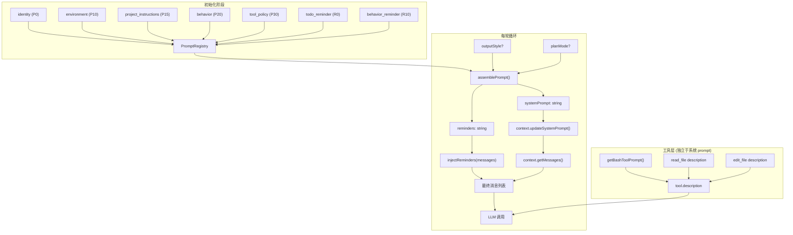

# 第三章：Prompt 工程

> *"上下文即货币"*
> *—— Prompt 设计的核心约束是 token 预算*

---

## 一、学习分析

### 1.1 Prompt 架构总览

Claude Code 使用**分层模块化**的 prompt 架构。不是一个巨大的 prompt 文件，而是 12 个可组合的模块，在运行时按需拼装：

```
┌───────────────────────────────────────────────────────┐
│  Layer 5: 工具定义层                                   │  每个工具的 description/prompt
├───────────────────────────────────────────────────────┤
│  Layer 4: 动态上下文层                                 │  IDE 文件、git 状态、输出风格
├───────────────────────────────────────────────────────┤
│  Layer 3: Reminder 注入层                              │  Todo 状态、安全提醒、行为约束
├───────────────────────────────────────────────────────┤
│  Layer 2: 核心工作流层                                 │  194 行行为定义（或输出风格变体）
├───────────────────────────────────────────────────────┤
│  Layer 1: 身份层                                       │  1 行："You are Claude Code"
└───────────────────────────────────────────────────────┘
```

### 1.2 十二个 Prompt 模块详解

#### 模块 1：`system-identity` — 身份声明（1 行）

```
You are Claude Code, Anthropic's official CLI for Claude.
```

只有一行。作用是在 system prompt 的最开头锚定 Agent 的角色身份。

#### 模块 2：`system-workflow` — 核心工作流（~194 行）

这是最重要的 prompt，定义了 Agent 的全部行为。按功能可拆分为 10 个段落：

**段落 A：安全护栏**
```
IMPORTANT: Assist with defensive security tasks only.
Refuse to create, modify, or improve code that may be used maliciously.
```
出现在 prompt 开头和结尾——**边界重复模式**，确保安全约束不被中间内容冲淡。

**段落 B：自我参考协议**
```
When the user directly asks about Claude Code, first use the WebFetch tool
to gather information from https://docs.anthropic.com/en/docs/claude-code
```
模型被指示不要凭记忆回答关于自身的问题，而是用工具查文档——防止幻觉。

**段落 C：语气与风格**
```
You should be concise, direct, and to the point.
You MUST answer concisely with fewer than 4 lines.
Minimize output tokens as much as possible.
Do NOT add unnecessary preamble or postamble.
One word answers are best.
```
配合大量具体示例（`2+2` → `4`，`is 11 prime?` → `Yes`），将抽象的"简洁"要求具体化。

**段落 D：主动性策略**
```
You are allowed to be proactive, but only when the user asks you to do something.
Strike a balance between doing the right thing and not surprising the user.
```
关键限制：问答题先回答再行动，不要上来就执行。

**段落 E：代码规范**
```
NEVER assume a library is available — always check first.
Mimic existing code style, use existing libraries.
DO NOT ADD ANY COMMENTS unless asked.
```

**段落 F：任务管理**
```
Use TodoWrite tools VERY frequently.
Mark todos as completed as soon as you are done.
Do not batch up multiple tasks before marking them as completed.
```
附带两个完整的示例对话，演示如何使用 TodoWrite 规划和跟踪任务。

**段落 G：执行任务的标准流程**
```
1. Use TodoWrite to plan
2. Search extensively (parallel + sequential)
3. Implement using all tools
4. Verify with tests
5. MUST run lint/typecheck
NEVER commit unless explicitly asked.
```

**段落 H：工具使用策略**
```
Prefer Task tool for file search (reduce context usage).
Batch independent tool calls together.
When making multiple bash calls, send single message with multiple tool calls.
```

**段落 I：环境信息模板**
```xml
<env>
Working directory: $cwd
Is directory a git repo: $boolean
Platform: $OS
Today's date: $date
</env>
Model: Sonnet 4 (claude-sonnet-4-20250514)
Knowledge cutoff: January 2025
```

**段落 J：代码引用格式**
```
When referencing code, include file_path:line_number pattern.
```

#### 模块 3：`system-compact` — 压缩身份（1 行）

```
You are a helpful AI assistant tasked with summarizing conversations.
```

上下文压缩时替换正常的 identity+workflow，让模型切换为"纯摘要器"角色。

#### 模块 4：`system-reminder-start` — 用户消息前注入

```xml
<system-reminder>
As you answer the user's questions, you can use the following context:

# important-instruction-reminders
Do what has been asked; nothing more, nothing less.
NEVER create files unless they're absolutely necessary.
ALWAYS prefer editing an existing file to creating a new one.
NEVER proactively create documentation files (*.md) or README files.

IMPORTANT: this context may or may not be relevant to your tasks.
</system-reminder>
```

插入位置：最后一条用户消息的**前面**。用 `<system-reminder>` 标签包裹，模型被训练识别此标签为系统侧内容。

#### 模块 5：`system-reminder-end` — 用户消息后注入

```xml
<system-reminder>This is a reminder that your todo list is currently empty.
DO NOT mention this to the user explicitly because they are already aware.
If you are working on tasks that would benefit from a todo list please
use the TodoWrite tool to create one.</system-reminder>
```

动态内容——实际运行时会注入当前 Todo 列表的状态。包含**meta 指令**："DO NOT mention this to the user"。

#### 模块 6：`compact` — 压缩指令（~100 行）

定义了 9 段式结构化摘要格式：
1. Primary Request and Intent
2. Key Technical Concepts
3. Files and Code Sections（含完整代码片段）
4. Errors and Fixes
5. Problem Solving
6. All User Messages（原文保留）
7. Pending Tasks
8. Current Work（当前工作的精确描述）
9. Optional Next Step（含原文引用）

要求先在 `<analysis>` 标签中做思考，再在 `<summary>` 标签中输出。

#### 模块 7：`system-output-style-explanatory` — 解释模式

替换标准的 workflow prompt。额外添加：
```
★ Insight ─────────────────────────────────────
[2-3 key educational points]
─────────────────────────────────────────────────
```
在写代码前后都要插入教育性的 Insight 块。允许超出通常的长度限制。

#### 模块 8：`system-output-style-learning` — 教学模式

替换标准的 workflow prompt。额外添加：
- **Learn by Doing** 请求格式：要求用户贡献 2-10 行代码
- **TODO(human)** 占位符：在代码中插入让用户填写的位置
- 严格要求："Don't take any action after the Learn by Doing request. Wait for human."

#### 模块 9：`check-new-topic` — 话题检测（1 行）

```
Analyze if this message indicates a new conversation topic.
Format as JSON: {isNewTopic: boolean, title: string|null}
```
用 Haiku 轻量模型运行，不携带上下文，用于更新终端标题。

#### 模块 10：`check-active-git-files` — Git 文件分析（1 行）

```
Given a list of files and their modification counts, return exactly five filenames
that are frequently modified and represent core application logic.
```

#### 模块 11：`summarize-previous-conversation` — 会话摘要（1 行）

```
Summarize this coding conversation in under 50 characters.
```

#### 模块 12：`ide-opened-file` — IDE 文件上下文

```
The user opened the file $filename in the IDE. This may or may not be related.
```
模板变量 `$filename` 在运行时替换。

### 1.3 Prompt 组装流程

Kode-Agent 的源码揭示了完整的 prompt 组装管线：

```typescript
// 1. 基础系统 prompt（getSystemPrompt() 返回 string[]）
const basePrompt: string[] = getSystemPrompt();

// 2. 注入项目上下文、GPT-5 持久化指令、用户上下文
const { systemPrompt, reminders } = formatSystemPromptWithContext(
    basePrompt, context, agentId
);
// → 添加 <context name="..."> XML 包裹的项目文档
// → 生成 <system-reminder> 字符串（Todo 状态、安全提醒等）

// 3. 追加模式特定内容
systemPrompt.push(...planModeAdditions);     // plan 模式提示
systemPrompt.push(...hookAdditions);          // 钩子系统注入
systemPrompt.push(...outputStyleAdditions);   // 输出风格（Explanatory/Learning）

// 4. 注入 reminders 到最后一条用户消息
if (reminders) {
    const lastUserMsg = findLastUserMessage(messages);
    lastUserMsg.content = reminders + lastUserMsg.content;
}

// 5. 最终发送前，在最开头添加 CLI 身份前缀
// queryAnthropicNative() 中: getCLISyspromptPrefix() 前置
```

### 1.4 Kode-Agent 的 Reminder 事件系统

Kode-Agent 有一个**事件驱动的 Reminder 服务**（446 行），根据运行时事件动态生成提醒：

```typescript
// 事件类型 → 触发 reminder 生成
"session:startup"     → 初始化 reminder 状态
"todo:changed"        → 更新 Todo 状态提醒
"file:read"           → 文件读取后的安全提醒
"file:edited"         → 文件修改后的冲突检测
"agent:mentioned"     → @agent 提及时的子代理调用提醒
"file:mentioned"      → @file 提及时的文件读取提醒
"ask-model:mentioned" → @model 提及时的模型切换提醒

// SystemReminderService 类
class SystemReminderService {
    generateSystemReminders(): string {
        // 组合所有活跃的 reminder 为一个 <system-reminder> 字符串
        return `<system-reminder>${todoReminder}${securityReminder}${...}</system-reminder>`;
    }
}
```

### 1.5 工具 Prompt 的集成方式

工具的 prompt 不在系统 prompt 中——而是作为工具 schema 的 `description` 字段传递给 LLM：

```typescript
// Anthropic API 格式
{
    name: "Bash",
    description: getBashToolPrompt(),  // 200+ 行的使用说明
    input_schema: { ... }
}

// OpenAI API 格式
{
    type: "function",
    function: {
        name: "bash",
        description: getBashToolPrompt(),  // 同样的 prompt
        parameters: { ... }
    }
}
```

以 BashTool 为例，其 prompt 由三部分动态组合：

```typescript
function getBashToolPrompt(): string {
    return [
        coreInstructions,         // 基础使用说明
        getBashSandboxPrompt(),   // 沙箱限制（根据配置动态生成）
        getBashGitPrompt(),       // Git commit/PR 工作流
    ].join("\n\n");
}
```

### 1.6 模型分级调度

不同的 prompt 模块对应不同的模型：

| Prompt 模块 | 使用模型 | 原因 |
|-------------|---------|------|
| `system-workflow` + 工具调用 | Sonnet 4（主模型） | 核心推理 |
| `compact` + `system-compact` | Sonnet 4 | 摘要质量要高 |
| `check-new-topic` | Haiku 3.5 | 轻量任务，节省成本 |
| `summarize-previous-conversation` | Haiku 3.5 | 同上 |
| `check-active-git-files` | Haiku 3.5 | 同上 |
| WebFetch 内容处理 | "small, fast model" | 处理网页内容 |

### 1.7 LLM 心理学技巧

Southbridge AI 的分析揭示了 Claude Code 在 prompt 中运用的一系列"心理学操控"技巧——这些不是标准的工程手段，而是利用 LLM 训练特性来强化约束遵守度的策略：

**游戏化惩罚框架**

```
If you fail to follow this rule, it will cost the user -$1000.
```

Claude Code 在多处使用了虚拟金钱惩罚来强化关键约束。这种"惩罚"对 LLM 没有实际意义，但在 RLHF 训练数据中，金钱惩罚与"重要性"强相关——因此模型会更认真地对待带有金钱惩罚的规则。

**情绪化措辞**

```
This is UNACCEPTABLE behavior.
This would be a catastrophic failure.
```

使用强烈的否定情绪词汇标记违规行为。LLM 在训练中学到的"unacceptable"的权重远高于简单的"don't do this"。

**禁止短语列表**

```
FORBIDDEN PHRASES:
- "I need to"
- "Let me"
- "I apologize"
- "I'll now"
- "First, let me"
- "Great"
- "Certainly"
```

Claude Code 明确列出了模型不应使用的"客气话"短语——这是从模型的常见行为模式出发的逆向约束。比起说"be concise"，直接禁止具体的冗余短语效果更好。

**重复强化**

关键规则不是只出现一次，而是在不同位置、以不同措辞重复出现：
- `system-identity` 中首次出现安全规则
- `system-workflow` 中用示例再次强化
- `system-reminder` 中第三次提醒
- 对应工具的 `description` 中第四次以工具视角重述

**形式对比**：同一条规则的四次表述：

| 位置 | 措辞 |
|------|------|
| identity | "NEVER commit without explicit user request" |
| workflow | 示例中展示了正确行为（不自动 commit） |
| reminder | "Remember: do not commit unless asked" |
| git 工具 description | "Only create commits when user explicitly asks" |

### 1.8 强调层级体系

Claude Code 的 prompt 中存在一个隐式的**强调层级**，用不同的标记词表示约束的优先级：

```
RULE 0 > CRITICAL > VERY IMPORTANT > IMPORTANT > 普通描述
```

| 级别 | 标记词 | 语义 | 示例场景 |
|------|--------|------|----------|
| RULE 0 | `RULE 0:` | 绝对不可违反的底线 | 安全边界、用户数据保护 |
| CRITICAL | `CRITICAL:` | 违反会导致严重后果 | 权限检查、文件保护 |
| VERY IMPORTANT | `VERY IMPORTANT:` | 违反会显著降低质量 | 代码风格、输出格式 |
| IMPORTANT | `IMPORTANT:` | 应该遵守的最佳实践 | 工具使用建议 |
| 普通 | 无标记 | 一般指导 | 偏好、建议 |

**实际效果**：当两条规则冲突时（如"使用最佳工具" vs "优先使用用户指定的方法"），模型会倾向于遵守层级更高的规则。这种显式的优先级标记避免了模型在冲突规则间的随机选择。

### 1.9 命令注入检测 Prompt

Claude Code 专门设计了检测命令注入的 prompt 模块，用于在执行 bash 命令前判断用户输入中是否包含恶意注入：

```
Analyze the following command for potential command injection attacks.

A command injection occurs when:
1. User-controlled input is embedded in a shell command
2. The input contains shell metacharacters (;, |, &&, ||, $(), ``)
3. The command accesses sensitive files or directories
4. The command attempts network access not related to the task

Classify as: SAFE, SUSPICIOUS, or DANGEROUS

Command: {command}
Context: {what the user asked to do}
```

**设计要点**：
- 不是用正则表达式做静态分析（容易被绕过），而是让 LLM 理解命令语义
- 提供了明确的分类标准和严重等级
- 包含上下文（用户原始请求）——同一个命令在不同上下文中危险度不同

---

## 二、思考提炼

### 2.1 Prompt 工程核心技巧

从 Claude Code 的 prompt 中提炼出的关键技巧：

**技巧 1：边界重复**

安全约束出现在 prompt 的开头和结尾。关键规则如 "NEVER commit unless asked" 也重复多次。这不是冗余——长 prompt 中间的内容容易被模型忽略，重要约束放在首尾能显著降低违规率。

**技巧 2：具体示例胜过抽象描述**

```
// 抽象描述（弱）
"Be concise in your responses."

// 具体示例（强）
user: 2 + 2
assistant: 4

user: is 11 prime?
assistant: Yes
```

Claude Code 的 workflow prompt 包含 7 个具体的问答示例来教模型什么叫"简洁"。

**技巧 3：反模式显式禁止**

```
Do NOT add unnecessary preamble or postamble.
NEVER assume a library is available.
NEVER create files unless absolutely necessary.
NEVER commit unless explicitly asked.
```

不仅说"该做什么"，还明确说"不该做什么"。用 `NEVER`/`DO NOT`/`IMPORTANT` 关键词提升约束强度。

**技巧 4：Meta 指令**

```xml
<system-reminder>
...DO NOT mention this to the user explicitly because they are already aware.
</system-reminder>
```

告诉模型"这条信息存在，但不要告诉用户你看到了它"。用于注入内部状态（Todo 列表）而不破坏用户体验。

**技巧 5：渐进式披露**

```
IMPORTANT: this context may or may not be relevant to your tasks.
```

提醒模型注入的上下文不一定相关——防止模型过度关注不相关的注入内容。

**技巧 6：角色切换**

同一个模型在不同任务中使用不同的 system prompt：
- 正常对话：`system-identity` + `system-workflow`
- 压缩上下文：`system-compact`（"You are a helpful AI assistant tasked with summarizing"）
- 话题检测：`check-new-topic`（纯 JSON 输出指令）

**技巧 7：结构化输出要求**

压缩 prompt 要求模型先在 `<analysis>` 标签中思考，再在 `<summary>` 标签中输出。这迫使模型进行结构化推理，提高摘要质量。

### 2.2 Prompt 分层的设计原则

**原则 1：关注点分离**

每个 prompt 模块只负责一个关注点。身份、行为、提醒、压缩、工具——各自独立。

**原则 2：可替换性**

输出风格（concise/explanatory/learning）通过替换整个 workflow prompt 实现，而不是在同一个 prompt 中加条件判断。

**原则 3：注入位置很重要**

- System prompt：静态行为定义
- 用户消息前（reminder-start）：环境上下文
- 用户消息后（reminder-end）：动态状态（Todo 列表）
- 工具 description：工具使用手册

每个位置对模型的影响力不同——system prompt 影响力最强但最容易被长对话稀释，reminder 在用户消息中出现时"存在感"更强。

**原则 4：token 预算意识**

Claude Code 的 prompt 长度大约消耗 3000-5000 tokens。这看似很多，但相比 200K 的上下文窗口只占 2-3%。关键是**工具 prompt 额外消耗**——15 个工具的 description 加起来可能又要 3000-5000 tokens。所以 prompt 设计必须在"信息量"和"token 成本"之间权衡。

**原则 5：约束即自由（Constraints as Liberation）**

这是 Southbridge 分析中提出的深刻洞察：越多的具体约束反而让 LLM 的输出质量越高。
- 没有 FORBIDDEN PHRASES → 模型自由发挥，输出冗长的客套话
- 有了 FORBIDDEN PHRASES → 模型被迫直接回答问题，效率反而提升

类比：好的编程语言不是给你最大自由度的，而是通过类型系统等约束帮你避免错误的。LLM 也是如此——**约束是元提示（meta-prompt）**。

**原则 6：多通道强化**

同一条规则不应只在一个地方出现。关键约束应该通过不同的表达方式在不同的注入位置重复出现：system prompt（声明式）→ workflow prompt（示例式）→ reminder（命令式）→ tool description（上下文式）。这四种"通道"的组合远强于单一通道的重复。

### 2.3 最优 Prompt 架构选择

| 设计维度 | 最优选择 | 理由 |
|----------|---------|------|
| 架构模式 | **分层可组合** | 模块化便于替换和调试 |
| 系统 prompt | **分段数组 + 运行时拼接** | 方便条件注入和排序 |
| 提醒注入 | **用户消息内嵌 `<system-reminder>`** | 比系统 prompt 末尾的"存在感"更强 |
| 工具 prompt | **写在工具 description 中，不在系统 prompt 中** | 减少系统 prompt 膨胀 |
| 输出风格 | **prompt 模板替换，不用条件分支** | 更清晰，无交叉污染 |
| 压缩 | **独立的角色 + 结构化输出模板** | 结构化保证信息保留 |
| 强调层级 | **RULE 0 > CRITICAL > IMPORTANT** | 约束冲突时有明确优先级 |
| 安全约束 | **独立 security 模块 + 惩罚措辞** | 利用 LLM 心理学强化安全 |

---

## 三、最优设计方案

### 3.1 Prompt 模块定义

```typescript
// ── Prompt 模块类型 ───────────────────────────────────────

interface PromptModule {
    name: string;
    content: string | (() => string);  // 静态字符串或动态生成函数
    position: "system" | "reminder" | "tool";
    priority: number;  // 越小越靠前
}

// ── Prompt 注册表 ─────────────────────────────────────────

class PromptRegistry {
    private modules: PromptModule[] = [];

    register(module: PromptModule): void {
        this.modules.push(module);
        this.modules.sort((a, b) => a.priority - b.priority);
    }

    getSystemPrompt(): string {
        return this.modules
            .filter(m => m.position === "system")
            .map(m => typeof m.content === "function" ? m.content() : m.content)
            .join("\n\n");
    }

    getReminders(): string {
        const parts = this.modules
            .filter(m => m.position === "reminder")
            .map(m => typeof m.content === "function" ? m.content() : m.content)
            .filter(Boolean);
        if (parts.length === 0) return "";
        return `<system-reminder>\n${parts.join("\n")}\n</system-reminder>`;
    }
}
```

### 3.2 核心 Prompt 模块

```typescript
// ── 身份模块 ──────────────────────────────────────────────

const identityModule: PromptModule = {
    name: "identity",
    position: "system",
    priority: 0,
    content: "You are a powerful terminal-based AI coding assistant. You help users with software engineering tasks.",
};

// ── 环境模块（动态） ──────────────────────────────────────

const environmentModule: PromptModule = {
    name: "environment",
    position: "system",
    priority: 10,
    content: () => [
        "# Environment",
        `- Working directory: ${process.cwd()}`,
        `- Platform: ${process.platform}`,
        `- Date: ${new Date().toDateString()}`,
    ].join("\n"),
};

// ── 行为规范模块 ──────────────────────────────────────────

const behaviorModule: PromptModule = {
    name: "behavior",
    position: "system",
    priority: 20,
    content: `# Behavior

## Tone and Style
- Be concise, direct, and to the point.
- Answer in fewer than 4 lines unless the user asks for detail.
- Minimize output tokens. One word answers are best when appropriate.
- Do NOT add preamble or postamble. Do not explain your code unless asked.
- Only use emojis if the user explicitly requests it.

FORBIDDEN PHRASES (never use these):
- "I need to"
- "Let me"
- "I apologize"
- "I'll now"
- "First, let me"
- "Great"
- "Certainly"

## Proactiveness
- Only act when the user asks. Do not surprise the user with unsolicited actions.
- If the user asks how to approach something, answer first, then offer to act.

## Code Conventions
- NEVER assume a library is available. Check the codebase first.
- Mimic existing code style, naming conventions, and patterns.
- DO NOT add comments unless asked.
- Follow security best practices. Never expose secrets.

## Task Execution
1. Plan with todo_write if the task has 3+ steps
2. Search extensively using grep/glob/read_file
3. Implement using edit_file/write_file/bash
4. Verify with tests, lint, and typecheck
5. NEVER commit unless explicitly asked

## Emphasis Hierarchy
When instructions conflict, follow this priority order:
- RULE 0: Absolute constraints (security boundaries, never violate)
- CRITICAL: Severe consequences if violated (permission checks, data protection)
- VERY IMPORTANT: Significant quality impact (code style, output format)
- IMPORTANT: Best practices (tool preferences, conventions)
- Unmarked: General guidance`,
};

// ── 工具策略模块 ──────────────────────────────────────────

const toolPolicyModule: PromptModule = {
    name: "tool_policy",
    position: "system",
    priority: 30,
    content: `# Tool Usage Policy
- Batch independent tool calls in a single response for optimal performance.
- Prefer read_file over bash cat. Prefer grep over bash grep.
- Use edit_file for modifying existing files. Use write_file only for new files.
- For open-ended search across large codebases, prefer task (sub-agent) to reduce context usage.`,
};

// ── 安全约束模块 ──────────────────────────────────────────

const securityModule: PromptModule = {
    name: "security",
    position: "system",
    priority: 25,
    content: `# Security Constraints

RULE 0: NEVER execute commands that could compromise user security.

CRITICAL: Before executing any bash command:
- Check for shell metacharacters in user-controlled input (;, |, &&, ||, $(), \`\`)
- NEVER access ~/.ssh, ~/.aws, ~/.gnupg, or credential files
- NEVER make network requests not directly related to the user's task
- If a command looks suspicious, explain why and ask for confirmation

CRITICAL: Command injection detection:
When a user's request could result in embedding their input into a shell command,
analyze for injection risk. Classify as SAFE / SUSPICIOUS / DANGEROUS.
SUSPICIOUS and DANGEROUS commands MUST be shown to user before execution.

If you fail to follow security rules, it will cost the user -$1000.`,
};

// ── 项目指令模块（条件注入） ──────────────────────────────

function createProjectInstructionsModule(instructions: string | undefined): PromptModule | null {
    if (!instructions) return null;
    return {
        name: "project_instructions",
        position: "system",
        priority: 15,
        content: `# Project Instructions\n${instructions}`,
    };
}
```

### 3.3 Reminder 系统

```typescript
// ── Reminder 状态管理 ─────────────────────────────────────

interface ReminderState {
    todoList: string;           // 当前 Todo 列表的渲染文本
    customReminders: string[];  // 自定义提醒
}

const reminderState: ReminderState = {
    todoList: "",
    customReminders: [],
};

// ── Todo Reminder 模块 ────────────────────────────────────

const todoReminderModule: PromptModule = {
    name: "todo_reminder",
    position: "reminder",
    priority: 0,
    content: () => {
        if (!reminderState.todoList) {
            return "Your todo list is currently empty. If you are working on tasks that would benefit from a todo list, use the todo_write tool. Do NOT mention this to the user.";
        }
        return `Current todo list:\n${reminderState.todoList}\nUpdate todos as you make progress. Do NOT mention this reminder to the user.`;
    },
};

// ── 行为 Reminder 模块 ────────────────────────────────────

const behaviorReminderModule: PromptModule = {
    name: "behavior_reminder",
    position: "reminder",
    priority: 10,
    content: [
        "Do what has been asked; nothing more, nothing less.",
        "NEVER create files unless absolutely necessary.",
        "ALWAYS prefer editing existing files over creating new ones.",
    ].join("\n"),
};

// ── 更新 Todo 状态 ────────────────────────────────────────

function updateTodoReminder(todoText: string): void {
    reminderState.todoList = todoText;
}
```

### 3.4 Prompt 组装引擎

```typescript
// ── Prompt 组装 ───────────────────────────────────────────

interface AssembledPrompt {
    systemPrompt: string;
    reminders: string;
}

function assemblePrompt(
    registry: PromptRegistry,
    options?: {
        outputStyle?: "default" | "explanatory" | "learning";
        planMode?: boolean;
    },
): AssembledPrompt {
    const systemPrompt = registry.getSystemPrompt();
    const reminders = registry.getReminders();

    // 输出风格追加
    let styleAddition = "";
    if (options?.outputStyle === "explanatory") {
        styleAddition = EXPLANATORY_STYLE_PROMPT;
    } else if (options?.outputStyle === "learning") {
        styleAddition = LEARNING_STYLE_PROMPT;
    }

    // Plan 模式追加
    let planAddition = "";
    if (options?.planMode) {
        planAddition = "\n\n# Plan Mode\nYou are in plan mode. Do NOT make any changes. Only analyze and propose a plan.";
    }

    return {
        systemPrompt: systemPrompt + styleAddition + planAddition,
        reminders,
    };
}

// ── 输出风格 prompt ────────────────────────────────────────

const EXPLANATORY_STYLE_PROMPT = `

# Output Style: Explanatory
Provide educational insights before and after writing code using:
★ Insight ─────────────────────────────────────
[2-3 key educational points]
─────────────────────────────────────────────────
You may exceed typical length constraints when providing insights.`;

const LEARNING_STYLE_PROMPT = `

# Output Style: Learning
Help users learn through hands-on practice.
Ask the user to contribute 2-10 line code pieces for design decisions.
Use TODO(human) placeholders in code. Wait for human input before proceeding.`;
```

### 3.5 Reminder 注入到消息

```typescript
// ── 注入 Reminder 到最后一条用户消息 ──────────────────────

function injectReminders(messages: Message[], reminders: string): Message[] {
    if (!reminders || messages.length === 0) return messages;

    const result = [...messages];
    // 从后向前找最后一条 user 消息
    for (let i = result.length - 1; i >= 0; i--) {
        if (result[i].role === "user" && typeof result[i].content === "string") {
            result[i] = {
                ...result[i],
                content: reminders + "\n" + result[i].content,
            };
            break;
        }
    }
    return result;
}
```

### 3.6 接入 Agent 循环

将 prompt 系统接入第一章的 `agentLoop`：

```typescript
// ── 初始化 ─────────────────────────────────────────────────

const promptRegistry = new PromptRegistry();
promptRegistry.register(identityModule);
promptRegistry.register(environmentModule);
promptRegistry.register(behaviorModule);
promptRegistry.register(securityModule);
promptRegistry.register(toolPolicyModule);
promptRegistry.register(todoReminderModule);
promptRegistry.register(behaviorReminderModule);

// 可选：项目指令
const projectMod = createProjectInstructionsModule(config.developerInstructions);
if (projectMod) promptRegistry.register(projectMod);

// ── 在 agentLoop 中使用 ───────────────────────────────────

async function* agentLoop(
    userMessage: string,
    config: AgentConfig,
    context: ContextManager,
    signal?: AbortSignal,
): AsyncGenerator<AgentEvent> {
    context.addUser(userMessage);

    for (let turn = 0; turn < config.maxTurns; turn++) {
        // ▶ 每轮重新组装 prompt（动态模块可能变化）
        const { systemPrompt, reminders } = assemblePrompt(promptRegistry, {
            outputStyle: config.outputStyle,
            planMode: config.planMode,
        });
        context.updateSystemPrompt(systemPrompt);

        // ▶ 注入 reminders 到消息
        const messages = injectReminders(context.getMessages(), reminders);

        // ... LLM 调用、工具执行（同第一章）

        // ▶ 工具执行后更新 reminder 状态
        if (toolName === "todo_write") {
            updateTodoReminder(toolOutput);
        }
    }
}
```

**关键变化**：
- `assemblePrompt()` 在**每轮循环**开始时调用，因为动态模块（环境、Todo 状态）可能在轮次间变化
- `injectReminders()` 将 reminder 注入到消息列表中，而不是附加到 system prompt
- Todo 工具执行后更新 `reminderState`，下一轮的 reminder 会反映新状态

### 3.7 压缩 Prompt 模块

```typescript
// ── 上下文压缩时的 prompt 切换 ────────────────────────────

const COMPACT_SYSTEM_PROMPT = "You are a helpful AI assistant tasked with summarizing conversations.";

const COMPACT_INSTRUCTION = `Your task is to create a detailed summary of the conversation so far.

Before providing your final summary, wrap your analysis in <analysis> tags.

Your summary should include:
1. Primary Request and Intent
2. Key Technical Concepts
3. Files and Code Sections (include full code snippets)
4. Errors and Fixes
5. Problem Solving
6. All User Messages (verbatim)
7. Pending Tasks
8. Current Work (precise description with file names and code)
9. Optional Next Step (with direct quotes from conversation)

Provide your summary in <summary> tags.`;

async function compactContext(
    messages: Message[],
    llm: LLMClient,
): Promise<string> {
    const compactMessages: Message[] = [
        { role: "system", content: COMPACT_SYSTEM_PROMPT },
        // 将所有历史消息序列化为一条用户消息
        { role: "user", content: serializeMessages(messages) + "\n\n" + COMPACT_INSTRUCTION },
    ];

    let summary = "";
    for await (const event of llm.stream(compactMessages, null)) {
        if (event.type === "text_delta") summary += event.text!;
    }
    return summary;
}
```

### 3.8 完整 Prompt 组装流程图



### 3.9 扩展路线图

| 阶段 | 扩展 | 修改点 |
|------|------|--------|
| **当前** | 5 个系统模块 + 2 个 reminder 模块 | 本章实现 |
| **+输出风格** | 注册 explanatory/learning 模块 | `assemblePrompt()` 的 `options` |
| **+事件驱动 Reminder** | `SystemReminderService` 事件总线 | 替换简单的 `reminderState` |
| **+文件新鲜度** | 读取/编辑文件后注入冲突提醒 | 新增 reminder 模块 |
| **+Nag 机制** | 3 轮未更新 Todo 就注入提醒 | 在循环中计数 + 新增 reminder |
| **+身份重注入** | 压缩后重新注入 `<identity>` 标签 | `compactContext()` 后处理 |

---

## 四、关键源码索引

| 文件 | 说明 |
|------|------|
| `origin/claude-code-reverse-main/results/prompts/system-identity.prompt.md` | 身份声明（1 行） |
| `origin/claude-code-reverse-main/results/prompts/system-workflow.prompt.md` | 核心工作流（~194 行） |
| `origin/claude-code-reverse-main/results/prompts/system-compact.prompt.md` | 压缩角色（1 行） |
| `origin/claude-code-reverse-main/results/prompts/system-reminder-start.prompt.md` | 用户消息前注入 |
| `origin/claude-code-reverse-main/results/prompts/system-reminder-end.prompt.md` | 用户消息后注入（Todo 状态） |
| `origin/claude-code-reverse-main/results/prompts/compact.prompt.md` | 9 段式压缩指令（~100 行） |
| `origin/claude-code-reverse-main/results/prompts/system-output-style-explanatory.prompt.md` | 解释模式 |
| `origin/claude-code-reverse-main/results/prompts/system-output-style-learning.prompt.md` | 教学模式 |
| `origin/claude-code-reverse-main/results/prompts/check-new-topic.prompt.md` | 话题检测 |
| `origin/claude-code-reverse-main/results/prompts/check-active-git-files.prompt.md` | Git 文件分析 |
| `origin/claude-code-reverse-main/results/prompts/summarize-previous-conversation.prompt.md` | 会话摘要 |
| `origin/claude-code-reverse-main/results/prompts/ide-opened-file.prompt.md` | IDE 文件上下文 |
| `origin/Kode-Agent-main/src/constants/prompts.ts` | Kode-Agent 系统 prompt 模板 |
| `origin/Kode-Agent-main/src/services/system/systemPrompt.ts` | prompt 组装函数 |
| `origin/Kode-Agent-main/src/services/system/systemReminder.ts` | 事件驱动 Reminder 服务（446 行） |
| `origin/Kode-Agent-main/src/services/ui/outputStyles.ts` | 输出风格管理（540 行） |
| `origin/Kode-Agent-main/src/tools/system/BashTool/prompt.ts` | BashTool prompt 组合（257 行） |
