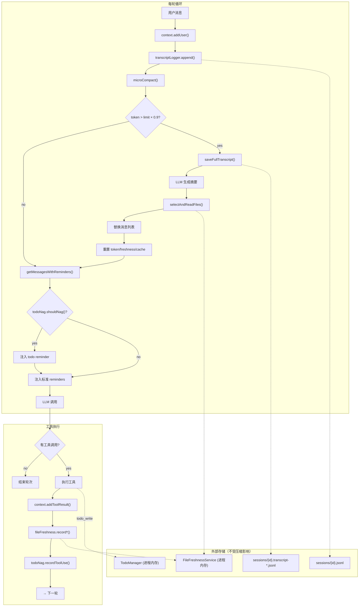
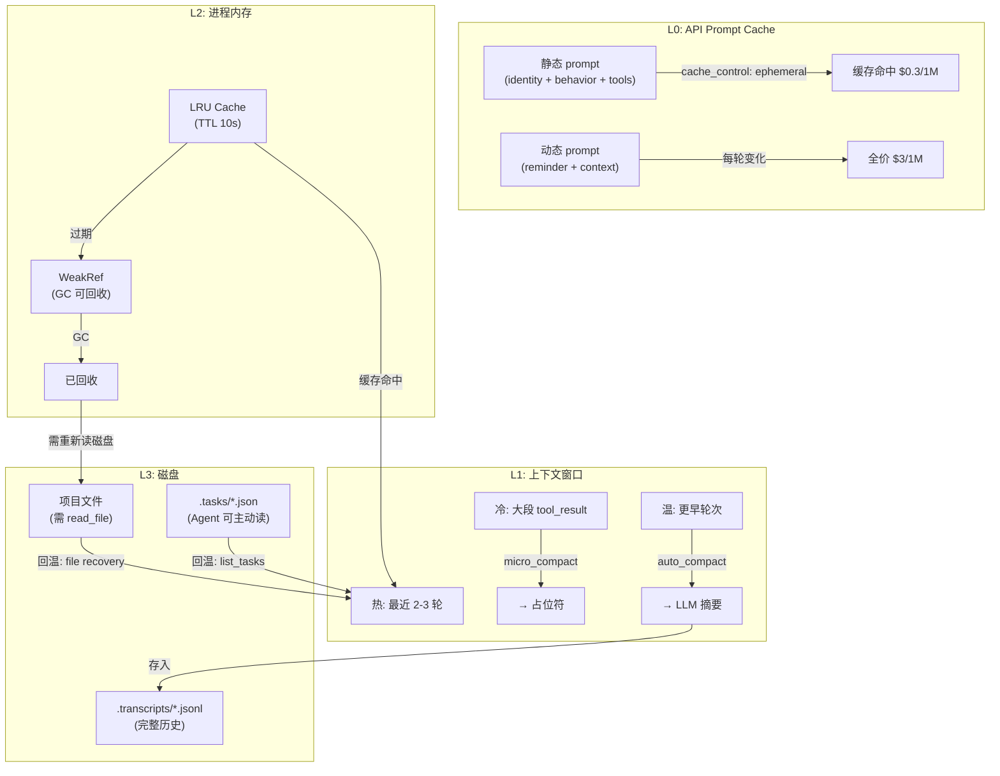

# 第四章：上下文管理

> *"上下文总会满，要有办法腾地方"*
> *—— 三层压缩 + 外部记忆，换来无限会话*

---

## 一、学习分析

### 1.1 三层压缩架构

Agent CLI 工具面临的核心矛盾：**上下文窗口有限，但任务可以无限长**。读 30 个文件、跑 20 条命令就能轻松突破 100k token。所有项目都采用了分层压缩策略，激进程度递增：

```
每轮循环:
┌──────────────┐
│ 工具调用结果  │
└──────┬───────┘
       v
[Layer 1: micro_compact]         静默，每轮执行
  旧 tool_result → 占位符
       │
       v
[Token 超阈值？]
  │           │
  no          yes
  │           │
  v           v
继续      [Layer 2: auto_compact]
            保存完整对话到磁盘
            LLM 生成摘要
            替换全部消息
                │
                v
          [Layer 3: compact 工具]
            Agent 或用户主动触发
            同样的摘要机制
```

#### Layer 1：micro_compact（静默裁剪）

learn-claude-code 的实现——将 3 轮之前的 tool_result 内容替换为占位符：

```python
# learn-claude-code: s06_context_compact.py
def micro_compact(messages):
    tool_results = [...]  # 收集所有 tool_result
    if len(tool_results) <= KEEP_RECENT:  # KEEP_RECENT = 3
        return messages
    to_clear = tool_results[:-KEEP_RECENT]
    for _, _, result in to_clear:
        if len(result["content"]) > 100:
            result["content"] = f"[Previous: used {tool_name}]"
    return messages
```

**关键洞察**：工具结果是上下文中最大的 token 消耗者（一个 1000 行文件 ≈ 4000 token），但旧结果对当前推理的价值很低。用占位符替换后，LLM 仍知道"之前读过某文件"，但不再占用 token 预算。

#### Layer 2：auto_compact（自动摘要）

当 token 超过阈值时，保存完整对话到磁盘，然后让 LLM 生成摘要替换全部消息。

**learn-claude-code** 的简单版：

```python
# 阈值 50k token，估算方式: len(str(messages)) // 4
def auto_compact(messages):
    # 1. 保存到磁盘（信息不丢失）
    transcript_path = f".transcripts/transcript_{int(time.time())}.jsonl"
    save_jsonl(transcript_path, messages)

    # 2. LLM 摘要
    summary = llm_summarize(messages)

    # 3. 替换全部消息
    return [
        {"role": "user", "content": f"[Compressed]\n\n{summary}"},
        {"role": "assistant", "content": "Understood. Continuing."},
    ]
```

**Kode-Agent** 的生产级实现增加了多项关键增强：

| 特性 | learn-claude-code | Kode-Agent |
|------|-------------------|------------|
| Token 计算 | 字符数 / 4（启发式） | API `usage` 字段（精确值） |
| 阈值 | 硬编码 50k | 可配置比例，默认 `contextLimit × 0.9` |
| 模型选择 | 固定使用主模型 | 优先 compact 模型，超出其上下文则回退 main |
| 文件恢复 | 无 | 压缩后重新注入最近访问的重要文件 |
| 状态清理 | 无 | 清除代码风格缓存、文件新鲜度记录、Reminder |
| 压缩 Prompt | 简单一句话 | 8 段结构化模板（Technical Context / Project Overview / Code Changes / ...） |

Kode-Agent 的模型选择逻辑：

```typescript
// Kode-Agent: autoCompactCore.ts — 模型选择
let compressionModel: "compact" | "main" = "compact";

// 1. compact 模型未配置 → 回退 main
if (!compactResolution.success) {
    compressionModel = "main";
}
// 2. 当前上下文超出 compact 模型的容量 → 回退 main
else if (tokenCount > compactResolution.profile.contextLength * 0.9) {
    compressionModel = "main";
}
```

#### Layer 3：manual compact（手动触发）

作为工具或斜杠命令暴露给 Agent/用户。执行逻辑与 auto_compact 相同，但触发方式不同——Agent 判断上下文"太杂"时主动调用，或用户输入 `/compact`。

Kode-Agent 的 compact 命令在压缩完成后还会：
- 清空消息列表 `getMessagesSetter()([])`
- 清除上下文缓存 `getContext.cache.clear()`
- 清除代码风格缓存 `getCodeStyle.cache.clear()`
- 重置文件新鲜度记录
- 重置 Reminder 会话状态

### 1.2 Token 追踪与阈值

#### 精确追踪 vs 启发式估算

**learn-claude-code** 使用字符级启发式：

```python
def estimate_tokens(messages):
    return len(str(messages)) // 4  # ~4 字符 ≈ 1 token
```

**Kode-Agent** 使用 API 返回的精确值：

```typescript
// Kode-Agent: tokens.ts
function countTokens(messages: Message[]): number {
    // 从后往前找最后一条 assistant 消息的 usage
    for (let i = messages.length - 1; i >= 0; i--) {
        const msg = messages[i];
        if (msg.type === "assistant" && "usage" in msg.message) {
            const { usage } = msg.message;
            return (
                usage.input_tokens +
                (usage.cache_creation_input_tokens ?? 0) +
                (usage.cache_read_input_tokens ?? 0) +
                usage.output_tokens
            );
        }
    }
    return 0;
}
```

**为什么用最后一条 assistant 的 usage？** 因为 API 每次返回的 `input_tokens` 反映了整个上下文的累计大小，比任何客户端估算都准确。

#### 阈值计算

Kode-Agent 的阈值是模型上下文窗口的百分比（默认 90%）：

```typescript
// Kode-Agent: autoCompactThreshold.ts
const DEFAULT_RATIO = 0.9;

function calculateAutoCompactThresholds(tokenCount: number, contextLimit: number) {
    const threshold = contextLimit * ratio;
    return {
        isAboveAutoCompactThreshold: tokenCount >= threshold,
        percentUsed: Math.round((tokenCount / contextLimit) * 100),
        tokensRemaining: Math.max(0, threshold - tokenCount),
    };
}
```

### 1.3 外部记忆系统

上下文压缩的一个致命问题：**压缩会丢失结构化状态**。LLM 可能忘记已经完成了哪些步骤、下一步该做什么。三个项目都采用了"外部记忆"来解决这个问题。

#### TodoManager（内存级）

learn-claude-code 的 `TodoManager` 是最轻量的方案：

```python
class TodoManager:
    def __init__(self):
        self.items = []  # [{"id", "text", "status"}]

    def update(self, items):
        # 验证: max 20 items, 只允许 1 个 in_progress
        in_progress_count = sum(1 for i in items if i["status"] == "in_progress")
        if in_progress_count > 1:
            raise ValueError("Only one task can be in_progress at a time")
        self.items = validated
        return self.render()

    def render(self):
        # [ ] pending / [>] in_progress / [x] completed
        # (3/5 completed)
```

配合 **Nag Reminder**——连续 3 轮未调用 todo 工具就注入提醒：

```python
rounds_since_todo = 0 if used_todo else rounds_since_todo + 1
if rounds_since_todo >= 3:
    results.insert(0, {"type": "text", "text": "<reminder>Update your todos.</reminder>"})
```

**局限**：TodoManager 存在于进程内存中，一旦执行 auto_compact（替换所有消息），Todo 状态虽然还在内存里，但 LLM 对它的上下文记忆被清除了——除非通过 Reminder 重新注入。

#### File-Persisted Tasks（磁盘级）

learn-claude-code 的 `s07_task_system.py` 采用更持久的方案——每个任务存为独立 JSON 文件：

```
.tasks/
  task_1.json  {"id":1, "subject":"...", "status":"completed", ...}
  task_2.json  {"id":2, "blockedBy":[1], "status":"pending", ...}
  task_3.json  {"id":3, "blockedBy":[2], "blocks":[], ...}
```

**优势**：
- 任务存活于上下文之外——压缩后 Agent 可以 `list_tasks` 重新加载
- 支持依赖图：`blockedBy` / `blocks` 字段表示任务间的先后关系
- 完成一个任务时自动从被阻塞任务的 `blockedBy` 中移除

**代价**：需要额外的工具调用（`create_task`, `update_task`, `list_tasks`）来读写文件系统。

#### Claude Code 的 TodoWrite

Claude Code 的 TodoWrite 工具比上述方案更精细：

```yaml
# Claude Code: TodoWrite.tool.yaml
properties:
  todos:
    items:
      properties:
        id:       { type: string }
        content:  { type: string, minLength: 1 }
        status:   { enum: [pending, in_progress, completed] }
        priority: { enum: [high, medium, low] }
```

特点：
- 增加了 `priority` 字段（high/medium/low）
- 工具描述中用大量示例教 LLM 何时该用、何时不该用
- 要求同一时间只有 1 个 `in_progress`
- 强调"只有完全完成才能标记 completed"

### 1.4 文件新鲜度追踪

Kode-Agent 独有的设计——`FileFreshnessService` 追踪 Agent 访问过的所有文件：

```typescript
// Kode-Agent: fileFreshness.ts
interface FileTimestamp {
    path: string;
    lastRead: number;       // 最近一次读取时间
    lastModified: number;   // 磁盘上的修改时间
    size: number;
    lastAgentEdit?: number; // Agent 最近一次编辑时间
}

class FileFreshnessService {
    private readTimestamps: Map<string, FileTimestamp>;
    private editConflicts: Set<string>;
    private sessionFiles: Set<string>;

    recordFileRead(path: string): void { /* ... */ }
    recordFileEdit(path: string): void { /* ... */ }

    // 判断文件是否被外部修改
    checkFileFreshness(path: string): {
        isFresh: boolean;
        conflict: boolean;  // 自 Agent 上次读取后被外部修改
    }

    // 压缩后恢复：按最近访问排序，取前 N 个
    getImportantFiles(maxFiles = 5): Array<{ path, timestamp, size }> {
        return Array.from(this.readTimestamps.entries())
            .filter(([path]) => this.isValidForRecovery(path))
            .sort((a, b) => b.timestamp - a.timestamp)
            .slice(0, maxFiles);
    }
}
```

**恢复逻辑**（`fileRecoveryCore.ts`）：

```typescript
const MAX_FILES_TO_RECOVER = 5;
const MAX_TOKENS_PER_FILE = 10_000;
const MAX_TOTAL_FILE_TOKENS = 50_000;

async function selectAndReadFiles() {
    const importantFiles = fileFreshnessService.getImportantFiles(5);
    const results = [];
    let totalTokens = 0;

    for (const fileInfo of importantFiles) {
        const content = readFile(fileInfo.path);
        const tokens = Math.ceil(content.length * 0.25);

        // 单文件上限 10k tokens，总上限 50k tokens
        if (totalTokens + Math.min(tokens, MAX_TOKENS_PER_FILE) > MAX_TOTAL_FILE_TOKENS) break;

        results.push({ path: fileInfo.path, content, tokens, truncated: tokens > MAX_TOKENS_PER_FILE });
        totalTokens += Math.min(tokens, MAX_TOKENS_PER_FILE);
    }
    return results;
}
```

压缩后，恢复的文件以用户消息形式重新注入：

```
**Recovered File: src/main.ts**

\`\`\`
1| import { App } from "./app";
2| const app = new App();
...
\`\`\`

*Automatically recovered (2340 tokens) [truncated]*
```

#### 过滤规则

`isValidForRecovery` 排除不值得恢复的文件：
- `node_modules/`、`.git/`、`/tmp/`、`.cache/`、`dist/`、`build/`

### 1.5 会话持久化

#### Kode-Agent 的 JSONL 日志

Kode-Agent 使用结构化 JSONL 格式记录每条消息：

```typescript
// Kode-Agent: kodeAgentSessionLog.ts
type SessionJsonlEntry =
    | { type: "user";      message: any; uuid: string; parentUuid: string | null; timestamp: string; /* ... */ }
    | { type: "assistant";  message: any; uuid: string; parentUuid: string; requestId?: string; /* ... */ }
    | { type: "summary";    summary: string; leafUuid: string }
    | { type: "custom-title"; sessionId: string; customTitle: string }
    | { type: "tag";        sessionId: string; tag: string }
    | { type: "file-history-snapshot"; messageId: string; snapshot: { ... } }
```

关键设计：
- **UUID 链**：每条消息有 `uuid` 和 `parentUuid`，形成因果链。支持"分叉"对话——当用户从中间某条消息重新开始
- **Session / Agent 分离**：主对话写入 `{sessionId}.jsonl`，子代理写入 `agent-{agentId}.jsonl`
- **Slug 生成**：用 `{adjective}-{noun}-{verb}` 组合为会话生成可读标识符
- **存储路径**：`~/.kode/projects/{sanitized-cwd}/{sessionId}.jsonl`

#### learn-claude-code 的简单方案

learn-claude-code 仅在压缩时保存原始对话：

```python
transcript_path = TRANSCRIPT_DIR / f"transcript_{int(time.time())}.jsonl"
with open(transcript_path, "w") as f:
    for msg in messages:
        f.write(json.dumps(msg, default=str) + "\n")
```

#### 压缩 Prompt 对比

**Claude Code** 的压缩 prompt（`compact.prompt.md`）要求 LLM 先用 `<analysis>` 标签做内部分析，然后输出 9 段结构化摘要：

| 段落 | 内容 |
|------|------|
| 1. Primary Request and Intent | 用户的所有显式请求 |
| 2. Key Technical Concepts | 涉及的技术概念 |
| 3. Files and Code Sections | 具体文件和代码片段 |
| 4. Errors and Fixes | 遇到的错误及修复 |
| 5. Problem Solving | 问题解决过程 |
| 6. All User Messages | 所有用户消息（原文） |
| 7. Pending Tasks | 待完成任务 |
| 8. Current Work | 当前工作精确描述 |
| 9. Optional Next Step | 下一步计划（带原文引用） |

**Kode-Agent** 的压缩 prompt（`autoCompactCore.ts`）采用 8 段技术导向模板：

| 段落 | 内容 |
|------|------|
| 1. Technical Context | 开发环境、工具链、技术约束 |
| 2. Project Overview | 项目目标、组件关系、数据模型 |
| 3. Code Changes | 创建/修改/分析过的文件 |
| 4. Debugging & Issues | 遇到的问题及根因 |
| 5. Current Status | 刚完成的工作、当前状态 |
| 6. Pending Tasks | 下一步优先级 |
| 7. User Preferences | 编码风格偏好 |
| 8. Key Decisions | 重要技术决策及理由 |

### 1.6 成本追踪

Kode-Agent 维护一个全局成本累加器：

```typescript
// Kode-Agent: costTracker.ts
const STATE = { totalCost: 0, totalAPIDuration: 0, startTime: Date.now() };

function addToTotalCost(cost: number, duration: number): void {
    STATE.totalCost += cost;
    STATE.totalAPIDuration += duration;
}

function formatTotalCost(): string {
    return `Total cost: $${STATE.totalCost.toFixed(4)}
Total duration (API): ${formatDuration(STATE.totalAPIDuration)}
Total duration (wall): ${formatDuration(Date.now() - STATE.startTime)}`;
}
```

区分两种时间维度：
- **API Duration**：实际等待 LLM 响应的时间（网络 + 推理）
- **Wall Duration**：用户感知的总耗时（包含工具执行、用户思考等）

### 1.7 ANR 检测（Application Not Responding）

Southbridge AI 揭示了 Claude Code 中一个被忽视的可靠性机制——ANR 检测，借鉴了 Android 的 ANR 概念，用 Worker Thread 监控主线程是否卡死：

```typescript
import { Worker, parentPort, isMainThread } from "worker_threads";

class ANRDetector {
    private worker: Worker | null = null;
    private heartbeatInterval: ReturnType<typeof setInterval> | null = null;
    private readonly threshold: number;

    constructor(thresholdMs = 5000) {
        this.threshold = thresholdMs;
    }

    start(onANR: (blockedMs: number) => void): void {
        if (!isMainThread) return;

        // Worker 线程：定期检查主线程心跳
        const workerCode = `
            const { parentPort } = require("worker_threads");
            let lastHeartbeat = Date.now();
            const threshold = ${this.threshold};

            parentPort.on("message", (msg) => {
                if (msg === "heartbeat") lastHeartbeat = Date.now();
            });

            setInterval(() => {
                const blocked = Date.now() - lastHeartbeat;
                if (blocked > threshold) {
                    parentPort.postMessage({ type: "anr", blockedMs: blocked });
                }
            }, 1000);
        `;

        this.worker = new Worker(workerCode, { eval: true });
        this.worker.on("message", (msg) => {
            if (msg.type === "anr") onANR(msg.blockedMs);
        });

        // 主线程：定期发送心跳
        this.heartbeatInterval = setInterval(() => {
            this.worker?.postMessage("heartbeat");
        }, 1000);
    }

    stop(): void {
        if (this.heartbeatInterval) clearInterval(this.heartbeatInterval);
        this.worker?.terminate();
        this.worker = null;
    }
}
```

**为什么需要 ANR 检测**：Agent 执行期间，主线程可能被长时间阻塞——如同步文件操作、大量 JSON 解析、或死锁。ANR 检测可以：
1. 记录阻塞日志，帮助定位性能瓶颈
2. 触发超时处理（如中断当前工具执行）
3. 显示"处理中"指示器，避免用户以为程序崩溃

### 1.8 活跃内存压力监控

Claude Code 不是被动等待 OOM，而是主动监控内存使用并采取预防措施：

```typescript
class MemoryPressureMonitor {
    private readonly thresholds = {
        warning: 0.7,    // RSS 占可用内存 70% 时警告
        critical: 0.85,  // 85% 时采取行动
        emergency: 0.95, // 95% 时紧急处理
    };

    check(): "normal" | "warning" | "critical" | "emergency" {
        const usage = process.memoryUsage();
        const heapRatio = usage.heapUsed / usage.heapTotal;
        const rssGB = usage.rss / (1024 ** 3);

        if (heapRatio > this.thresholds.emergency || rssGB > 2) return "emergency";
        if (heapRatio > this.thresholds.critical) return "critical";
        if (heapRatio > this.thresholds.warning) return "warning";
        return "normal";
    }

    act(level: ReturnType<typeof this.check>): void {
        switch (level) {
            case "warning":
                // 提前触发缓存淘汰
                global.gc?.();
                break;

            case "critical":
                // 触发上下文压缩 + 清理非关键缓存
                // autoCompact(context);
                break;

            case "emergency":
                // 保存当前状态到磁盘，释放大对象
                // persistAndEvict();
                break;
        }
    }
}
```

**与上下文管理的协同**：内存压力可以作为自动压缩的另一个触发条件（除了 token 阈值之外）。当内存紧张时，即使 token 未超阈值，也应该提前压缩以释放消息数组占用的内存。

### 1.9 三层战略缓存架构

Southbridge 分析揭示了 Claude Code 的三层缓存设计——这不仅是性能优化，更是上下文管理的基础设施：

```
┌──────────────────────────────────────────────────────────────┐
│  L1: 进程内 LRU + TTL 缓存                                    │
│  ├── 文件内容缓存（最近读取的文件）                               │
│  ├── Git 状态缓存（TTL=5s）                                    │
│  └── 工具结果缓存（相同参数短时间内不重复执行）                     │
├──────────────────────────────────────────────────────────────┤
│  L2: WeakRef 缓存（GC 友好）                                   │
│  ├── 大文件内容（GC 可回收）                                     │
│  ├── 解析后的 AST（内存紧张时自动释放）                            │
│  └── FinalizationRegistry 自动清理 Map 条目                     │
├──────────────────────────────────────────────────────────────┤
│  L3: 磁盘缓存                                                  │
│  ├── 会话 transcript (JSONL)                                   │
│  ├── 压缩摘要                                                   │
│  └── 文件新鲜度记录                                              │
└──────────────────────────────────────────────────────────────┘
```

```typescript
// L1: LRU + TTL 缓存
class LRUCache<K, V> {
    private map = new Map<K, { value: V; expiresAt: number }>();

    constructor(
        private maxSize: number,
        private defaultTTL: number,
    ) {}

    get(key: K): V | undefined {
        const entry = this.map.get(key);
        if (!entry) return undefined;
        if (Date.now() > entry.expiresAt) {
            this.map.delete(key);
            return undefined;
        }
        // LRU: 删除再插入，移到 Map 末尾
        this.map.delete(key);
        this.map.set(key, entry);
        return entry.value;
    }

    set(key: K, value: V, ttl = this.defaultTTL): void {
        if (this.map.size >= this.maxSize) {
            const oldest = this.map.keys().next().value!;
            this.map.delete(oldest);
        }
        this.map.set(key, { value, expiresAt: Date.now() + ttl });
    }
}

// L2: WeakRef 缓存（见第二章 1.12）
// 适用于大对象——当内存紧张时 GC 自动回收

// L3: 磁盘缓存
// 通过 JSONL transcript + 文件新鲜度记录实现（见 3.5 和 3.6）
```

**设计启示**：
- L1 适合频繁访问、小体积、有明确过期时间的数据（git status、目录列表）
- L2 适合大体积、可重新计算的数据（文件内容），利用 WeakRef 让 GC 自动管理
- L3 适合需要跨会话保留的数据（transcript、压缩摘要）

### 1.10 层级化 CLAUDE.md 加载

Claude Code 支持从项目根目录到子目录的层级化配置文件加载，使用 `@override` 和 `@append` 指令控制合并策略：

```typescript
interface ProjectConfig {
    content: string;
    directives: Map<string, "override" | "append">;
}

async function loadHierarchicalConfig(
    workingDir: string,
    filename = "CLAUDE.md",
): Promise<string> {
    const configs: ProjectConfig[] = [];
    let dir = workingDir;

    // 从当前目录向上遍历到项目根
    while (dir !== path.dirname(dir)) {
        const configPath = path.join(dir, filename);
        if (await fileExists(configPath)) {
            configs.unshift(await parseConfig(configPath));
        }
        dir = path.dirname(dir);
    }

    // 按指令合并
    let result = "";
    for (const config of configs) {
        if (config.directives.has("override")) {
            result = config.content;
        } else {
            result += "\n\n" + config.content;
        }
    }
    return result.trim();
}
```

**应用场景**：monorepo 中不同子项目可以有不同的编码规范——根目录 `CLAUDE.md` 定义通用规则，子目录用 `@override` 覆盖冲突规则，或用 `@append` 补充特定规则。

### 1.11 冷热存储机制

Agent 的上下文管理本质上是一个多层冷热存储系统。这三个项目分别实现了不同层次的冷热迁移。

#### learn-claude-code 的冷热实现

learn-claude-code 的三层压缩管线就是一个典型的冷热架构：

```python
# micro_compact：窗口内冷热（降温路径）
def micro_compact(messages):
    """将旧的大段 tool_result 替换为占位符"""
    for i, msg in enumerate(messages[:-3]):  # 保留最近 3 轮（热数据）
        if msg.role == "tool" and len(msg.content) > 2000:
            msg.content = f"[Previous: used {msg.tool_name}]"  # 冷数据 → 占位符

# auto_compact：窗口 ↔ 磁盘迁移（降温路径）
def auto_compact(messages, llm):
    """超阈值时将上下文压缩为摘要，原文存磁盘"""
    transcript_path = save_full_transcript(messages)  # 热→冷：存磁盘
    summary = llm.summarize(messages)                  # 提取精华
    return [SystemMessage(summary)]                    # 用摘要替代
```

特点：简单直接，但**没有回温路径**——一旦压缩，旧数据只能通过 Agent 重新调用工具来恢复。

#### Kode-Agent 的冷热实现

Kode-Agent 在 learn-claude-code 基础上增加了**主动回温**机制：

```typescript
// 降温路径：与 learn-claude-code 类似
// autoCompactCore.ts → saveTranscript + LLM summarize

// 回温路径：fileRecoveryCore.ts
async function selectAndReadFiles(
    freshnessService: FileFreshnessService,
    tokenBudget: number,
): Promise<Message[]> {
    // 按热度排序：Agent 编辑过的 > Agent 读过的
    const ranked = freshnessService
        .getAll()
        .sort((a, b) => scoreFile(b) - scoreFile(a));

    const recovered: Message[] = [];
    let budget = tokenBudget;
    for (const file of ranked) {
        const content = await readFile(file.path);
        const cost = estimateTokens(content);
        if (cost > budget) break;
        recovered.push({ role: "user", content: `[Recovery] ${file.path}:\n${content}` });
        budget -= cost;
    }
    return recovered;
}

// FileFreshnessService 追踪每个文件的"温度"
function scoreFile(record: FileRecord): number {
    let score = 0;
    if (record.lastAgentEdit) score += 100;     // Agent 自己编辑的文件最热
    if (record.lastRead > Date.now() - 60_000) score += 50;  // 最近 1 分钟读过
    score += Math.max(0, 30 - (Date.now() - record.lastRead) / 60_000); // 衰减
    return score;
}
```

特点：**双向迁移**——不仅有降温（压缩），还有升温（recovery）。`FileFreshnessService` 本身就是一个文件热度追踪器。

#### Claude Code 的冷热实现

Claude Code 在上述基础上增加了 **API 级缓存**层：

```typescript
// L0 层：Prompt Cache（经济性冷热）
// 系统 prompt + 工具定义是"热"的（缓存命中，1/10 价格）
// 用户消息 + reminder 是"冷"的（每轮变化，全价）
const systemBlocks = [
    { type: "text", text: identityPrompt },      // 静态 → 缓存
    { type: "text", text: toolDefinitions },      // 静态 → 缓存
    { type: "text", text: behaviorRules,
      cache_control: { type: "ephemeral" } },     // 缓存断点
    { type: "text", text: dynamicReminder },      // 动态 → 不缓存
];

// L1 层：tt 函数内的 micro_compact
// Claude Code 反编译代码中，micro_compact 的 keepRecent 参数为 2
// 即保留最近 2 轮的完整 tool_result，更早的替换为占位符

// L2 层：WeakRef 文件缓存（ReadFileState）
class ReadFileCache {
    private cache = new Map<string, WeakRef<string>>();
    get(path: string): string | undefined {
        const ref = this.cache.get(path);
        return ref?.deref();  // GC 回收后返回 undefined
    }
}
```

特点：三层冷热 + 经济成本维度。Prompt Cache 的命中率直接影响运行成本，形成了一个**成本敏感的冷热模型**。

#### 三项目冷热能力对比

| 层级 | learn-claude-code | Kode-Agent | Claude Code |
|------|-------------------|------------|-------------|
| L0: API Cache | ✗ | ✗ | ✓ `cache_control: ephemeral` |
| L1: 窗口内冷热 | ✓ `micro_compact` | ✓ 增强版 micro_compact | ✓ `keepRecent=2` |
| L2: 进程内存 | ✗ | ✗ | ✓ `WeakRef` + `ReadFileState` |
| L3: 磁盘持久化 | ✓ `.transcripts/` | ✓ JSONL + UUID 链 | ✓ 内置 |
| 降温路径 | ✓ | ✓ | ✓ |
| **升温路径** | ✗ 无 | ✓ `selectAndReadFiles` | ✓ 推测有类似机制 |
| 温度追踪 | ✗ | ✓ `FileFreshnessService` | ✗ 未知 |

**关键洞察**：仅有降温路径的系统（learn-claude-code）在长对话中表现明显弱于有双向迁移的系统——Agent 需要反复重新读取文件，浪费大量 token。

---

## 二、思考提炼

### 核心设计原则

**原则 1：战略性遗忘（冷热存储模型）**

信息不是被"删除"，而是在不同温度的存储层之间迁移。这是上下文管理的核心心智模型——**四层冷热架构**：

```
┌─────────────────────────────────────────────────────────────┐
│  L0: Prompt Cache (API 级冷热)                               │
│  ├── 热: 系统 prompt + 工具定义（cache hit, 1/10 价格）        │
│  └── 冷: 用户消息 + reminder（每轮变化，全价）                  │
├─────────────────────────────────────────────────────────────┤
│  L1: 上下文窗口内 (micro_compact 管理)                        │
│  ├── 热: 最近 2-3 轮的 assistant 回复 + 工具结果               │
│  ├── 温: 更早的对话轮次（提供背景但不直接参与推理）              │
│  └── 冷: 3 轮以前的大段 tool_result → 替换为占位符              │
├─────────────────────────────────────────────────────────────┤
│  L2: 进程内存 (WeakRef + LRU 管理)                            │
│  ├── 热: LRU 缓存中的最近文件内容（TTL 10s）                   │
│  ├── 温: WeakRef 持有的大文件（GC 可回收）                     │
│  └── 冷: 已被 GC 回收 → 需要重新读磁盘                        │
├─────────────────────────────────────────────────────────────┤
│  L3: 磁盘 (持久化)                                            │
│  ├── 温: .tasks/*.json（Todo 状态，Agent 可主动 list_tasks）   │
│  ├── 冷: .transcripts/*.jsonl（完整历史，用于会话恢复）         │
│  └── 冰: 项目文件本身（Agent 需要用 read_file 重新加载）       │
└─────────────────────────────────────────────────────────────┘
```

**每一层的"温度"含义不同**：

| 层级 | "热"的含义 | "冷"的含义 |
|------|-----------|-----------|
| L0 (API Cache) | 缓存命中，成本 1/10 | 缓存未命中，全价 |
| L1 (上下文窗口) | 模型正在推理的上下文 | 已"用过"的旧数据 |
| L2 (进程内存) | 在 LRU 缓存中可直接读取 | 已被 GC 回收 |
| L3 (磁盘) | Agent 可主动读回的结构化数据 | 需要工具调用才能访问 |

**升温与降温路径**：

| 迁移方向 | 触发条件 | 机制 | token 成本 |
|----------|---------|------|-----------|
| L1 热→冷 | 每轮推进 | micro_compact 替换占位符 | ~50 tokens/次 |
| L1→L3 | token 超阈值（70%） | auto_compact 压缩+原文存 JSONL | ~2000 tokens（摘要） |
| L3→L1 **回温** | 压缩后自动 | FileFreshnessService 重读关键文件 | ~50K token 预算 |
| L3→L1 **主动** | Agent 工具调用 | `read_file` / `list_tasks` | 按文件大小 |
| L2→L1 | 工具调用缓存命中 | LRU 直接返回，免磁盘 I/O | 0（复用） |
| L2 温→冷 | 内存压力 | GC 回收 WeakRef | 0 |

**L0 层：API 级 Prompt Cache 的经济学**

Anthropic 的 `cache_control: { type: "ephemeral" }` 是一个容易被忽略但经济影响巨大的冷热机制：

```
[identity]   ← 每次相同 → 缓存命中 ($0.3/1M)
[behavior]   ← 每次相同 → 缓存命中
[tools × 15] ← 每次相同 → 缓存命中
                          ↑ cache_control 标记点
[reminder]   ← 每轮变化 → 全价 ($3/1M)
[用户消息]   ← 每轮变化 → 全价
```

一个 50 轮对话中，系统 prompt + 工具定义（约 5000 tokens）被重复发送 50 次。如果全部命中缓存，50 × 5000 × ($0.3 - $3) / 1M ≈ **节省 $0.675**。对于每天运行数百次的 Agent，这是显著的成本差异。

**L1 层：窗口内冷热的细节**

上下文窗口内部的消息并非等价。模型对"近"的消息关注度远高于"远"的。micro_compact 利用了这个特性：

```
轮次 1 的 tool_result: 12000 chars grep 输出  → "冷"，已被用于做决策
轮次 2 的 tool_result: 8000 chars 文件内容     → "温"，可能还需要参考
轮次 3 的 tool_result: 500 chars 编辑确认      → "热"，最新状态
```

micro_compact 只替换轮次 1 的大结果，保留轮次 2-3——这是一个**按年龄 + 大小双维度淘汰**的策略。

**L3→L1 回温：压缩后的关键恢复流程**

这是整个冷热架构中最精妙的部分。Kode-Agent 在压缩完成后立即执行"回温"：

```typescript
// 压缩后回温：按热度排序文件，在 token 预算内重新读入
async function selectAndReadFiles(
    freshnessService: FileFreshnessService,
    tokenBudget: number,  // 约 50K tokens
): Promise<Message[]> {
    // 热度排序：最近写入 > 最近读取 > 最近在 tool_result 中出现
    const ranked = freshnessService.rankByFreshness();
    const recoveryMessages: Message[] = [];
    let usedTokens = 0;

    for (const file of ranked) {
        const content = await readFile(file.path);
        const tokens = estimateTokens(content);
        if (usedTokens + tokens > tokenBudget) break;
        recoveryMessages.push({
            role: "user",
            content: `[File recovery] ${file.path}:\n${content}`,
        });
        usedTokens += tokens;
    }
    return recoveryMessages;
}
```

**为什么回温值得花 50K token？** 因为如果不回温，Agent 会"失忆"——它知道自己"之前做过什么"（摘要里有），但不知道"当前文件内容是什么"。结果是 Agent 会反复调用 `read_file` 重新读取，每次都消耗 token 且打断推理流程。主动花 50K 一次性恢复，比被动花 100K+ 反复读取更划算。

**冷热存储的设计启示**：

1. **不要只想着"删除"，要想着"迁移"** — 压缩不是丢弃信息，是把信息从 L1 移到 L3
2. **回温通道必须存在** — L3→L1 的路径（file recovery、list_tasks）让冷数据能被重新加热
3. **每层都有自己的淘汰策略** — L0 靠 TTL，L1 靠 age+size，L2 靠 GC 压力，L3 靠人工清理
4. **经济成本也是"温度"** — Prompt Cache 命中率直接影响运行成本

**原则 2：外部存储 > 内部记忆**

| 存储位置 | 压缩后 | 适用场景 |
|----------|--------|----------|
| 上下文窗口 | 丢失 | 短期推理上下文 |
| 进程内存（TodoManager） | 保留，但 LLM 不可见 | 需要 Reminder 重新注入 |
| 磁盘文件（.tasks/） | 保留，LLM 可主动读取 | 持久结构化状态 |
| JSONL 日志 | 保留，用户可查看 | 审计与恢复 |

最可靠的方案是磁盘文件——Agent 压缩后可以通过 `list_tasks` 工具自行恢复任务状态。

**原则 3：分层激进度**

每层压缩都在**信息保留**和**空间释放**之间做权衡：

| 层级 | 触发 | 信息损失 | 空间释放 |
|------|------|----------|----------|
| micro_compact | 每轮自动 | 低（保留工具名） | 中（替换大 result） |
| auto_compact | 超阈值 | 中（LLM 摘要能力有限） | 高（替换全部） |
| manual compact | Agent/用户主动 | 中 | 高 |
| file recovery | 压缩后自动 | 反向补偿 | 消耗一些恢复空间 |

**原则 4：Token 是货币**

每个设计决策都在做 token 交易：
- micro_compact：用几十个 token 的占位符换取几千个 token 的原始 result
- file recovery：花 50k token 预算恢复关键文件，避免 Agent "失忆"后反复重新读取
- Nag reminder：花 ~20 token 注入提醒，换取 Agent 持续更新 Todo 的行为

**原则 5：恢复优先**

Kode-Agent 在压缩后做的第一件事不是继续工作，而是恢复关键上下文：
1. 文件恢复（`selectAndReadFiles`）——重新注入最近编辑/阅读的文件
2. 状态通知——告知 Agent "上下文已压缩"
3. 缓存清理——避免过期缓存影响后续决策

### 架构选型对比

| 维度 | learn-claude-code | Kode-Agent | Claude Code |
|------|-------------------|------------|-------------|
| 复杂度 | 低（~100 行） | 高（~800 行） | 中（prompt 驱动） |
| Token 计算 | 启发式 | 精确（API usage） | 未知（闭源） |
| 外部记忆 | TodoManager（内存）+ Tasks（磁盘） | 无独立 Todo 模块 | TodoWrite 工具 |
| 文件恢复 | 无 | FileFreshnessService | 未知 |
| 会话持久化 | .transcripts/ | 结构化 JSONL + UUID 链 | 内置 |
| 压缩 Prompt | 简单指令 | 8 段结构化 | 9 段 + analysis 标签 |

---

## 三、最优设计方案

### 3.1 Token 追踪器

```typescript
// ── Token 追踪 ──────────────────────────────────────────────

interface TokenUsage {
    inputTokens: number;
    outputTokens: number;
    cacheCreationTokens: number;
    cacheReadTokens: number;
}

class TokenTracker {
    private lastKnownUsage: TokenUsage | null = null;
    private totalCost = 0;
    private totalApiDuration = 0;
    private startTime = Date.now();

    /** 每次 LLM 响应后调用，记录精确 token 数 */
    recordUsage(usage: TokenUsage, cost: number, apiDuration: number): void {
        this.lastKnownUsage = usage;
        this.totalCost += cost;
        this.totalApiDuration += apiDuration;
    }

    /** 当前上下文的 token 总数（优先用 API 精确值，回退到启发式） */
    getTokenCount(messages: Message[]): number {
        if (this.lastKnownUsage) {
            const u = this.lastKnownUsage;
            return u.inputTokens + u.cacheCreationTokens + u.cacheReadTokens + u.outputTokens;
        }
        return Math.ceil(JSON.stringify(messages).length / 4);
    }

    /** 是否应该触发自动压缩 */
    shouldAutoCompact(messages: Message[], contextLimit: number, ratio = 0.9): boolean {
        if (messages.length < 3) return false;
        const tokenCount = this.getTokenCount(messages);
        return tokenCount >= contextLimit * ratio;
    }

    /** 压缩后重置 usage（下次 LLM 调用会刷新） */
    resetUsage(): void {
        this.lastKnownUsage = null;
    }

    getStats(): { cost: number; apiDuration: number; wallDuration: number } {
        return {
            cost: this.totalCost,
            apiDuration: this.totalApiDuration,
            wallDuration: Date.now() - this.startTime,
        };
    }
}
```

### 3.2 Micro Compactor

```typescript
// ── 微压缩：替换旧 tool_result ──────────────────────────────

interface MicroCompactOptions {
    keepRecent: number;     // 保留最近 N 个 tool_result（默认 3）
    minContentLength: number; // 只压缩超过此长度的内容（默认 200）
}

function microCompact(
    messages: Message[],
    options: MicroCompactOptions = { keepRecent: 3, minContentLength: 200 },
): Message[] {
    // 1. 收集所有 tool_result 的位置
    const toolResults: Array<{ msgIdx: number; partIdx: number; toolCallId: string }> = [];
    for (let i = 0; i < messages.length; i++) {
        const msg = messages[i];
        if (msg.role !== "user" || typeof msg.content === "string") continue;
        for (let j = 0; j < msg.content.length; j++) {
            const part = msg.content[j];
            if (part.type === "tool_result") {
                toolResults.push({ msgIdx: i, partIdx: j, toolCallId: part.tool_use_id });
            }
        }
    }

    if (toolResults.length <= options.keepRecent) return messages;

    // 2. 建立 tool_use_id → tool_name 的映射
    const toolNameMap = new Map<string, string>();
    for (const msg of messages) {
        if (msg.role !== "assistant" || typeof msg.content === "string") continue;
        for (const block of msg.content) {
            if (block.type === "tool_use") {
                toolNameMap.set(block.id, block.name);
            }
        }
    }

    // 3. 替换旧 result（保留最近 keepRecent 个）
    const toReplace = toolResults.slice(0, -options.keepRecent);
    for (const { msgIdx, partIdx, toolCallId } of toReplace) {
        const part = messages[msgIdx].content[partIdx];
        if (typeof part.content === "string" && part.content.length > options.minContentLength) {
            const toolName = toolNameMap.get(toolCallId) ?? "unknown";
            part.content = `[Previous: used ${toolName}]`;
        }
    }

    return messages;
}
```

### 3.3 Transcript Logger

```typescript
// ── 会话日志：JSONL 持久化 ──────────────────────────────────

import { randomUUID } from "crypto";
import { appendFileSync, mkdirSync, existsSync } from "fs";
import { dirname, join } from "path";

interface TranscriptEntry {
    type: "user" | "assistant" | "summary" | "compact";
    uuid: string;
    parentUuid: string | null;
    sessionId: string;
    timestamp: string;
    message?: any;
    summary?: string;
}

class TranscriptLogger {
    private logPath: string;
    private lastUuid: string | null = null;

    constructor(
        private sessionId: string,
        baseDir: string,
    ) {
        const dir = join(baseDir, "sessions");
        if (!existsSync(dir)) mkdirSync(dir, { recursive: true });
        this.logPath = join(dir, `${sessionId}.jsonl`);
    }

    /** 记录一条消息，返回该条目的 uuid */
    append(type: TranscriptEntry["type"], payload: any): string {
        const uuid = randomUUID();
        const entry: TranscriptEntry = {
            type,
            uuid,
            parentUuid: this.lastUuid,
            sessionId: this.sessionId,
            timestamp: new Date().toISOString(),
            ...(type === "summary" ? { summary: payload } : { message: payload }),
        };
        appendFileSync(this.logPath, JSON.stringify(entry) + "\n", "utf8");
        this.lastUuid = uuid;
        return uuid;
    }

    /** 保存完整消息列表（压缩前调用） */
    saveFullTranscript(messages: Message[]): string {
        const transcriptPath = this.logPath.replace(".jsonl", `.transcript-${Date.now()}.jsonl`);
        const dir = dirname(transcriptPath);
        if (!existsSync(dir)) mkdirSync(dir, { recursive: true });
        for (const msg of messages) {
            appendFileSync(transcriptPath, JSON.stringify(msg) + "\n", "utf8");
        }
        return transcriptPath;
    }

    getLogPath(): string {
        return this.logPath;
    }
}
```

### 3.4 文件新鲜度服务

```typescript
// ── 文件新鲜度追踪 ──────────────────────────────────────────

import { statSync, existsSync as fileExists } from "fs";

interface FileRecord {
    path: string;
    lastRead: number;
    lastModified: number;
    size: number;
    lastAgentEdit?: number;
}

const EXCLUDED_PATTERNS = [
    /node_modules\//,
    /\.git\//,
    /\/tmp\//,
    /\.cache\//,
    /dist\//,
    /build\//,
];

class FileFreshnessService {
    private records = new Map<string, FileRecord>();

    recordRead(filePath: string): void {
        try {
            const stat = statSync(filePath);
            this.records.set(filePath, {
                path: filePath,
                lastRead: Date.now(),
                lastModified: stat.mtimeMs,
                size: stat.size,
                lastAgentEdit: this.records.get(filePath)?.lastAgentEdit,
            });
        } catch { /* ignore missing files */ }
    }

    recordEdit(filePath: string): void {
        const existing = this.records.get(filePath);
        if (existing) {
            existing.lastAgentEdit = Date.now();
            existing.lastModified = Date.now();
        } else {
            this.recordRead(filePath);
            const record = this.records.get(filePath);
            if (record) record.lastAgentEdit = Date.now();
        }
    }

    /** 检查文件是否在 Agent 上次读取后被外部修改 */
    checkFreshness(filePath: string): { isFresh: boolean; conflict: boolean } {
        const record = this.records.get(filePath);
        if (!record) return { isFresh: true, conflict: false };

        try {
            const stat = statSync(filePath);
            const externallyModified = stat.mtimeMs > record.lastRead
                && (!record.lastAgentEdit || stat.mtimeMs > record.lastAgentEdit);
            return {
                isFresh: stat.mtimeMs <= record.lastRead,
                conflict: externallyModified,
            };
        } catch {
            return { isFresh: false, conflict: false };
        }
    }

    /** 获取最近访问的重要文件（用于压缩后恢复） */
    getImportantFiles(maxFiles = 5): FileRecord[] {
        return Array.from(this.records.values())
            .filter(r => !EXCLUDED_PATTERNS.some(p => p.test(r.path)))
            .filter(r => fileExists(r.path))
            .sort((a, b) => b.lastRead - a.lastRead)
            .slice(0, maxFiles);
    }

    /**
     * 回温：压缩后在 token 预算内重新读取关键文件
     * 按热度排序：最近写入 > 最近读取 > 最近出现在 tool_result 中
     */
    async recoverFiles(tokenBudget = 50_000): Promise<Message[]> {
        const ranked = this.rankByFreshness();
        const recoveryMessages: Message[] = [];
        let usedTokens = 0;

        for (const file of ranked) {
            if (!fileExists(file.path)) continue;
            try {
                const content = readFileSync(file.path, "utf-8");
                const tokens = Math.ceil(content.length / 4);
                if (usedTokens + tokens > tokenBudget) break;

                recoveryMessages.push({
                    role: "user",
                    content: [
                        `<system_reminder>[File recovery after context compaction]`,
                        `Path: ${file.path}`,
                        `Reason: ${file.lastAgentEdit ? "recently edited by you" : "recently read"}`,
                        `</system_reminder>`,
                        content,
                    ].join("\n"),
                });
                usedTokens += tokens;
            } catch { /* skip unreadable */ }
        }

        return recoveryMessages;
    }

    /** 按热度排序所有追踪的文件 */
    private rankByFreshness(): FileRecord[] {
        return Array.from(this.records.values())
            .filter(r => !EXCLUDED_PATTERNS.some(p => p.test(r.path)))
            .filter(r => fileExists(r.path))
            .sort((a, b) => {
                // 最近 Agent 编辑的文件优先级最高
                if (a.lastAgentEdit && !b.lastAgentEdit) return -1;
                if (!a.lastAgentEdit && b.lastAgentEdit) return 1;
                if (a.lastAgentEdit && b.lastAgentEdit) {
                    return b.lastAgentEdit - a.lastAgentEdit;
                }
                // 其次按最近读取时间
                return b.lastRead - a.lastRead;
            });
    }

    reset(): void {
        this.records.clear();
    }
}
```

### 3.5 Compact Engine

```typescript
// ── 压缩引擎：自动/手动压缩 + 文件恢复 ──────────────────────

import { readFileSync } from "fs";

const COMPACT_SYSTEM_PROMPT = "You are a helpful AI assistant tasked with summarizing conversations.";

const COMPACT_INSTRUCTION = `Create a detailed summary of the conversation so far.

Before your final summary, wrap your analysis in <analysis> tags.

Your summary should include:
1. Primary Request and Intent
2. Key Technical Concepts
3. Files and Code Sections (include full code snippets where applicable)
4. Errors and Fixes
5. Problem Solving
6. All User Messages (verbatim, non-tool-result messages)
7. Pending Tasks
8. Current Work (precise description with file names and code)
9. Optional Next Step (with direct quotes from recent conversation)

Provide your summary in <summary> tags.`;

interface CompactResult {
    messages: Message[];
    summary: string;
    transcriptPath: string;
    recoveredFiles: number;
}

class CompactEngine {
    constructor(
        private llm: LLMClient,
        private tokenTracker: TokenTracker,
        private fileFreshness: FileFreshnessService,
        private transcriptLogger: TranscriptLogger,
    ) {}

    /** 检查是否需要自动压缩，如果需要则执行 */
    async checkAndCompact(
        messages: Message[],
        contextLimit: number,
        signal?: AbortSignal,
    ): Promise<{ messages: Message[]; wasCompacted: boolean }> {
        if (!this.tokenTracker.shouldAutoCompact(messages, contextLimit)) {
            return { messages, wasCompacted: false };
        }

        try {
            const result = await this.execute(messages, signal);
            return { messages: result.messages, wasCompacted: true };
        } catch (error) {
            console.error("[compact] Auto-compact failed:", error);
            return { messages, wasCompacted: false };
        }
    }

    /** 执行压缩 */
    async execute(messages: Message[], signal?: AbortSignal): Promise<CompactResult> {
        // 1. 保存完整对话到磁盘
        const transcriptPath = this.transcriptLogger.saveFullTranscript(messages);

        // 2. LLM 生成摘要
        const conversationText = JSON.stringify(messages).slice(0, 100_000);
        const compactMessages: Message[] = [
            { role: "system", content: COMPACT_SYSTEM_PROMPT },
            { role: "user", content: conversationText + "\n\n" + COMPACT_INSTRUCTION },
        ];

        let summary = "";
        for await (const event of this.llm.stream(compactMessages, null, signal)) {
            if (event.type === "text_delta") summary += event.text!;
        }

        // 3. 提取 <summary> 标签内容（如果 LLM 遵循了格式）
        const summaryMatch = summary.match(/<summary>([\s\S]*?)<\/summary>/);
        const cleanSummary = summaryMatch ? summaryMatch[1].trim() : summary;

        // 4. 恢复重要文件
        const recoveredFiles = this.recoverFiles();

        // 5. 构建压缩后的消息
        const compactedMessages: Message[] = [
            {
                role: "user",
                content: `[Context compressed. Transcript: ${transcriptPath}]\n\n${cleanSummary}`,
            },
            {
                role: "assistant",
                content: "Understood. I have the context from the summary and recovered files. Continuing.",
            },
            ...recoveredFiles,
        ];

        // 6. 记录压缩事件
        this.transcriptLogger.append("compact", { summary: cleanSummary, transcriptPath });

        // 7. 重置状态
        this.tokenTracker.resetUsage();
        this.fileFreshness.reset();

        return {
            messages: compactedMessages,
            summary: cleanSummary,
            transcriptPath,
            recoveredFiles: recoveredFiles.length,
        };
    }

    /** 读取并构建恢复文件消息 */
    private recoverFiles(): Message[] {
        const MAX_TOKENS_PER_FILE = 10_000;
        const MAX_TOTAL_TOKENS = 50_000;
        const files = this.fileFreshness.getImportantFiles(5);
        const recovered: Message[] = [];
        let totalTokens = 0;

        for (const file of files) {
            try {
                const content = readFileSync(file.path, "utf8");
                const estimatedTokens = Math.ceil(content.length * 0.25);
                const cappedTokens = Math.min(estimatedTokens, MAX_TOKENS_PER_FILE);

                if (totalTokens + cappedTokens > MAX_TOTAL_TOKENS) break;

                const finalContent = estimatedTokens > MAX_TOKENS_PER_FILE
                    ? content.slice(0, Math.floor(MAX_TOKENS_PER_FILE / 0.25))
                    : content;

                const numbered = finalContent
                    .split("\n")
                    .map((line, i) => `${i + 1}| ${line}`)
                    .join("\n");

                recovered.push({
                    role: "user",
                    content: `**Recovered File: ${file.path}**\n\n\`\`\`\n${numbered}\n\`\`\`\n\n*Recovered (${cappedTokens} tokens)${estimatedTokens > MAX_TOKENS_PER_FILE ? " [truncated]" : ""}*`,
                });

                totalTokens += cappedTokens;
            } catch { /* skip unreadable files */ }
        }

        return recovered;
    }
}
```

### 3.6 Todo Manager（外部记忆）

```typescript
// ── Todo 管理：结构化进度追踪 ────────────────────────────────

interface TodoItem {
    id: string;
    content: string;
    status: "pending" | "in_progress" | "completed";
    priority: "high" | "medium" | "low";
}

class TodoManager {
    private items: TodoItem[] = [];

    update(newItems: TodoItem[]): string {
        if (newItems.length > 20) {
            throw new Error("Max 20 todos allowed");
        }
        const inProgress = newItems.filter(i => i.status === "in_progress");
        if (inProgress.length > 1) {
            throw new Error("Only one task can be in_progress at a time");
        }
        for (const item of newItems) {
            if (!item.content?.trim()) {
                throw new Error(`Todo ${item.id}: content is required`);
            }
        }
        this.items = newItems;
        return this.render();
    }

    render(): string {
        if (this.items.length === 0) return "No todos.";
        const markers = { pending: "[ ]", in_progress: "[>]", completed: "[x]" } as const;
        const priorityLabels = { high: "!!!", medium: "!!", low: "!" } as const;

        const lines = this.items.map(item =>
            `${markers[item.status]} ${priorityLabels[item.priority]} #${item.id}: ${item.content}`
        );
        const done = this.items.filter(i => i.status === "completed").length;
        lines.push(`\n(${done}/${this.items.length} completed)`);
        return lines.join("\n");
    }

    isEmpty(): boolean {
        return this.items.length === 0;
    }

    getItems(): readonly TodoItem[] {
        return this.items;
    }
}

// ── Nag Reminder 集成 ────────────────────────────────────────

class TodoNagTracker {
    private roundsSinceUpdate = 0;
    private threshold: number;

    constructor(threshold = 3) {
        this.threshold = threshold;
    }

    recordToolUse(toolName: string): void {
        if (toolName === "todo_write") {
            this.roundsSinceUpdate = 0;
        } else {
            this.roundsSinceUpdate++;
        }
    }

    shouldNag(): boolean {
        return this.roundsSinceUpdate >= this.threshold;
    }

    reset(): void {
        this.roundsSinceUpdate = 0;
    }
}
```

### 3.7 增强版 ContextManager

将以上所有组件集成到第一章的 `ContextManager` 中：

```typescript
// ── 增强版 ContextManager ────────────────────────────────────

interface ContextManagerConfig {
    contextLimit: number;        // 模型上下文窗口大小（tokens）
    autoCompactRatio: number;    // 自动压缩阈值比例（默认 0.9）
    microCompactKeepRecent: number; // micro_compact 保留最近 N 个 result
    sessionDir: string;          // 会话日志存储目录
}

class EnhancedContextManager {
    private messages: Message[] = [];
    private systemPrompt: string;

    readonly tokenTracker: TokenTracker;
    readonly fileFreshness: FileFreshnessService;
    readonly todoManager: TodoManager;
    readonly todoNag: TodoNagTracker;
    readonly transcriptLogger: TranscriptLogger;
    readonly compactEngine: CompactEngine;

    constructor(
        systemPrompt: string,
        sessionId: string,
        llm: LLMClient,
        private config: ContextManagerConfig,
    ) {
        this.systemPrompt = systemPrompt;
        this.tokenTracker = new TokenTracker();
        this.fileFreshness = new FileFreshnessService();
        this.todoManager = new TodoManager();
        this.todoNag = new TodoNagTracker();
        this.transcriptLogger = new TranscriptLogger(sessionId, config.sessionDir);
        this.compactEngine = new CompactEngine(
            llm, this.tokenTracker, this.fileFreshness, this.transcriptLogger,
        );
    }

    updateSystemPrompt(prompt: string): void {
        this.systemPrompt = prompt;
    }

    addUser(content: string): void {
        this.messages.push({ role: "user", content });
        this.transcriptLogger.append("user", { content });
    }

    addAssistant(content: string | null, toolCalls?: ToolCallInfo[]): void {
        this.messages.push({ role: "assistant", content, toolCalls });
        this.transcriptLogger.append("assistant", { content, toolCalls });
    }

    addToolResult(toolCallId: string, toolName: string, content: string): void {
        this.messages.push({ role: "tool", toolCallId, content });
        this.todoNag.recordToolUse(toolName);

        // 追踪文件访问
        if (toolName === "read_file") this.trackFileRead(content);
        if (toolName === "edit_file" || toolName === "write_file") this.trackFileEdit(content);
    }

    /** 每轮循环开始时调用：微压缩 + 自动压缩检查 */
    async prepareForLLMCall(signal?: AbortSignal): Promise<{ wasCompacted: boolean }> {
        // Layer 1: micro_compact
        microCompact(this.messages, {
            keepRecent: this.config.microCompactKeepRecent,
            minContentLength: 200,
        });

        // Layer 2: auto_compact check
        const { messages, wasCompacted } = await this.compactEngine.checkAndCompact(
            this.messages,
            this.config.contextLimit,
            signal,
        );

        if (wasCompacted) {
            this.messages = messages;

            // ── 回温：压缩后立即恢复关键文件 ────────────
            const recoveryMessages = await this.fileFreshness.recoverFiles(50_000);
            if (recoveryMessages.length > 0) {
                this.messages.push(...recoveryMessages);
                this.transcriptLogger?.append(recoveryMessages);
            }
        }

        return { wasCompacted };
    }

    /** 手动压缩（compact 工具调用） */
    async manualCompact(signal?: AbortSignal): Promise<string> {
        const result = await this.compactEngine.execute(this.messages, signal);
        this.messages = result.messages;
        return result.summary;
    }

    /** 获取发送给 LLM 的完整消息列表 */
    getMessages(): Message[] {
        return [
            { role: "system", content: this.systemPrompt },
            ...this.messages,
        ];
    }

    /** 获取带 Reminder 注入的消息（用于实际 LLM 调用） */
    getMessagesWithReminders(reminders: string): Message[] {
        const msgs = this.getMessages();
        if (!reminders) return msgs;

        // Nag reminder 追加
        let finalReminders = reminders;
        if (this.todoNag.shouldNag()) {
            finalReminders += "\n<reminder>Update your todos.</reminder>";
        }

        // 注入到最后一条 user 消息
        for (let i = msgs.length - 1; i >= 0; i--) {
            if (msgs[i].role === "user" && typeof msgs[i].content === "string") {
                msgs[i] = { ...msgs[i], content: finalReminders + "\n" + msgs[i].content };
                break;
            }
        }
        return msgs;
    }

    get messageCount(): number {
        return this.messages.length;
    }

    private trackFileRead(toolOutput: string): void {
        const pathMatch = toolOutput.match(/^Reading file: (.+)/);
        if (pathMatch) this.fileFreshness.recordRead(pathMatch[1]);
    }

    private trackFileEdit(toolOutput: string): void {
        const pathMatch = toolOutput.match(/^(?:Edited|Wrote) (.+)/);
        if (pathMatch) this.fileFreshness.recordEdit(pathMatch[1]);
    }
}
```

### 3.8 接入 Agent 循环

将增强版 ContextManager 接入第一章的 `agentLoop`：

```typescript
// ── 集成到 agentLoop ────────────────────────────────────────

async function* agentLoop(
    userMessage: string,
    config: AgentConfig,
    context: EnhancedContextManager,
    promptRegistry: PromptRegistry,
    signal?: AbortSignal,
): AsyncGenerator<AgentEvent> {
    context.addUser(userMessage);

    for (let turn = 0; turn < config.maxTurns; turn++) {
        // ▶ 每轮：组装 prompt
        const { systemPrompt, reminders } = assemblePrompt(promptRegistry, {
            outputStyle: config.outputStyle,
            planMode: config.planMode,
        });
        context.updateSystemPrompt(systemPrompt);

        // ▶ 每轮：微压缩 + 自动压缩检查
        const { wasCompacted } = await context.prepareForLLMCall(signal);
        if (wasCompacted) {
            yield { type: "system", message: "Context auto-compacted." };
        }

        // ▶ 获取带 Reminder 的消息
        const messages = context.getMessagesWithReminders(reminders);

        // ▶ LLM 调用
        const response = await llm.call(messages, toolSchemas, signal);

        // ▶ 记录 usage
        if (response.usage) {
            context.tokenTracker.recordUsage(response.usage, response.cost ?? 0, response.duration ?? 0);
        }

        // ▶ 处理文本输出
        if (response.text) {
            context.addAssistant(response.text, response.toolCalls);
            yield { type: "text", content: response.text };
        }

        // ▶ 无工具调用 → 结束
        if (!response.toolCalls?.length) {
            yield { type: "turn_complete", reason: "end_turn" };
            return;
        }

        // ▶ 执行工具
        yield { type: "tool_start", calls: response.toolCalls };
        for (const call of response.toolCalls) {
            // 特殊处理 compact 工具
            if (call.name === "compact") {
                const summary = await context.manualCompact(signal);
                context.addToolResult(call.id, "compact", summary);
                yield { type: "system", message: "Context manually compacted." };
                continue;
            }

            // 特殊处理 todo_write 工具
            if (call.name === "todo_write") {
                const output = context.todoManager.update(call.args.todos);
                context.addToolResult(call.id, "todo_write", output);
                yield { type: "tool_result", callId: call.id, output };
                continue;
            }

            // 常规工具执行
            const output = await toolRegistry.execute(call.name, call.args);
            context.addToolResult(call.id, call.name, output);
            yield { type: "tool_result", callId: call.id, output };
        }
        yield { type: "tool_end" };
    }

    yield { type: "turn_complete", reason: "max_turns" };
}
```

### 3.9 完整流程图



### 3.10 可靠性守卫：ANR 检测 + 内存监控

```typescript
// ── ANR 检测器 ───────────────────────────────────────────

class ANRDetector {
    private worker: Worker | null = null;
    private interval: ReturnType<typeof setInterval> | null = null;

    start(thresholdMs = 5000, onANR?: (blockedMs: number) => void): void {
        const code = `
            const { parentPort } = require("worker_threads");
            let lastBeat = Date.now();
            parentPort.on("message", () => { lastBeat = Date.now(); });
            setInterval(() => {
                const blocked = Date.now() - lastBeat;
                if (blocked > ${thresholdMs}) parentPort.postMessage(blocked);
            }, 1000);
        `;
        this.worker = new Worker(code, { eval: true });
        this.worker.on("message", (blockedMs: number) => {
            onANR?.(blockedMs);
        });
        this.interval = setInterval(() => this.worker?.postMessage("beat"), 1000);
    }

    stop(): void {
        if (this.interval) clearInterval(this.interval);
        this.worker?.terminate();
    }
}

// ── 内存压力监控 ──────────────────────────────────────────

class MemoryMonitor {
    check(): "normal" | "warning" | "critical" {
        const { heapUsed, heapTotal, rss } = process.memoryUsage();
        const ratio = heapUsed / heapTotal;
        if (ratio > 0.85 || rss > 2 * 1024 ** 3) return "critical";
        if (ratio > 0.70) return "warning";
        return "normal";
    }
}

// ── 接入 ContextManager ──────────────────────────────────

class EnhancedContextManager extends ContextManager {
    private memoryMonitor = new MemoryMonitor();

    shouldCompact(): boolean {
        if (this.tokenTracker.percentage > this.compactThreshold) return true;
        if (this.memoryMonitor.check() === "critical") return true;
        return false;
    }
}
```

**设计要点**：
- ANR 检测用 Worker Thread 实现，不影响主线程性能
- 内存监控作为上下文压缩的**额外触发条件**——即使 token 未超阈值，内存紧张时也提前压缩
- 两者都是可选的守卫组件，不改变核心循环逻辑

### 3.11 LRU 缓存层

```typescript
class ToolResultCache {
    private lru: LRUCache<string, string>;

    constructor(maxSize = 50, ttlMs = 10_000) {
        this.lru = new LRUCache(maxSize, ttlMs);
    }

    private key(name: string, args: Record<string, unknown>): string {
        return `${name}:${JSON.stringify(args)}`;
    }

    get(name: string, args: Record<string, unknown>, isReadOnly: boolean): string | undefined {
        if (!isReadOnly) return undefined;
        return this.lru.get(this.key(name, args));
    }

    set(name: string, args: Record<string, unknown>, result: string, isReadOnly: boolean): void {
        if (!isReadOnly) return;
        this.lru.set(this.key(name, args), result);
    }
}
```

**仅缓存只读工具的结果**——写操作每次都必须真实执行。缓存 key 由工具名 + 参数 JSON 组成，TTL 默认 10 秒（短于用户编辑文件的典型间隔）。

### 3.12 Prompt Cache 集成（L0 层冷热）

```typescript
// ── Prompt Cache：API 级别的经济性冷热存储 ────────────────

interface CacheableBlock {
    type: "text";
    text: string;
    cache_control?: { type: "ephemeral" };
}

/**
 * 为 Anthropic API 构建带缓存标记的 system prompt。
 * 静态部分（identity + behavior + tools）标记为 ephemeral → 缓存命中后 1/10 价格。
 * 动态部分（reminder + context）不标记 → 每轮全价但内容不同。
 */
function buildCacheAwareSystemPrompt(
    staticModules: string[],
    dynamicModules: string[],
): CacheableBlock[] {
    const blocks: CacheableBlock[] = [];

    // 静态部分合并为一个块，末尾打缓存断点
    const staticText = staticModules.join("\n\n");
    blocks.push({
        type: "text",
        text: staticText,
        cache_control: { type: "ephemeral" },
    });

    // 动态部分不打缓存标记
    if (dynamicModules.length > 0) {
        blocks.push({
            type: "text",
            text: dynamicModules.join("\n\n"),
        });
    }

    return blocks;
}

/**
 * 在 LLM Client 中根据 provider 决定是否启用 prompt cache。
 * Anthropic 原生支持；OpenAI 兼容模式下忽略 cache_control 字段。
 */
function prepareSystemForProvider(
    blocks: CacheableBlock[],
    provider: "anthropic" | "openai" | "bedrock",
): string | CacheableBlock[] {
    switch (provider) {
        case "anthropic":
        case "bedrock":
            return blocks;  // 原样传递，API 自动处理缓存
        case "openai":
        default:
            // OpenAI 不支持 cache_control，合并为纯文本
            return blocks.map(b => b.text).join("\n\n");
    }
}

/**
 * 用法示例：接入 ContextManager
 */
class CacheAwareContextManager extends ContextManager {
    private staticModules: string[] = [];
    private dynamicModules: string[] = [];

    setStaticModules(modules: string[]): void {
        this.staticModules = modules;
    }

    setDynamicModules(modules: string[]): void {
        this.dynamicModules = modules;
    }

    getSystemBlocks(): CacheableBlock[] {
        return buildCacheAwareSystemPrompt(this.staticModules, this.dynamicModules);
    }
}
```

**Prompt Cache 的经济效果**：

```
假设：系统 prompt = 5000 tokens，50 轮对话
─────────────────────────────────────────────
无缓存：50 × 5000 × $3/1M   = $0.75（input 全价）
有缓存：1 × 5000 × $3.75/1M  = $0.019（首次写入缓存，稍贵）
       + 49 × 5000 × $0.3/1M = $0.074（后续缓存命中，1/10）
       = $0.093
─────────────────────────────────────────────
节省：$0.75 - $0.093 ≈ $0.66 / 会话 (88% 成本降低)
```

**设计要点**：

1. **缓存粒度**：Anthropic 的 prompt cache 以 block 为单位。将所有静态内容合并为**一个 block** 并在末尾打 `cache_control`，可最大化命中率
2. **缓存失效**：内容变化时自动失效。所以 reminder / context 不标记缓存——它们每轮变化
3. **Provider 适配**：只有 Anthropic 系（含 Bedrock）支持 `cache_control`。OpenAI 需要剥离该字段
4. **与工具定义的协同**：工具的 JSON Schema 也是静态的，可以放在缓存 block 之前，一起被缓存

### 3.13 冷热存储全景图



### 3.14 扩展路线图

| 阶段 | 扩展 | 修改点 |
|------|------|--------|
| **当前** | 三层压缩 + Todo + 文件恢复 + JSONL 日志 + ANR/内存监控 + Prompt Cache | 本章实现 |
| **+磁盘级 Todo** | 任务持久化到 `.tasks/*.json`，支持依赖图 | `TodoManager` 增加 `save()`/`load()` 和 `blockedBy` 字段 |
| **+增量压缩** | 不替换全部消息，只压缩最旧的 N 轮 | `CompactEngine` 增加 `compactOldest(n)` |
| **+压缩模型路由** | 优先用 compact 模型，超出容量回退 main | `CompactEngine` 增加 `modelSelector` |
| **+Token 预算分配** | 为系统 prompt / 工具结果 / 用户对话分配独立预算 | `TokenTracker` 增加 `budgets` 字段 |
| **+会话恢复** | 从 JSONL 日志恢复上次对话 | `TranscriptLogger` 增加 `restore()` |
| **+背景任务** | 长时间工具在后台线程运行，结果队列注入 | 新增 `BackgroundTaskManager` |
| **+编辑冲突检测** | Agent 读取文件后被外部修改时注入 Reminder | `FileFreshnessService.checkFreshness()` → Reminder 模块 |
| **+层级化配置** | 支持 monorepo 子目录覆盖/追加 CLAUDE.md 规则 | 新增 `loadHierarchicalConfig()` |
| **+工具结果缓存** | 只读工具相同参数短时间内复用结果 | `ToolResultCache` 接入 `ToolRegistry.execute()` |
| **+冷热迁移可视化** | 在 TUI 中展示各层存储的使用量、命中率、成本 | 新增 `StorageMetrics` 仪表盘 |

---

## 四、关键源码索引

| 文件 | 说明 |
|------|------|
| `origin/learn-claude-code-main/agents/s06_context_compact.py` | 三层压缩管线（~248 行） |
| `origin/learn-claude-code-main/agents/s03_todo_write.py` | TodoManager + Nag Reminder（~210 行） |
| `origin/learn-claude-code-main/agents/s07_task_system.py` | 磁盘级持久化任务系统（~248 行） |
| `origin/learn-claude-code-main/agents/s08_background_tasks.py` | 后台任务 + 通知队列（~234 行） |
| `origin/learn-claude-code-main/docs/zh/s06-context-compact.md` | 三层压缩中文文档 |
| `origin/learn-claude-code-main/docs/zh/s03-todo-write.md` | TodoWrite 中文文档 |
| `origin/Kode-Agent-main/src/utils/session/autoCompactCore.ts` | 生产级自动压缩：模型选择 + 文件恢复（~208 行） |
| `origin/Kode-Agent-main/src/utils/session/autoCompactThreshold.ts` | 可配置阈值计算（~47 行） |
| `origin/Kode-Agent-main/src/utils/session/fileRecoveryCore.ts` | 压缩后文件恢复（~59 行） |
| `origin/Kode-Agent-main/src/services/system/fileFreshness.ts` | 文件新鲜度追踪服务（~335 行） |
| `origin/Kode-Agent-main/src/utils/model/tokens.ts` | API usage 精确 token 计数（~43 行） |
| `origin/Kode-Agent-main/src/utils/protocol/kodeAgentSessionLog.ts` | JSONL 会话持久化 + UUID 链（~374 行） |
| `origin/Kode-Agent-main/src/core/costTracker.ts` | 成本/时长累加器（~55 行） |
| `origin/Kode-Agent-main/src/commands/compact.ts` | 手动 compact 命令（~119 行） |
| `origin/Kode-Agent-main/src/app/messages.ts` | 消息存储 getter/setter（~37 行） |
| `origin/claude-code-reverse-main/results/prompts/compact.prompt.md` | Claude Code 9 段压缩指令（~105 行） |
| `origin/claude-code-reverse-main/results/prompts/system-compact.prompt.md` | 压缩角色声明（1 行） |
| `origin/claude-code-reverse-main/results/tools/TodoWrite.tool.yaml` | Claude Code TodoWrite 工具定义（~270 行） |
| `origin/claude-code-reverse-main/results/prompts/system-reminder-end.prompt.md` | Todo 状态 Reminder 注入 |
