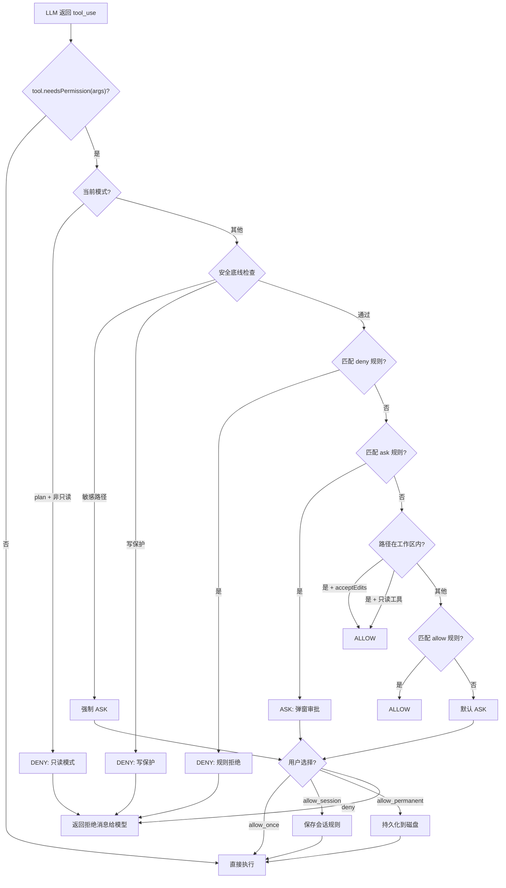

# 第五章：权限系统

> *"Agent 能做的事，不等于 Agent 该做的事"*
> *—— 能力通过工具赋予，边界通过权限约束*

---

## 一、学习分析

### 1.1 权限系统的本质

Agent CLI 工具的核心矛盾：**为了有用必须赋予能力，为了安全必须限制能力**。工具系统（第二章）解决了"Agent 能做什么"，权限系统解决"Agent 被允许做什么"。

权限系统由五个层次构成：

```
┌──────────────────────────────────────────────────────────────┐
│  Layer 5: 审批 UI（PermissionRequest 组件）                    │  向用户展示请求
├──────────────────────────────────────────────────────────────┤
│  Layer 4: 决策引擎（Decision Tree）                            │  Deny → Mode → Allow → Ask
├──────────────────────────────────────────────────────────────┤
│  Layer 3: 规则存储（Rule Store）                               │  会话 / 本地 / 项目 / 用户
├──────────────────────────────────────────────────────────────┤
│  Layer 2: 规则匹配（Rule Matcher）                             │  路径 glob / 命令前缀 / 域名
├──────────────────────────────────────────────────────────────┤
│  Layer 1: 权限模式（Permission Mode）                          │  default / acceptEdits / plan
└──────────────────────────────────────────────────────────────┘
```

### 1.2 三种权限模型对比

#### 模型 A：无门禁（learn-claude-code）

最简模型——不做人机审批，仅依赖静态安全网：

```typescript
// 转写自 learn-claude-code s02
const DANGEROUS_COMMANDS = ["rm -rf /", "sudo", "shutdown", "reboot", "> /dev/"];

function checkBashSafety(command: string): string | null {
    for (const pattern of DANGEROUS_COMMANDS) {
        if (command.includes(pattern)) return `Error: Dangerous command blocked`;
    }
    return null; // 安全
}

function safePath(p: string, workdir: string): string {
    const resolved = path.resolve(workdir, p);
    if (!resolved.startsWith(workdir)) {
        throw new Error(`Path escapes workspace: ${p}`);
    }
    return resolved;
}
```

**特点**：
- Bash：子字符串黑名单 + 超时（120s）+ 输出截断（50KB）
- 文件：`safePath()` 确保路径不逃逸工作区
- 无用户审批，无持久化规则
- 子代理通过**工具白名单**限制（explore 类型只能用 bash + read_file）

**适用场景**：教学、受信环境、容器化部署

#### 模型 B：路径感知 + 交互审批（Claude Code）

从逆向分析中提取的 Claude Code 权限模型：

```typescript
// PB 函数：路径是否在工作区内
function isPathInWorkspace(inputPath: string, workspaceDirs: string[]): boolean {
    const resolved = path.resolve(inputPath);
    return workspaceDirs.some(ws => resolved.startsWith(ws));
}

// 每个工具的 needsPermissions 函数
const toolPermissions: Record<string, (input: any) => boolean> = {
    bash:         () => true,                                    // 始终需要
    mcp:          () => true,                                    // 始终需要
    task:         () => false,                                   // 永不需要
    read:         (i) => !isPathInWorkspace(i.file_path),       // 工作区外才需要
    write:        (i) => !isPathInWorkspace(i.path),            // 工作区外才需要
    edit:         (i) => !isPathInWorkspace(i.path),            // 工作区外才需要
    ls:           (i) => !isPathInWorkspace(i.path),            // 工作区外才需要
    grep:         () => false,                                   // 优化过的工具，不需要
    notebook_edit:(i) => !isPathInWorkspace(i.path),            // 工作区外才需要
};
```

**审批流程**：

```
Config check → allowedTools 包含此工具？→ 是 → ALLOW
                                        → 否 → Interactive prompt
                                                 → Allow (temporary) → 本次允许
                                                 → Allow (permanent) → 加入 allowedTools
                                                 → Reject → 返回拒绝消息给模型
```

**拒绝消息**——注意这是返回给**模型**的，不是给用户看的：

```
"The user doesn't want to proceed with this tool use. The tool use was rejected 
(eg. if it was a file edit, the new_string was NOT written to the file). 
STOP what you are doing and wait for the user to tell you how to proceed."
```

**BashTool 特殊处理——沙箱分流**：

```
sandbox=true  → 受限环境（无写入、无网络）→ 无需审批
sandbox=false → 完全访问 → 需要用户审批
```

**信任对话框**——首次进入新目录时：

```
"Do you trust the files in this folder?"
"Claude Code may read files in this folder. Reading untrusted files may lead to 
Claude Code to behave in unexpected ways."
→ [Yes, proceed] / [No, exit]
```

#### 模型 C：完整规则引擎（Kode-Agent）

生产级权限系统——多模式、多作用域、多持久化层：

**权限模式**：

```typescript
type PermissionMode =
    | "default"             // 标准检查，需要确认
    | "acceptEdits"         // 编辑操作自动放行
    | "plan"                // 只读模式，只能用只读工具
    | "bypassPermissions"   // 绕过所有检查（需安全底线）
    | "dontAsk"             // 自动拒绝（无 UI 环境）
    | "delegate";           // 子任务委托模式
```

**规则行为**：

```typescript
type ToolPermissionRuleBehavior = "allow" | "deny" | "ask";
```

**规则作用域层级**（优先级从高到低）：

```typescript
type PermissionRuleScope =
    | "cliArg"           // 命令行参数（最高优先级）
    | "command"          // 斜杠命令
    | "session"          // 会话级（内存中，退出后丢失）
    | "localSettings"    // .kode/settings.local.json（不提交 git）
    | "projectSettings"  // .kode/settings.json（提交 git）
    | "policySettings"   // 组织策略
    | "userSettings";    // ~/.kode/settings.json（全局）
```

**规则格式**——`ToolName(content)` 的字符串模式：

| 工具 | 规则示例 | 说明 |
|------|---------|------|
| Bash | `Bash(ls:*)` | ls 命令及其任何参数 |
| Bash | `Bash(git status)` | 精确匹配 |
| File | `Read(/src/**)` | /src 下所有文件可读 |
| File | `Edit(~/projects/**)` | 家目录下项目可编辑 |
| WebFetch | `WebFetch(domain:*.github.com)` | GitHub 域名可访问 |
| Skill | `Skill(lint:*)` | lint 前缀的技能可用 |

### 1.3 Kode-Agent 决策树

完整的权限决策流程：

```
Level 1: 模式预检
    ├── bypassPermissions → 检查安全底线 → ALLOW / DENY
    ├── plan 模式 → 工具是 readOnly? → 是 → ALLOW, 否 → DENY
    ├── dontAsk → DENY（不弹窗）
    └── 继续检查

Level 2: 否定规则优先
    └── 任何 deny 规则匹配? → DENY

Level 3: 询问规则
    └── 任何 ask 规则匹配? → ASK（弹窗）

Level 4: 工作目录检查
    └── 路径在工作目录内? → ALLOW

Level 5: 允许规则
    └── 任何 allow 规则匹配? → ALLOW

Level 6: 默认行为
    └── ASK（弹窗，附带建议）
```

**关键设计**：`deny > ask > allow` 的优先级——安全永远优先。即使有 allow 规则，deny 规则也能覆盖它。

### 1.4 路径匹配引擎

Kode-Agent 使用 `ignore`（gitignore 风格）库进行路径匹配：

```typescript
// fileToolPermissionEngine.ts 的核心逻辑
function matchPermissionRuleForPath(opts: {
    inputPath: string;
    toolPermissionContext: ToolPermissionContext;
    operation: "read" | "edit";
    behavior: "allow" | "deny" | "ask";
}): string | null {
    const { inputPath, toolPermissionContext, operation, behavior } = opts;

    // 1. 获取对应行为的规则集
    const ruleMap = {
        allow: toolPermissionContext.alwaysAllowRules,
        deny:  toolPermissionContext.alwaysDenyRules,
        ask:   toolPermissionContext.alwaysAskRules,
    }[behavior];

    // 2. 按作用域优先级遍历
    const scopeOrder: PermissionRuleScope[] = [
        "cliArg", "session", "command",
        "localSettings", "projectSettings",
        "policySettings", "userSettings",
    ];

    for (const scope of scopeOrder) {
        const rules = ruleMap[scope] ?? [];
        for (const rule of rules) {
            const pattern = extractPathPattern(rule, operation);
            if (!pattern) continue;

            // 3. gitignore 风格匹配
            const root = resolveRoot(scope);
            const relative = path.relative(root, inputPath);
            if (ignore().add(pattern).ignores(relative)) {
                return rule;
            }
        }
    }

    return null;
}
```

**特殊路径处理**：

| 场景 | 处理方式 |
|------|---------|
| 符号链接 | `expandSymlinkPaths` 同时检查链接和目标路径 |
| Windows UNC 路径 | `hasSuspiciousWindowsPathPattern` 检测 `\\?\`、UNC 路径 |
| 敏感目录 | `.git`、`.ssh`、`.bashrc` 等 → 始终 ask |
| 写保护文件 | `.kode/settings.json`、`.claude/commands/` → 阻止写入 |

### 1.5 Bash 命令的特殊权限处理

Bash 命令是最复杂的权限场景——需要解析命令内容来判断风险：

```typescript
// Kode-Agent 的 Bash 权限引擎
function checkBashPermissions(command: string, context: ToolPermissionContext): PermissionResult {
    // 1. 安全命令白名单
    const safeCommands = ["git status", "pwd", "ls", "echo", "cat", "head", "tail"];
    if (safeCommands.some(safe => command.startsWith(safe))) {
        return { result: true };
    }

    // 2. 沙箱自动放行
    // sandbox=true → 无写入无网络 → 不需要审批

    // 3. 拆分子命令（&&、||、;、|）
    const subcommands = splitSubcommands(command);

    for (const sub of subcommands) {
        // 4. 精确匹配
        if (matchExactRule(sub, context, "allow")) continue;

        // 5. 前缀匹配（如 Bash(git:*)）
        if (matchPrefixRule(sub, context, "allow")) continue;

        // 6. 提取路径参数，检查文件权限
        const paths = extractPathsFromCommand(sub);
        for (const p of paths) {
            const fileResult = checkFilePermission(p, context);
            if (!fileResult.result) return fileResult;
        }

        // 7. 无匹配 → 需要审批
        return { result: false, shouldPromptUser: true };
    }

    return { result: true };
}
```

**子命令拆分的必要性**：用户可能写 `git add . && rm -rf /`，如果只检查整个命令会匹配 `git:*` 规则而放行。必须拆分后逐个检查。

### 1.6 用户审批流程

Kode-Agent 的完整审批 UI 流程：

```
1. hasPermissionsToUseTool() → { result: false, shouldPromptUser: true, suggestions: [...] }
    ↓
2. REPL 渲染工具专属的 PermissionRequest 组件
    ├── FileEditPermissionRequest（显示 diff 预览）
    ├── BashPermissionRequest（显示命令 + 风险等级）
    ├── WebFetchPermissionRequest（显示 URL + 域名）
    └── FallbackPermissionRequest（通用模板）
    ↓
3. 用户选择：
    ├── [Yes, this time]     → onAllow("temporary") → 仅本次放行
    ├── [Yes, always]        → onAllow("permanent") → 写入持久化规则
    ├── [Yes, for session]   → applyToolPermissionUpdate(session) → 会话级规则
    └── [No]                 → onReject() → 返回拒绝消息给模型
    ↓
4. 持久化（permanent 选项）：
    └── persistToolPermissionUpdateToDisk(destination, update)
        → 写入 .kode/settings.local.json 或 ~/.kode/settings.json
```

**建议系统**——当拒绝时，系统会提供快速操作建议：

```typescript
function suggestFilePermissionUpdates(
    path: string,
    operation: "read" | "edit",
): ToolPermissionContextUpdate[] {
    return [
        {
            type: "addRules",
            destination: "session",
            behavior: "allow",
            rules: [`${operation === "read" ? "Read" : "Edit"}(${path})`],
        },
        {
            type: "addRules",
            destination: "session",
            behavior: "allow",
            rules: [`${operation === "read" ? "Read" : "Edit"}(${path.replace(/[^/]+$/, "**")})`],
        },
        {
            type: "setMode",
            mode: "acceptEdits",
            destination: "session",
        },
    ];
}
```

三个建议分别是：允许该文件、允许该目录、切换到 acceptEdits 模式。

### 1.7 权限模式循环

Kode-Agent 支持用户在运行时切换权限模式：

```
default → acceptEdits → plan → bypassPermissions(如可用) → default
```

```typescript
function getNextPermissionMode(
    current: PermissionMode,
    bypassAvailable: boolean,
): PermissionMode {
    switch (current) {
        case "default":       return "acceptEdits";
        case "acceptEdits":   return "plan";
        case "plan":          return bypassAvailable ? "bypassPermissions" : "default";
        case "bypassPermissions": return "default";
        default:              return "default";
    }
}
```

`dontAsk` 不在循环中——它由 CLI 参数或 API 调用方设定，适用于无 UI 的自动化场景。

### 1.8 工具定义中的权限钩子

每个工具可以自定义权限检查逻辑：

```typescript
// Kode-Agent 工具定义中的权限相关字段
interface ToolDefinition {
    name: string;
    isReadOnly: boolean;                     // 只读标记

    needsPermissions(input: any): boolean;   // 是否需要权限检查
    checkPermissions?(                       // 自定义检查逻辑
        input: any,
        context: ToolUseContext,
        permContext: ToolPermissionContext,
    ): Promise<PermissionResult>;
    getPath?(input: any): string | undefined; // 提取操作路径（用于规则匹配）
}
```

**三个钩子的分工**：
- `needsPermissions(input)`：快速过滤——如果返回 false，跳过整个权限流程
- `getPath(input)`：提取路径——用于路径规则匹配，不是所有工具都有路径
- `checkPermissions(input, ...)`：完整检查——工具特定的复杂逻辑（如 Bash 的子命令拆分）

### 1.9 安全底线（Safety Floor）

即使在 `bypassPermissions` 模式下，也有不可逾越的底线：

```typescript
// Kode-Agent 的安全底线
const WRITE_PROTECTED_PATHS = [
    ".kode/settings.json",
    ".kode/settings.local.json",
    ".claude/commands/",
];

const SENSITIVE_PATHS = [
    ".git/",
    ".ssh/",
    ".bashrc",
    ".zshrc",
    ".env",
    ".env.*",
];

function checkSafetyFloor(
    path: string,
    operation: "read" | "write",
    mode: PermissionMode,
): boolean {
    // 写保护文件：即使 bypassPermissions 也不允许写入
    if (operation === "write") {
        if (WRITE_PROTECTED_PATHS.some(p => path.includes(p))) return false;
    }
    // 敏感文件：即使 bypassPermissions 也要 ask
    if (SENSITIVE_PATHS.some(p => path.includes(p))) return false;

    return true;
}
```

Claude Code 的 `dangerouslySkipPermissions` 更加严格——只允许在 Docker 容器 + 无网络环境中使用，且不允许 root/sudo。

---

## 二、思考提炼

### 2.1 核心设计原则

**原则 1：安全默认（Secure by Default）**

默认行为应该是"拒绝"而非"允许"。用户需要显式授权才能扩大 Agent 的能力范围。
- learn-claude-code 违反了这一原则——工具直接执行
- Claude Code 和 Kode-Agent 遵守了——未知操作默认 ask

**原则 2：Deny 永远优先**

```
deny > ask > allow
```

这是所有安全系统的基本原则。即使有一条 allow 规则匹配了路径 `/etc/passwd`，只要有一条 deny 规则也匹配它，最终结果是 deny。不存在"allow 覆盖 deny"的情况。

**原则 3：路径是一切的基础**

Agent CLI 工具 90% 的操作都涉及文件系统。路径匹配是权限系统的核心：
- 工作区内 vs 工作区外
- glob 模式匹配
- 符号链接解析
- 敏感目录检测

**原则 4：工具决定自己的权限需求**

权限引擎不应该硬编码"哪个工具需要什么权限"。每个工具通过 `needsPermissions(input)` 自声明——这使得新增工具时不需要修改权限引擎。

**原则 5：权限是分层渐进的**

```
临时（一次性） → 会话级 → 项目级 → 全局级
```

用户可以从最小授权开始，逐步放宽。每一层都有明确的作用域和持久化位置。

**原则 6：拒绝消息是给模型看的**

权限拒绝后返回给模型的消息非常重要——它不仅要告诉模型"操作被拒绝了"，还要指导模型的后续行为：

```
"STOP what you are doing and wait for the user to tell you how to proceed."
```

如果只说"permission denied"，模型可能会反复重试或尝试其他方式绕过。

### 2.2 权限粒度设计

| 维度 | 粗粒度 | 细粒度 | 最优选择 |
|------|--------|--------|---------|
| 工具级 | 整个 bash 允许/拒绝 | 按命令前缀匹配 | **细粒度** — `Bash(git:*)` 比 `Bash(*)` 更安全 |
| 路径级 | 工作区内/外二分 | glob 模式 | **先粗后细** — 工作区内自动放行，工作区外细粒度 |
| 操作级 | 全部操作统一 | 读/写分离 | **读写分离** — 读操作风险低，写操作风险高 |
| 时间级 | 永久 | 临时/会话/持久 | **三级** — 临时 + 会话 + 持久 |

### 2.3 最优架构选择

| 设计维度 | 最优选择 | 理由 |
|----------|---------|------|
| 决策模型 | **deny > ask > allow 优先级链** | 安全第一原则 |
| 规则格式 | **`ToolName(content)` 字符串** | 人类可读、易序列化、支持 glob |
| 匹配引擎 | **gitignore 风格 + minimatch** | 开发者熟悉、成熟生态 |
| 权限模式 | **default + acceptEdits + plan** | 覆盖日常场景 + 只读场景 |
| 持久化 | **会话(内存) + 项目(JSON) + 全局(JSON)** | 分层、可覆盖 |
| 安全底线 | **硬编码敏感路径黑名单** | 即使 bypass 也不可逾越 |
| 工具集成 | **工具自声明 needsPermissions** | 权限引擎不关心工具细节 |
| 拒绝策略 | **返回结构化消息 + 行为指导** | 引导模型正确响应 |

---

## 三、最优设计方案

### 3.1 类型定义

```typescript
import { z } from "zod";

// ── 权限模式 ──────────────────────────────────────────────────

type PermissionMode = "default" | "acceptEdits" | "plan";

// ── 规则行为 ──────────────────────────────────────────────────

type RuleBehavior = "allow" | "deny" | "ask";

// ── 规则作用域（优先级从高到低）──────────────────────────────

type RuleScope = "session" | "project" | "user";

// ── 规则定义 ──────────────────────────────────────────────────

interface PermissionRule {
    scope: RuleScope;
    behavior: RuleBehavior;
    pattern: string;           // "ToolName(content)" 格式
}

// ── 权限检查结果 ──────────────────────────────────────────────

type PermissionResult =
    | { allowed: true }
    | {
          allowed: false;
          reason: string;
          shouldPrompt: boolean;    // 是否应该弹窗询问用户
          suggestions?: PermissionSuggestion[];
      };

// ── 用户审批建议 ──────────────────────────────────────────────

interface PermissionSuggestion {
    label: string;              // 展示给用户的描述
    action: PermissionAction;
}

type PermissionAction =
    | { type: "addRule"; scope: RuleScope; behavior: RuleBehavior; pattern: string }
    | { type: "setMode"; mode: PermissionMode };

// ── 用户审批回调 ──────────────────────────────────────────────

type ApprovalDecision =
    | { type: "allow_once" }
    | { type: "allow_session"; rule: string }
    | { type: "allow_permanent"; rule: string; scope: RuleScope }
    | { type: "deny" };

type PermissionPrompter = (
    toolName: string,
    args: Record<string, unknown>,
    suggestions: PermissionSuggestion[],
) => Promise<ApprovalDecision>;

// ── 工具权限钩子（扩展第二章的 ToolDef）────────────────────

interface PermissionAwareToolDef {
    name: string;
    isReadOnly: boolean;
    needsPermission(args: Record<string, unknown>): boolean;
    getPath?(args: Record<string, unknown>): string | undefined;
}
```

### 3.2 敏感路径检测

```typescript
const SENSITIVE_PATTERNS = [
    "**/.ssh/**",
    "**/.gnupg/**",
    "**/.aws/**",
    "**/.env",
    "**/.env.*",
    "**/credentials*",
    "**/secrets*",
    "**/*.pem",
    "**/*.key",
];

const WRITE_PROTECTED = [
    "**/.git/config",
    "**/.git/hooks/**",
];

function isSensitivePath(filePath: string): boolean {
    return SENSITIVE_PATTERNS.some(p => minimatch(filePath, p, { dot: true }));
}

function isWriteProtected(filePath: string): boolean {
    return WRITE_PROTECTED.some(p => minimatch(filePath, p, { dot: true }));
}
```

### 3.3 规则存储

```typescript
import * as fs from "fs/promises";
import * as path from "path";
import minimatch from "minimatch";

interface RuleStoreConfig {
    projectDir: string;       // 项目目录
    userConfigDir: string;    // ~/.agent-kit/
}

class RuleStore {
    private sessionRules: PermissionRule[] = [];
    private projectRules: PermissionRule[] = [];
    private userRules: PermissionRule[] = [];

    constructor(private config: RuleStoreConfig) {}

    async load(): Promise<void> {
        this.projectRules = await this.loadFromFile(
            path.join(this.config.projectDir, ".agent-kit", "permissions.json"),
            "project",
        );
        this.userRules = await this.loadFromFile(
            path.join(this.config.userConfigDir, "permissions.json"),
            "user",
        );
    }

    private async loadFromFile(filePath: string, scope: RuleScope): Promise<PermissionRule[]> {
        try {
            const raw = JSON.parse(await fs.readFile(filePath, "utf-8"));
            const rules: PermissionRule[] = [];
            for (const behavior of ["allow", "deny", "ask"] as RuleBehavior[]) {
                for (const pattern of raw[behavior] ?? []) {
                    rules.push({ scope, behavior, pattern });
                }
            }
            return rules;
        } catch {
            return [];
        }
    }

    /**
     * 获取所有规则，按作用域优先级排序
     */
    getAllRules(): PermissionRule[] {
        return [...this.sessionRules, ...this.projectRules, ...this.userRules];
    }

    /**
     * 按行为获取规则
     */
    getRulesByBehavior(behavior: RuleBehavior): PermissionRule[] {
        return this.getAllRules().filter(r => r.behavior === behavior);
    }

    /**
     * 添加会话级规则
     */
    addSessionRule(behavior: RuleBehavior, pattern: string): void {
        this.sessionRules.push({ scope: "session", behavior, pattern });
    }

    /**
     * 持久化规则到磁盘
     */
    async persistRule(scope: Exclude<RuleScope, "session">, behavior: RuleBehavior, pattern: string): Promise<void> {
        const filePath = scope === "project"
            ? path.join(this.config.projectDir, ".agent-kit", "permissions.json")
            : path.join(this.config.userConfigDir, "permissions.json");

        let data: Record<string, string[]> = {};
        try {
            data = JSON.parse(await fs.readFile(filePath, "utf-8"));
        } catch { /* 文件不存在 */ }

        data[behavior] = data[behavior] ?? [];
        if (!data[behavior].includes(pattern)) {
            data[behavior].push(pattern);
        }

        await fs.mkdir(path.dirname(filePath), { recursive: true });
        await fs.writeFile(filePath, JSON.stringify(data, null, 2));

        // 同步到内存
        const target = scope === "project" ? this.projectRules : this.userRules;
        target.push({ scope, behavior, pattern });
    }
}
```

**存储格式**（`.agent-kit/permissions.json`）：

```json
{
    "allow": [
        "Bash(git:*)",
        "Bash(npm:*)",
        "Read(/src/**)"
    ],
    "deny": [
        "Bash(rm -rf:*)",
        "Edit(**/.env)"
    ],
    "ask": [
        "WebFetch(domain:*)"
    ]
}
```

### 3.4 规则匹配器

```typescript
// ── 规则解析 ──────────────────────────────────────────────

interface ParsedRule {
    toolName: string;        // "Bash", "Read", "Edit", "WebFetch" 等
    content: string | null;  // 括号内的内容，null 表示匹配所有
}

function parseRule(pattern: string): ParsedRule {
    const match = pattern.match(/^(\w+)(?:\((.+)\))?$/);
    if (!match) return { toolName: pattern, content: null };
    return { toolName: match[1], content: match[2] ?? null };
}

// ── 规则匹配 ──────────────────────────────────────────────

function matchRule(rule: ParsedRule, toolName: string, context: MatchContext): boolean {
    if (rule.toolName !== toolName) return false;
    if (rule.content === null) return true;

    switch (toolName) {
        case "Bash":
            return matchBashRule(rule.content, context.command!);
        case "Read":
        case "Edit":
        case "Write":
            return matchPathRule(rule.content, context.filePath!);
        case "WebFetch":
            return matchWebRule(rule.content, context.url!);
        default:
            return rule.content === "*";
    }
}

interface MatchContext {
    command?: string;
    filePath?: string;
    url?: string;
}

// ── Bash 规则匹配 ─────────────────────────────────────────

function matchBashRule(ruleContent: string, command: string): boolean {
    if (ruleContent === "*") return true;

    // 前缀匹配：git:* → 匹配以 "git" 开头的命令
    if (ruleContent.endsWith(":*")) {
        const prefix = ruleContent.slice(0, -2);
        return command.startsWith(prefix);
    }

    // 精确匹配
    return command === ruleContent;
}

// ── 路径规则匹配 ───────────────────────────────────────────

function matchPathRule(ruleContent: string, filePath: string): boolean {
    if (ruleContent === "**") return true;
    return minimatch(filePath, ruleContent, { dot: true });
}

// ── Web 规则匹配 ───────────────────────────────────────────

function matchWebRule(ruleContent: string, url: string): boolean {
    if (ruleContent === "*") return true;

    // domain:pattern
    if (ruleContent.startsWith("domain:")) {
        const pattern = ruleContent.slice(7);
        const hostname = new URL(url).hostname;
        return minimatch(hostname, pattern);
    }

    return false;
}
```

### 3.5 权限决策引擎

```typescript
class PermissionEngine {
    private mode: PermissionMode = "default";
    private ruleStore: RuleStore;
    private workspaceDirs: string[];

    constructor(ruleStore: RuleStore, workspaceDirs: string[]) {
        this.ruleStore = ruleStore;
        this.workspaceDirs = workspaceDirs.map(d => path.resolve(d));
    }

    setMode(mode: PermissionMode): void {
        this.mode = mode;
    }

    getMode(): PermissionMode {
        return this.mode;
    }

    /**
     * 核心决策方法
     */
    check(
        tool: PermissionAwareToolDef,
        args: Record<string, unknown>,
    ): PermissionResult {
        // ── Phase 0: 快速过滤 ─────────────────────────────
        if (!tool.needsPermission(args)) {
            return { allowed: true };
        }

        // ── Phase 1: 模式预检 ─────────────────────────────
        if (this.mode === "plan" && !tool.isReadOnly) {
            return {
                allowed: false,
                reason: "Plan mode: only read-only tools are allowed",
                shouldPrompt: false,
            };
        }

        // ── Phase 2: 安全底线 ─────────────────────────────
        const toolPath = tool.getPath?.(args);
        if (toolPath) {
            if (isSensitivePath(toolPath)) {
                return {
                    allowed: false,
                    reason: `Sensitive path detected: ${toolPath}`,
                    shouldPrompt: true,
                    suggestions: this.suggestForPath(toolPath, tool.isReadOnly ? "read" : "write"),
                };
            }
            if (!tool.isReadOnly && isWriteProtected(toolPath)) {
                return {
                    allowed: false,
                    reason: `Write-protected path: ${toolPath}`,
                    shouldPrompt: false,
                };
            }
        }

        // ── Phase 3: 构建匹配上下文 ───────────────────────
        const matchCtx = this.buildMatchContext(tool.name, args, toolPath);

        // ── Phase 4: Deny 规则（最高优先级）────────────────
        for (const rule of this.ruleStore.getRulesByBehavior("deny")) {
            const parsed = parseRule(rule.pattern);
            if (matchRule(parsed, tool.name, matchCtx)) {
                return {
                    allowed: false,
                    reason: `Denied by rule: ${rule.pattern} (${rule.scope})`,
                    shouldPrompt: false,
                };
            }
        }

        // ── Phase 5: Ask 规则 ──────────────────────────────
        for (const rule of this.ruleStore.getRulesByBehavior("ask")) {
            const parsed = parseRule(rule.pattern);
            if (matchRule(parsed, tool.name, matchCtx)) {
                return {
                    allowed: false,
                    reason: `Requires approval per rule: ${rule.pattern}`,
                    shouldPrompt: true,
                    suggestions: toolPath
                        ? this.suggestForPath(toolPath, tool.isReadOnly ? "read" : "write")
                        : [],
                };
            }
        }

        // ── Phase 6: 工作区检查 ────────────────────────────
        if (toolPath) {
            const resolved = path.resolve(toolPath);
            const inWorkspace = this.workspaceDirs.some(ws => resolved.startsWith(ws));

            if (inWorkspace) {
                // acceptEdits 模式：工作区内的写操作自动放行
                if (this.mode === "acceptEdits" || tool.isReadOnly) {
                    return { allowed: true };
                }
            }
        }

        // ── Phase 7: Allow 规则 ────────────────────────────
        for (const rule of this.ruleStore.getRulesByBehavior("allow")) {
            const parsed = parseRule(rule.pattern);
            if (matchRule(parsed, tool.name, matchCtx)) {
                return { allowed: true };
            }
        }

        // ── Phase 8: 默认 → Ask ───────────────────────────
        return {
            allowed: false,
            reason: `No matching rule for ${tool.name}`,
            shouldPrompt: true,
            suggestions: toolPath
                ? this.suggestForPath(toolPath, tool.isReadOnly ? "read" : "write")
                : [{ label: `Allow ${tool.name} for this session`, action: { type: "addRule", scope: "session", behavior: "allow", pattern: tool.name } }],
        };
    }

    private buildMatchContext(
        toolName: string,
        args: Record<string, unknown>,
        toolPath: string | undefined,
    ): MatchContext {
        return {
            command: toolName === "Bash" ? String(args.command ?? "") : undefined,
            filePath: toolPath,
            url: toolName === "WebFetch" ? String(args.url ?? "") : undefined,
        };
    }

    private suggestForPath(filePath: string, operation: "read" | "write"): PermissionSuggestion[] {
        const toolPrefix = operation === "read" ? "Read" : "Edit";
        const dir = path.dirname(filePath) + "/**";

        return [
            {
                label: `Allow ${operation} for this file (session)`,
                action: { type: "addRule", scope: "session", behavior: "allow", pattern: `${toolPrefix}(${filePath})` },
            },
            {
                label: `Allow ${operation} for ${path.dirname(filePath)}/ (session)`,
                action: { type: "addRule", scope: "session", behavior: "allow", pattern: `${toolPrefix}(${dir})` },
            },
            {
                label: "Switch to acceptEdits mode",
                action: { type: "setMode", mode: "acceptEdits" },
            },
        ];
    }
}
```

### 3.6 Bash 子命令拆分

```typescript
/**
 * 将复合命令拆分为子命令列表
 * "git add . && npm test" → ["git add .", "npm test"]
 */
function splitSubcommands(command: string): string[] {
    const results: string[] = [];
    let current = "";
    let depth = 0;          // 括号/引号嵌套深度
    let inSingle = false;
    let inDouble = false;
    let escape = false;

    for (let i = 0; i < command.length; i++) {
        const ch = command[i];

        if (escape) { current += ch; escape = false; continue; }
        if (ch === "\\") { current += ch; escape = true; continue; }
        if (ch === "'" && !inDouble) { inSingle = !inSingle; current += ch; continue; }
        if (ch === '"' && !inSingle) { inDouble = !inDouble; current += ch; continue; }
        if (inSingle || inDouble) { current += ch; continue; }

        if (ch === "(" || ch === "{") { depth++; current += ch; continue; }
        if (ch === ")" || ch === "}") { depth--; current += ch; continue; }

        if (depth > 0) { current += ch; continue; }

        // 检测分隔符：&&、||、;、|
        if (ch === "&" && command[i + 1] === "&") {
            if (current.trim()) results.push(current.trim());
            current = "";
            i++;
            continue;
        }
        if (ch === "|" && command[i + 1] === "|") {
            if (current.trim()) results.push(current.trim());
            current = "";
            i++;
            continue;
        }
        if (ch === ";") {
            if (current.trim()) results.push(current.trim());
            current = "";
            continue;
        }
        if (ch === "|") {
            if (current.trim()) results.push(current.trim());
            current = "";
            continue;
        }

        current += ch;
    }

    if (current.trim()) results.push(current.trim());
    return results;
}
```

### 3.7 审批回调处理

```typescript
/**
 * 处理用户的审批决定，更新规则存储
 */
async function handleApproval(
    decision: ApprovalDecision,
    ruleStore: RuleStore,
    engine: PermissionEngine,
): Promise<void> {
    switch (decision.type) {
        case "allow_once":
            break;

        case "allow_session":
            ruleStore.addSessionRule("allow", decision.rule);
            break;

        case "allow_permanent":
            await ruleStore.persistRule(decision.scope, "allow", decision.rule);
            break;

        case "deny":
            break;
    }
}

/**
 * 权限拒绝后返回给模型的消息
 */
function formatRejectionForModel(toolName: string, reason: string): string {
    return [
        `Permission denied for ${toolName}: ${reason}`,
        "",
        "The user has rejected this tool use. The operation was NOT executed.",
        "STOP what you are doing and wait for the user to tell you how to proceed.",
        "Do NOT retry the same operation or attempt workarounds.",
    ].join("\n");
}
```

### 3.8 接入 Agent 循环

```typescript
// ── 增强第二章的 ToolRegistry ─────────────────────────────

class PermissionAwareToolRegistry extends ToolRegistry {
    private engine: PermissionEngine;
    private prompter: PermissionPrompter;

    constructor(
        engine: PermissionEngine,
        prompter: PermissionPrompter,
    ) {
        super();
        this.engine = engine;
        this.prompter = prompter;
    }

    override async execute(
        name: string,
        rawArgs: Record<string, unknown>,
        maxOutputChars = 30_000,
    ): Promise<string> {
        const tool = this.get(name);
        if (!tool) return `Error: Unknown tool "${name}"`;

        // ── 权限检查 ──────────────────────────────────────
        const permResult = this.engine.check(tool, rawArgs);

        if (!permResult.allowed) {
            if (!permResult.shouldPrompt) {
                return formatRejectionForModel(name, permResult.reason);
            }

            // 弹窗询问用户
            const decision = await this.prompter(
                name,
                rawArgs,
                permResult.suggestions ?? [],
            );

            if (decision.type === "deny") {
                return formatRejectionForModel(name, "User rejected");
            }

            // 应用审批决定
            await handleApproval(decision, this.engine["ruleStore"], this.engine);
        }

        // ── 输入校验 + 执行 + 截断 ──────────────────────
        const parsed = tool.schema.safeParse(rawArgs);
        if (!parsed.success) {
            return `Error: Invalid input for ${name}: ${parsed.error.message}`;
        }

        try {
            const raw = await tool.execute(parsed.data);
            return normalizeToSize(raw, maxOutputChars);
        } catch (err: any) {
            return `Error: ${err.message ?? String(err)}`;
        }
    }
}

// ── 使用示例 ──────────────────────────────────────────────

const ruleStore = new RuleStore({
    projectDir: process.cwd(),
    userConfigDir: path.join(os.homedir(), ".agent-kit"),
});
await ruleStore.load();

const engine = new PermissionEngine(ruleStore, [process.cwd()]);

const prompter: PermissionPrompter = async (toolName, args, suggestions) => {
    // TUI 中渲染审批 UI，等待用户选择
    // 简化版：直接 readline 询问
    const answer = await question(
        `Allow ${toolName}(${JSON.stringify(args)})? [y/n/s(ession)/p(ermanent)] `
    );
    switch (answer.toLowerCase()) {
        case "y": return { type: "allow_once" };
        case "s": return { type: "allow_session", rule: `${toolName}` };
        case "p": return { type: "allow_permanent", rule: `${toolName}`, scope: "project" };
        default:  return { type: "deny" };
    }
};

const registry = new PermissionAwareToolRegistry(engine, prompter);
registry.registerAll([bashTool, readFileTool, writeFileTool, editFileTool, globTool, grepTool]);

const config: AgentConfig = {
    maxTurns: 50,
    systemPrompt: "...",
    tools: registry.getSchemas(),
    executeTool: (name, args) => registry.execute(name, args),
    llm: myLLMClient,
};
```

**核心设计思路**：
- `PermissionAwareToolRegistry` 继承自第二章的 `ToolRegistry`，只覆盖 `execute()` 方法
- 权限检查在输入校验之前——先判断"能不能做"，再判断"输入对不对"
- `prompter` 是一个异步回调，由 UI 层实现——TUI、Web UI、测试 mock 各自提供
- Agent 核心循环（第一章）完全不需要修改——权限逻辑全部封装在 `executeTool` 中

### 3.9 完整权限决策流程图



### 3.10 扩展路线图

| 阶段 | 扩展 | 修改点 |
|------|------|--------|
| **当前** | 模式 + 规则引擎 + 路径匹配 + 会话/持久化 | 本章实现 |
| **+沙箱** | Bash 命令在 sandbox-exec 中执行 | `bashTool.execute()` 增加沙箱分流 |
| **+工具专属 UI** | FileEdit 显示 diff，Bash 显示风险等级 | `prompter` 接收工具类型信息 |
| **+组织策略** | 新增 `policySettings` 作用域，优先级高于 project | `RuleScope` + `RuleStore` |
| **+命令注入检测** | Bash 权限检查前用 LLM 分析命令语义 | `checkBashPermissions` 增加 LLM 调用 |
| **+信任对话框** | 首次进入目录时询问 | 新增 `TrustManager` |
| **+审计日志** | 每次权限决策记录到文件 | `PermissionEngine.check()` 增加日志钩子 |
| **+Headless 模式** | API/CI 环境下的非交互式审批 | `prompter` 替换为 JSON stdin/stdout |

---

## 四、关键源码索引

| 文件 | 说明 |
|------|------|
| `origin/Kode-Agent-main/src/types/permissionMode.ts` | 权限模式类型定义 |
| `origin/Kode-Agent-main/src/types/toolPermissionContext.ts` | 权限上下文 + 规则类型 |
| `origin/Kode-Agent-main/src/core/permissions/engine/index.ts` | 主决策引擎入口 |
| `origin/Kode-Agent-main/src/core/permissions/rules/permissionKey.ts` | 规则 Key 生成 |
| `origin/Kode-Agent-main/src/core/permissions/store/savePermission.ts` | 规则持久化 |
| `origin/Kode-Agent-main/src/utils/permissions/fileToolPermissionEngine.ts` | 文件路径权限引擎 |
| `origin/Kode-Agent-main/src/utils/permissions/bashToolPermissionEngine.ts` | Bash 命令权限引擎 |
| `origin/Kode-Agent-main/src/utils/permissions/toolPermissionSettings.ts` | 磁盘设置读写 |
| `origin/Kode-Agent-main/src/utils/permissions/toolPermissionContextState.ts` | 会话级状态管理 |
| `origin/Kode-Agent-main/src/utils/permissions/permissionModeState.ts` | 模式切换状态 |
| `origin/Kode-Agent-main/src/utils/permissions/ruleString.ts` | 规则字符串解析工具 |
| `origin/Kode-Agent-main/src/utils/permissions/filesystem.ts` | 运行时文件系统权限集合 |
| `origin/Kode-Agent-main/src/ui/components/permissions/` | 权限审批 UI 组件目录 |
| `origin/learn-claude-code-main/agents/s02_tool_use.py` | safe_path + bash 黑名单 |
| `origin/learn-claude-code-main/skills/agent-builder/references/tool-templates.py` | 工具模板中的安全检查 |
| `origin/claude-code-reverse-main/v1/merged-chunks/claude-code-3.mjs` | PB() 路径检查函数 |
| `origin/claude-code-reverse-main/v1/merged-chunks/claude-code-5.mjs` | 拒绝消息常量 fu |
| `origin/southbridge-claude-code-analysis/README.md` | 权限决策树 + ToolPermissionContext |
