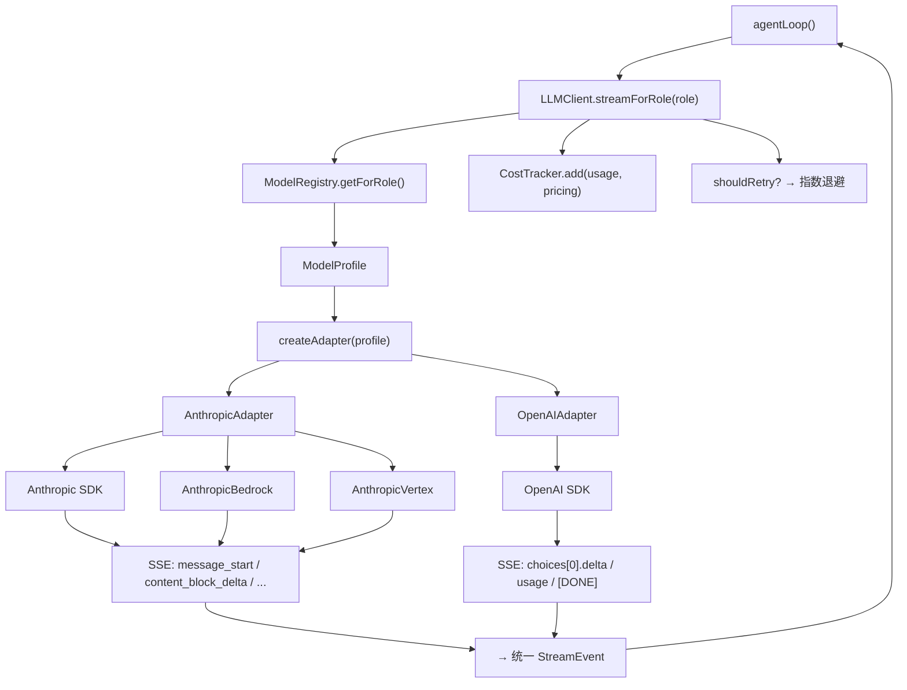

# 第六章：多模型集成

> *"LLM 是 Agent 的大脑，但大脑不止一种"*
> *—— 一套接口，多个提供商，按角色路由*

---

## 一、学习分析

### 1.1 多模型集成的核心挑战

Agent CLI 工具需要支持多个 LLM 提供商（Anthropic、OpenAI、Bedrock、Vertex、DeepSeek……），但每个提供商的 API 格式、流式协议、响应结构、能力集合、定价都不同。核心挑战是：

```
                   ┌─────────────┐
                   │  Agent Loop  │    统一的 LLMClient 接口
                   └──────┬──────┘
                          │
           ┌──────────────┼──────────────┐
           ▼              ▼              ▼
    ┌────────────┐ ┌────────────┐ ┌────────────┐
    │  Anthropic  │ │   OpenAI   │ │   Bedrock  │    各自的 API 格式
    │  Messages   │ │    Chat    │ │  Invoke    │
    │    API      │ │ Completions│ │  Stream    │
    └────────────┘ └────────────┘ └────────────┘
```

**五个归一化维度**：

| 维度 | 差异 | 归一化目标 |
|------|------|-----------|
| 请求格式 | system prompt 位置、tool 格式、cache_control | 统一的 Message + ToolSchema |
| 流式协议 | SSE 事件类型、delta 结构 | 统一的 StreamEvent |
| 响应结构 | content blocks vs choices、tool_calls 位置 | 统一的 AssistantMessage |
| Token 计量 | 字段名不同、cache token 概念不通用 | 统一的 TokenUsage |
| 能力集合 | thinking、vision、function calling 支持度 | 统一的 ModelCapabilities |

### 1.2 四种客户端架构对比

#### 架构 A：直连无抽象（learn-claude-code）

```typescript
// 转写自 learn-claude-code 的模式
import Anthropic from "@anthropic-ai/sdk";

const client = new Anthropic({
    baseURL: process.env.ANTHROPIC_BASE_URL, // 可选：兼容提供商
});

const response = await client.messages.create({
    model: process.env.MODEL_ID!,
    system: SYSTEM_PROMPT,
    messages,
    tools: TOOLS,
    max_tokens: 8000,
});

// 直接访问 Anthropic SDK 类型
for (const block of response.content) {
    if (block.type === "text") { /* ... */ }
    if (block.type === "tool_use") { /* ... */ }
}
```

**特点**：
- 无流式、无抽象层、无类型归一化
- 通过 `ANTHROPIC_BASE_URL` 切换到兼容提供商（DeepSeek、MiniMax、GLM、Kimi）
- 所有提供商都必须兼容 Anthropic Messages API 格式
- 适用于：教学、快速原型

#### 架构 B：OpenAI SDK 统一层（agent-kit 当前）

```typescript
// agent-kit 现有实现
class LLMClient {
    private readonly clients: Map<string, OpenAI> = new Map();

    private getClient(profile: ModelProfile): OpenAI {
        const key = `${profile.baseUrl ?? "default"}::${profile.apiKey ?? ""}`;
        if (!this.clients.has(key)) {
            this.clients.set(key, new OpenAI({
                apiKey: profile.apiKey,
                baseURL: profile.baseUrl,
            }));
        }
        return this.clients.get(key)!;
    }

    async *chatCompletion(
        messages: Array<Record<string, any>>,
        tools: ToolSchema[] | null,
        profile: ModelProfile,
        stream = true,
    ): AsyncGenerator<StreamEvent> {
        // OpenAI Chat Completions API
        // 所有提供商都通过 OpenAI SDK 兼容层访问
    }
}
```

**特点**：
- 以 OpenAI Chat Completions 为统一协议
- 客户端实例按 `baseUrl + apiKey` 缓存
- 支持流式和非流式
- `ModelRegistry` 管理多个 profile，按角色（main/compaction/subagent）路由
- 局限：无法利用 Anthropic SDK 的 thinking、cache_control 等专有特性

#### 架构 C：多提供商原生支持（Claude Code）

从逆向分析中提取：

```typescript
// Claude Code 的提供商选择（JJ1 函数）
function getAnthropicClient(): AnthropicClient {
    if (USE_BEDROCK) {
        return new AnthropicBedrock({
            region: process.env.AWS_REGION ?? "us-east-1",
            baseURL: process.env.ANTHROPIC_BEDROCK_BASE_URL,
        });
    }
    if (USE_VERTEX) {
        return new AnthropicVertex({
            region: process.env.CLOUD_ML_REGION ?? "us-east5",
            projectId: process.env.ANTHROPIC_VERTEX_PROJECT_ID,
        });
    }
    return new Anthropic({
        apiKey: process.env.ANTHROPIC_API_KEY,
    });
}
```

**特点**：
- 三个提供商（Anthropic 直连、Bedrock、Vertex），全部使用 Anthropic SDK 的不同后端
- Bedrock：SigV4 签名认证、`/model/${model}/invoke-with-response-stream` 路径映射
- Vertex：Google OAuth token 自动刷新、`/publishers/anthropic/models/${model}:streamRawPredict`
- 只支持 Anthropic 模型，不支持 OpenAI/其他提供商
- 客户端实例全局缓存（单例）

**模型路由**：

| 任务 | 模型 | max_tokens | temperature |
|------|------|------------|-------------|
| 主 Agent 循环 | Sonnet 4 | 20000 | 默认 |
| 上下文压缩 | Sonnet 4 | 20000 | 默认 |
| 配额检查 | Haiku 3.5 | 1 | 0 |
| 话题检测 | Haiku 3.5 | 512 | 0 |
| 对话摘要 | Haiku 3.5 | — | — |
| AgentTool 综合 | Haiku | — | 0.3 |

#### 架构 D：完整适配器模式（Kode-Agent）

Kode-Agent 实现了最完整的多提供商抽象：

```typescript
// 适配器层级
abstract class ModelAPIAdapter {
    abstract parseStreamingResponse(response: Response): AsyncGenerator<StreamingEvent>;
    abstract buildRequestBody(messages, tools, options): Record<string, any>;
    normalizeTokens(usage: any): TokenUsage { /* 统一 token 字段 */ }
}

abstract class OpenAIAdapter extends ModelAPIAdapter {
    parseSSEChunk(line: string): any { /* data: 行解析 */ }
}

class ChatCompletionsAdapter extends OpenAIAdapter {
    // /v1/chat/completions 格式
    buildRequestBody(...) { /* OpenAI Chat Completions 格式 */ }
    async *parseStreamingResponse(...) { /* choices[0].delta 解析 */ }
}

class ResponsesAPIAdapter extends OpenAIAdapter {
    // GPT-5 Responses API 格式
    buildRequestBody(...) { /* input: [...] 格式 */ }
    async *parseStreamingResponse(...) { /* response.output_text.delta 解析 */ }
}
```

**适配器选择逻辑**：

```typescript
class ModelAdapterFactory {
    static createAdapter(profile: ModelProfile): ModelAPIAdapter {
        const caps = getModelCapabilities(profile.modelName);

        if (caps.apiArchitecture.primary === "responses_api"
            && isOfficialOpenAI(profile.baseURL)) {
            return new ResponsesAPIAdapter(profile);
        }

        return new ChatCompletionsAdapter(profile);
    }
}
```

**路由分叉**——Anthropic 原生 vs OpenAI 兼容：

```typescript
async function queryLLM(messages, systemPrompt, tools, options) {
    const model = ModelManager.resolveModelWithInfo(options.model);

    if (isAnthropicProvider(model.provider)) {
        return queryAnthropicNative(messages, systemPrompt, tools, model);
    }
    return queryOpenAI(messages, systemPrompt, tools, model);
}
```

### 1.3 模型能力注册表

Kode-Agent 为每个模型定义了详细的能力矩阵：

```typescript
// Kode-Agent: models.ts 中每个模型的元数据
interface ModelMetadata {
    model: string;
    max_tokens: number;
    max_input_tokens: number;
    max_output_tokens: number;
    input_cost_per_token: number;
    output_cost_per_token: number;
    cache_read_input_token_cost?: number;
    cache_creation_input_token_cost?: number;
    provider: string;
    mode: "chat";

    supports_function_calling?: boolean;
    supports_vision?: boolean;
    supports_prompt_caching?: boolean;
    supports_responses_api?: boolean;
    supports_reasoning_effort?: boolean;
    supports_verbosity_control?: boolean;
}
```

**关键能力标志**：

| 能力 | 影响 |
|------|------|
| `supports_function_calling` | 是否可以传 tools 参数 |
| `supports_vision` | 是否可以传图片 |
| `supports_prompt_caching` | 是否附加 `cache_control: ephemeral` |
| `supports_responses_api` | 是否用 GPT-5 Responses API |
| `supports_reasoning_effort` | 是否支持 `reasoning_effort` 参数 |

### 1.4 流式归一化

不同提供商的 SSE 事件格式差异巨大：

**Anthropic SSE 事件**：
```
event: message_start        → { message: { id, model, usage } }
event: content_block_start  → { content_block: { type: "text"|"tool_use"|"thinking" } }
event: content_block_delta  → { delta: { text } } 或 { delta: { partial_json } }
event: content_block_stop   → 块结束
event: message_delta        → { delta: { stop_reason }, usage }
event: message_stop         → 消息结束
```

**OpenAI Chat Completions SSE**：
```
data: { choices: [{ delta: { content, tool_calls, reasoning_content }, finish_reason }] }
data: { usage: { prompt_tokens, completion_tokens } }
data: [DONE]
```

**OpenAI Responses API SSE**：
```
event: response.output_text.delta        → { delta: "text" }
event: response.reasoning_text.delta     → { delta: "thinking" }
event: response.output_item.done         → { item: { type: "function_call" } }
event: response.completed                → { usage: { ... } }
```

Kode-Agent 将所有这些归一化为统一事件流：

```typescript
type StreamingEvent =
    | { type: "message_start"; message: any; responseId: string }
    | { type: "text_delta"; delta: string; responseId: string }
    | { type: "tool_request"; tool: any }
    | { type: "usage"; usage: TokenUsage }
    | { type: "message_stop"; message: any }
    | { type: "error"; error: string };
```

### 1.5 响应归一化

OpenAI 和 Anthropic 的响应格式有本质差异：

```typescript
// OpenAI 格式
interface OpenAIResponse {
    choices: [{
        message: {
            role: "assistant";
            content: string | null;
            tool_calls?: [{
                id: string;
                function: { name: string; arguments: string };
            }];
        };
        finish_reason: "stop" | "tool_calls";
    }];
    usage: { prompt_tokens: number; completion_tokens: number };
}

// Anthropic 格式
interface AnthropicResponse {
    content: Array<
        | { type: "text"; text: string }
        | { type: "tool_use"; id: string; name: string; input: Record<string, any> }
        | { type: "thinking"; thinking: string }
    >;
    stop_reason: "end_turn" | "tool_use";
    usage: { input_tokens: number; output_tokens: number };
}
```

Kode-Agent 的 `convertOpenAIResponseToAnthropic()` 做了完整映射：

| OpenAI 字段 | Anthropic 等价 |
|-------------|---------------|
| `choices[0].message.content` | `{ type: "text", text }` |
| `choices[0].message.tool_calls` | `{ type: "tool_use", id, name, input }` |
| `reasoning` / `reasoning_content` | `{ type: "thinking", thinking }` |
| `prompt_tokens` | `input_tokens` |
| `completion_tokens` | `output_tokens` |
| `finish_reason: "stop"` | `stop_reason: "end_turn"` |
| `finish_reason: "tool_calls"` | `stop_reason: "tool_use"` |

### 1.6 Token 计量归一化

不同提供商使用不同的 token 字段名：

```typescript
// Kode-Agent: normalizeUsage()
function normalizeUsage(raw: any): TokenUsage {
    return {
        inputTokens:
            raw.input_tokens           // Anthropic
            ?? raw.prompt_tokens       // OpenAI
            ?? raw.inputTokens         // 某些兼容层
            ?? 0,

        outputTokens:
            raw.output_tokens          // Anthropic
            ?? raw.completion_tokens   // OpenAI
            ?? raw.outputTokens
            ?? 0,

        cacheReadTokens:
            raw.cache_read_input_tokens                    // Anthropic
            ?? raw.prompt_token_details?.cached_tokens     // OpenAI
            ?? 0,

        cacheCreationTokens:
            raw.cache_creation_input_tokens  // Anthropic 独有
            ?? 0,

        reasoningTokens:
            raw.reasoning_tokens
            ?? raw.completion_tokens_details?.reasoning_tokens  // OpenAI o1/o3
            ?? 0,
    };
}
```

### 1.7 成本追踪

Claude Code 的定价模型（从逆向分析中提取）：

```typescript
const PRICING = {
    input_per_million:          0.80,   // $0.80 / 1M 输入 token
    output_per_million:         4.00,   // $4.00 / 1M 输出 token
    cache_read_per_million:     0.08,   // $0.08 / 1M 缓存读取 token
    cache_creation_per_million: 1.00,   // $1.00 / 1M 缓存创建 token
};

function calculateCost(usage: TokenUsage, pricing: ModelPricing): number {
    return (
        (usage.inputTokens / 1_000_000) * pricing.input_per_million +
        (usage.outputTokens / 1_000_000) * pricing.output_per_million +
        (usage.cacheReadTokens / 1_000_000) * pricing.cache_read_per_million +
        (usage.cacheCreationTokens / 1_000_000) * pricing.cache_creation_per_million
    );
}
```

Kode-Agent 在模型注册表中存储每个模型的定价：

```typescript
// 每个模型自带定价
const sonnet4 = {
    model: "claude-sonnet-4-20250514",
    input_cost_per_token: 0.000003,     // $3/1M
    output_cost_per_token: 0.000015,    // $15/1M
    cache_read_input_token_cost: 0.0000003,
    cache_creation_input_token_cost: 0.00000375,
};
```

### 1.8 重试与回退

**指数退避重试**（Kode-Agent + Claude Code 共同模式）：

```typescript
async function withRetry<T>(
    operation: () => Promise<T>,
    opts: { maxRetries: number; signal?: AbortSignal },
): Promise<T> {
    for (let attempt = 0; attempt <= opts.maxRetries; attempt++) {
        try {
            return await operation();
        } catch (err: any) {
            if (!shouldRetry(err) || attempt === opts.maxRetries) throw err;

            const delay = getRetryDelay(attempt, err.headers?.["retry-after"]);
            await sleep(delay);
        }
    }
    throw new Error("Unreachable");
}

function shouldRetry(err: any): boolean {
    if (err.headers?.["x-should-retry"] === "true") return true;
    const status = err.status ?? err.statusCode;
    return [408, 409, 429, 500, 502, 503, 504].includes(status)
        || err.code === "ECONNRESET"
        || err.code === "ETIMEDOUT";
}

function getRetryDelay(attempt: number, retryAfter?: string): number {
    if (retryAfter) {
        const seconds = Number(retryAfter);
        if (!isNaN(seconds)) return seconds * 1000;
    }
    return Math.min(500 * 2 ** attempt, 32_000);
}
```

**提供商回退链**（Southbridge 描述的 Claude Code 设计）：

```
Rate Limit → Anthropic 直连 → Bedrock → Vertex
```

**模型切换**（Kode-Agent 的 `switchToNextModel`）：

```typescript
// 当上下文超过模型容量的 90% 时切换到更大上下文的模型
class ModelManager {
    switchToNextModel(): ModelProfile | null {
        const current = this.getMainModel();
        const currentUsage = this.getContextUsageRatio();

        if (currentUsage < 0.9) return null;

        for (const profile of this.profiles) {
            if (profile.contextLength > current.contextLength) {
                this.setMainModel(profile);
                return profile;
            }
        }
        return null;
    }
}
```

### 1.9 消息格式转换

当使用 Anthropic 模型通过 OpenAI 兼容层调用时，需要做消息格式转换：

```typescript
// Kode-Agent: openaiMessageConversion.ts

function convertToOpenAIMessages(
    messages: AnthropicMessage[],
    systemPrompt: string,
): OpenAIMessage[] {
    const result: OpenAIMessage[] = [
        { role: "system", content: systemPrompt },
    ];

    for (const msg of messages) {
        if (msg.role === "user") {
            result.push({
                role: "user",
                content: convertContent(msg.content),
            });
        } else if (msg.role === "assistant") {
            const textParts: string[] = [];
            const toolCalls: any[] = [];

            for (const block of msg.content) {
                if (block.type === "text") textParts.push(block.text);
                if (block.type === "tool_use") {
                    toolCalls.push({
                        id: block.id,
                        type: "function",
                        function: {
                            name: block.name,
                            arguments: JSON.stringify(block.input),
                        },
                    });
                }
            }

            result.push({
                role: "assistant",
                content: textParts.join("\n") || null,
                tool_calls: toolCalls.length > 0 ? toolCalls : undefined,
            });
        }
    }

    return result;
}
```

### 1.10 Prompt Cache 控制

Anthropic 的 Prompt Caching 是一个重要的成本优化手段——缓存读取只花正常输入成本的 1/10：

```typescript
// Claude Code 的 cache_control 注入
function addCacheControl(messages: ApiMessage[]): ApiMessage[] {
    if (process.env.DISABLE_PROMPT_CACHING) return messages;

    return messages.map((msg, i) => {
        // 系统 prompt 的最后一个块加 cache_control
        if (msg.role === "system" && i === 0) {
            const blocks = msg.content as ContentBlock[];
            const last = blocks[blocks.length - 1];
            return {
                ...msg,
                content: [
                    ...blocks.slice(0, -1),
                    { ...last, cache_control: { type: "ephemeral" } },
                ],
            };
        }
        return msg;
    });
}
```

**缓存策略**：
- `ephemeral`：5 分钟 TTL，适合系统 prompt 和工具定义
- 系统 prompt 几乎每次都相同 → 第二次调用起就命中缓存
- 工具定义也是稳定的 → 同理
- 用户消息不加 cache_control — 它们每次都变

---

## 二、思考提炼

### 2.1 核心设计原则

**原则 1：内部格式选择决定一切**

Agent 内部必须选择一种"规范格式"来存储消息。两个主流选择：

| 选项 | 优点 | 缺点 |
|------|------|------|
| **Anthropic 格式为内部格式** | content blocks 更丰富（thinking、cache_control） | 调 OpenAI 时需要转换 |
| **OpenAI 格式为内部格式** | 生态更广，兼容提供商更多 | 丢失 Anthropic 专有能力 |

**最优选择**：定义一套**自己的中性格式**，两边都转。这样既不依赖 Anthropic 也不依赖 OpenAI，且可以表达两者的超集。

**原则 2：适配器在边界，不在核心**

格式转换只发生在两个边界：
1. **发送前**：中性格式 → 提供商格式
2. **接收后**：提供商响应 → 中性格式

Agent 核心循环和工具系统永远只看到中性格式。

**原则 3：能力驱动路由**

不应该硬编码"Anthropic 用 Messages API，OpenAI 用 Chat Completions"。而是根据模型的 `capabilities` 动态选择适配器：

```
supports_responses_api → ResponsesAPIAdapter
supports_anthropic_api → AnthropicAdapter
default                → ChatCompletionsAdapter
```

**原则 4：角色语义绑定**

不同任务需要不同的模型（主推理用最强模型，压缩/检测用最便宜模型）。通过"角色 → 模型 ID"的绑定表实现：

```
main     → sonnet-4
compact  → sonnet-4    (摘要质量要高)
quick    → haiku-3.5   (节省成本)
subagent → sonnet-4    (继承主模型)
```

**原则 5：成本是一等公民**

每次 API 调用都应该计算成本并累加。用户需要知道"这轮对话花了多少钱"。

### 2.2 最优架构选择

| 设计维度 | 最优选择 | 理由 |
|----------|---------|------|
| 内部消息格式 | **自定义中性格式** | 不绑定任何 SDK |
| 适配器模式 | **抽象基类 + 多实现** | 新提供商只需新增适配器 |
| 流式协议 | **统一 StreamEvent 类型** | 消费者不关心底层 SSE 差异 |
| 模型路由 | **角色绑定表** | main/compact/quick/subagent 语义清晰 |
| 成本追踪 | **每个模型自带定价 + 全局累加器** | 精确计费 |
| 重试策略 | **指数退避 + 尊重 retry-after** | 业界标准 |
| 客户端缓存 | **按 baseUrl + apiKey 缓存** | 避免重复创建连接 |
| 能力检测 | **模型注册表中声明** | 运行时查询，不硬编码 |

---

## 三、最优设计方案

### 3.1 类型定义

```typescript
// ── 中性消息格式（Agent 内部的规范格式）──────────────────

interface Message {
    role: "system" | "user" | "assistant" | "tool";
    content: string | ContentBlock[];
    toolCalls?: ToolCallInfo[];
    toolCallId?: string;
}

type ContentBlock =
    | { type: "text"; text: string }
    | { type: "tool_use"; id: string; name: string; input: Record<string, unknown> }
    | { type: "thinking"; text: string }
    | { type: "image"; mediaType: string; data: string };

interface ToolCallInfo {
    id: string;
    name: string;
    args: Record<string, unknown>;
}

// ── 统一 Token 用量 ──────────────────────────────────────

interface TokenUsage {
    inputTokens: number;
    outputTokens: number;
    cacheReadTokens: number;
    cacheCreationTokens: number;
    reasoningTokens: number;
}

function emptyUsage(): TokenUsage {
    return { inputTokens: 0, outputTokens: 0, cacheReadTokens: 0, cacheCreationTokens: 0, reasoningTokens: 0 };
}

function addUsage(a: TokenUsage, b: TokenUsage): TokenUsage {
    return {
        inputTokens:         a.inputTokens + b.inputTokens,
        outputTokens:        a.outputTokens + b.outputTokens,
        cacheReadTokens:     a.cacheReadTokens + b.cacheReadTokens,
        cacheCreationTokens: a.cacheCreationTokens + b.cacheCreationTokens,
        reasoningTokens:     a.reasoningTokens + b.reasoningTokens,
    };
}

// ── 统一流式事件 ──────────────────────────────────────────

type StreamEvent =
    | { type: "text_delta"; text: string }
    | { type: "thinking_delta"; text: string }
    | { type: "tool_call_start"; id: string; name: string }
    | { type: "tool_call_delta"; id: string; argsDelta: string }
    | { type: "tool_call_done"; call: ToolCallInfo }
    | { type: "message_done"; usage: TokenUsage; stopReason: StopReason }
    | { type: "error"; message: string };

type StopReason = "end_turn" | "tool_use" | "max_tokens" | "error";

// ── 模型配置 ──────────────────────────────────────────────

interface ModelProfile {
    id: string;
    provider: ProviderType;
    modelName: string;           // 提供商的模型 ID
    displayName: string;         // 人类可读名称
    apiKey?: string;
    baseUrl?: string;
    contextWindow: number;
    maxOutputTokens: number;
    temperature?: number;
    capabilities: ModelCapabilities;
    pricing: ModelPricing;
}

type ProviderType =
    | "anthropic"
    | "openai"
    | "bedrock"
    | "vertex"
    | "deepseek"
    | "custom-openai";

interface ModelCapabilities {
    functionCalling: boolean;
    vision: boolean;
    thinking: boolean;
    promptCaching: boolean;
    streaming: boolean;
}

interface ModelPricing {
    inputPerMillion: number;
    outputPerMillion: number;
    cacheReadPerMillion?: number;
    cacheCreationPerMillion?: number;
}

// ── 角色类型 ──────────────────────────────────────────────

type ModelRole = "main" | "compact" | "quick" | "subagent";
```

### 3.2 模型注册表

```typescript
class ModelRegistry {
    private profiles: Map<string, ModelProfile> = new Map();
    private bindings: Map<ModelRole, string> = new Map();
    private defaultId: string;

    constructor(models: Record<string, ModelProfile>, bindings: Record<string, string>, defaultId: string) {
        this.defaultId = defaultId;
        for (const [id, profile] of Object.entries(models)) {
            this.profiles.set(id, this.resolveEnvOverrides(id, profile));
        }
        for (const [role, id] of Object.entries(bindings)) {
            this.bindings.set(role as ModelRole, id);
        }
    }

    private resolveEnvOverrides(id: string, profile: ModelProfile): ModelProfile {
        const envKey = `MODEL_${id.toUpperCase()}_API_KEY`;
        const envUrl = `MODEL_${id.toUpperCase()}_BASE_URL`;
        return {
            ...profile,
            apiKey:  profile.apiKey  || process.env[envKey]  || process.env.API_KEY,
            baseUrl: profile.baseUrl || process.env[envUrl]  || process.env.BASE_URL,
        };
    }

    get(id?: string): ModelProfile {
        const target = id ?? this.defaultId;
        const profile = this.profiles.get(target);
        if (!profile) throw new Error(`Model "${target}" not found`);
        return profile;
    }

    getForRole(role: ModelRole): ModelProfile {
        const id = this.bindings.get(role) ?? this.defaultId;
        return this.get(id);
    }

    list(): ModelProfile[] {
        return Array.from(this.profiles.values());
    }

    /**
     * 上下文溢出时切换到更大模型
     */
    findLargerModel(currentId: string): ModelProfile | null {
        const current = this.get(currentId);
        for (const profile of this.profiles.values()) {
            if (profile.contextWindow > current.contextWindow
                && profile.capabilities.functionCalling) {
                return profile;
            }
        }
        return null;
    }
}
```

### 3.3 提供商适配器

```typescript
// ── 抽象适配器接口 ────────────────────────────────────────

interface LLMAdapter {
    stream(
        messages: Message[],
        tools: ToolSchema[] | null,
        profile: ModelProfile,
        signal?: AbortSignal,
    ): AsyncGenerator<StreamEvent>;
}

// ── 适配器工厂 ────────────────────────────────────────────

function createAdapter(profile: ModelProfile): LLMAdapter {
    switch (profile.provider) {
        case "anthropic":
        case "bedrock":
        case "vertex":
            return new AnthropicAdapter(profile);
        case "openai":
        case "deepseek":
        case "custom-openai":
            return new OpenAIAdapter(profile);
        default:
            return new OpenAIAdapter(profile);
    }
}
```

#### Anthropic 适配器

```typescript
import Anthropic from "@anthropic-ai/sdk";

class AnthropicAdapter implements LLMAdapter {
    private client: Anthropic;

    constructor(private profile: ModelProfile) {
        this.client = this.createClient(profile);
    }

    private createClient(profile: ModelProfile): Anthropic {
        switch (profile.provider) {
            case "bedrock":
                // @ts-ignore -- AnthropicBedrock 需要额外 SDK
                return new (require("@anthropic-ai/bedrock-sdk").AnthropicBedrock)({
                    region: process.env.AWS_REGION ?? "us-east-1",
                });
            case "vertex":
                // @ts-ignore
                return new (require("@anthropic-ai/vertex-sdk").AnthropicVertex)({
                    region: process.env.CLOUD_ML_REGION ?? "us-east5",
                    projectId: process.env.ANTHROPIC_VERTEX_PROJECT_ID,
                });
            default:
                return new Anthropic({
                    apiKey: profile.apiKey,
                    baseURL: profile.baseUrl,
                });
        }
    }

    async *stream(
        messages: Message[],
        tools: ToolSchema[] | null,
        profile: ModelProfile,
        signal?: AbortSignal,
    ): AsyncGenerator<StreamEvent> {
        const apiMessages = this.toAnthropicMessages(messages);
        const systemPrompt = this.extractSystem(messages);

        const params: any = {
            model: profile.modelName,
            max_tokens: profile.maxOutputTokens,
            system: systemPrompt,
            messages: apiMessages,
            stream: true,
        };

        if (tools && tools.length > 0) {
            params.tools = tools.map(t => ({
                name: t.name,
                description: t.description,
                input_schema: t.parameters,
            }));
        }

        if (profile.temperature !== undefined) {
            params.temperature = profile.temperature;
        }

        // Prompt caching: 标记系统 prompt 最后一个块
        if (profile.capabilities.promptCaching && params.system?.length > 0) {
            const last = params.system[params.system.length - 1];
            params.system[params.system.length - 1] = {
                ...last,
                cache_control: { type: "ephemeral" },
            };
        }

        const stream = this.client.messages.stream(params, { signal });
        const usage = emptyUsage();

        let currentToolId = "";
        let currentToolName = "";
        let currentToolArgs = "";

        for await (const event of stream) {
            switch (event.type) {
                case "message_start":
                    if (event.message?.usage) {
                        usage.inputTokens = event.message.usage.input_tokens ?? 0;
                        usage.cacheReadTokens = event.message.usage.cache_read_input_tokens ?? 0;
                        usage.cacheCreationTokens = event.message.usage.cache_creation_input_tokens ?? 0;
                    }
                    break;

                case "content_block_start":
                    if (event.content_block.type === "tool_use") {
                        currentToolId = event.content_block.id;
                        currentToolName = event.content_block.name;
                        currentToolArgs = "";
                        yield { type: "tool_call_start", id: currentToolId, name: currentToolName };
                    }
                    break;

                case "content_block_delta":
                    if (event.delta.type === "text_delta") {
                        yield { type: "text_delta", text: event.delta.text };
                    } else if (event.delta.type === "thinking_delta") {
                        yield { type: "thinking_delta", text: event.delta.thinking };
                    } else if (event.delta.type === "input_json_delta") {
                        currentToolArgs += event.delta.partial_json;
                        yield { type: "tool_call_delta", id: currentToolId, argsDelta: event.delta.partial_json };
                    }
                    break;

                case "content_block_stop":
                    if (currentToolName) {
                        try {
                            const args = JSON.parse(currentToolArgs || "{}");
                            yield { type: "tool_call_done", call: { id: currentToolId, name: currentToolName, args } };
                        } catch {
                            yield { type: "tool_call_done", call: { id: currentToolId, name: currentToolName, args: {} } };
                        }
                        currentToolName = "";
                    }
                    break;

                case "message_delta":
                    usage.outputTokens = event.usage?.output_tokens ?? 0;
                    break;

                case "message_stop":
                    yield {
                        type: "message_done",
                        usage,
                        stopReason: this.mapStopReason(stream.finalMessage?.stop_reason),
                    };
                    break;
            }
        }
    }

    private mapStopReason(reason?: string): StopReason {
        if (reason === "tool_use") return "tool_use";
        if (reason === "max_tokens") return "max_tokens";
        return "end_turn";
    }

    private extractSystem(messages: Message[]): any[] {
        const sys = messages.find(m => m.role === "system");
        if (!sys) return [];
        const content = typeof sys.content === "string" ? sys.content : sys.content.map(b => b);
        return Array.isArray(content)
            ? content.map(b => typeof b === "string" ? { type: "text", text: b } : b)
            : [{ type: "text", text: content }];
    }

    private toAnthropicMessages(messages: Message[]): any[] {
        return messages
            .filter(m => m.role !== "system")
            .map(msg => {
                if (msg.role === "tool") {
                    return {
                        role: "user",
                        content: [{
                            type: "tool_result",
                            tool_use_id: msg.toolCallId,
                            content: typeof msg.content === "string" ? msg.content : JSON.stringify(msg.content),
                        }],
                    };
                }
                if (msg.role === "assistant" && msg.toolCalls?.length) {
                    const blocks: any[] = [];
                    if (msg.content) {
                        const text = typeof msg.content === "string" ? msg.content : "";
                        if (text) blocks.push({ type: "text", text });
                    }
                    for (const tc of msg.toolCalls) {
                        blocks.push({ type: "tool_use", id: tc.id, name: tc.name, input: tc.args });
                    }
                    return { role: "assistant", content: blocks };
                }
                return {
                    role: msg.role,
                    content: typeof msg.content === "string"
                        ? msg.content
                        : msg.content?.map(b => b) ?? "",
                };
            });
    }
}
```

#### OpenAI 适配器

```typescript
import OpenAI from "openai";

class OpenAIAdapter implements LLMAdapter {
    private client: OpenAI;

    constructor(private profile: ModelProfile) {
        this.client = new OpenAI({
            apiKey: profile.apiKey,
            baseURL: profile.baseUrl,
        });
    }

    async *stream(
        messages: Message[],
        tools: ToolSchema[] | null,
        profile: ModelProfile,
        signal?: AbortSignal,
    ): AsyncGenerator<StreamEvent> {
        const openaiMessages = this.toOpenAIMessages(messages);

        const params: any = {
            model: profile.modelName,
            messages: openaiMessages,
            max_tokens: profile.maxOutputTokens,
            stream: true,
            stream_options: { include_usage: true },
        };

        if (tools && tools.length > 0) {
            params.tools = tools.map(t => ({
                type: "function" as const,
                function: { name: t.name, description: t.description, parameters: t.parameters },
            }));
        }

        if (profile.temperature !== undefined) {
            params.temperature = profile.temperature;
        }

        const stream = await this.client.chat.completions.create(params, {
            signal,
        });

        const toolAccumulators: Map<number, { id: string; name: string; args: string }> = new Map();
        const usage = emptyUsage();

        for await (const chunk of stream) {
            const delta = chunk.choices?.[0]?.delta;
            const finishReason = chunk.choices?.[0]?.finish_reason;

            if (delta?.content) {
                yield { type: "text_delta", text: delta.content };
            }

            if ((delta as any)?.reasoning_content) {
                yield { type: "thinking_delta", text: (delta as any).reasoning_content };
            }

            if (delta?.tool_calls) {
                for (const tc of delta.tool_calls) {
                    const idx = tc.index;
                    if (!toolAccumulators.has(idx)) {
                        toolAccumulators.set(idx, { id: tc.id!, name: tc.function!.name!, args: "" });
                        yield { type: "tool_call_start", id: tc.id!, name: tc.function!.name! };
                    }
                    if (tc.function?.arguments) {
                        const acc = toolAccumulators.get(idx)!;
                        acc.args += tc.function.arguments;
                        yield { type: "tool_call_delta", id: acc.id, argsDelta: tc.function.arguments };
                    }
                }
            }

            if (chunk.usage) {
                usage.inputTokens = chunk.usage.prompt_tokens ?? 0;
                usage.outputTokens = chunk.usage.completion_tokens ?? 0;
                usage.cacheReadTokens = (chunk.usage as any).prompt_tokens_details?.cached_tokens ?? 0;
                usage.reasoningTokens = (chunk.usage as any).completion_tokens_details?.reasoning_tokens ?? 0;
            }

            if (finishReason) {
                for (const [, acc] of toolAccumulators) {
                    try {
                        const args = JSON.parse(acc.args || "{}");
                        yield { type: "tool_call_done", call: { id: acc.id, name: acc.name, args } };
                    } catch {
                        yield { type: "tool_call_done", call: { id: acc.id, name: acc.name, args: {} } };
                    }
                }

                yield {
                    type: "message_done",
                    usage,
                    stopReason: this.mapFinishReason(finishReason),
                };
            }
        }
    }

    private mapFinishReason(reason: string): StopReason {
        if (reason === "tool_calls") return "tool_use";
        if (reason === "length") return "max_tokens";
        return "end_turn";
    }

    private toOpenAIMessages(messages: Message[]): any[] {
        return messages.map(msg => {
            if (msg.role === "system") {
                return {
                    role: "system",
                    content: typeof msg.content === "string"
                        ? msg.content
                        : msg.content?.map(b => "text" in b ? b.text : "").join("\n"),
                };
            }
            if (msg.role === "tool") {
                return {
                    role: "tool",
                    tool_call_id: msg.toolCallId,
                    content: typeof msg.content === "string" ? msg.content : JSON.stringify(msg.content),
                };
            }
            if (msg.role === "assistant" && msg.toolCalls?.length) {
                return {
                    role: "assistant",
                    content: typeof msg.content === "string" ? msg.content : null,
                    tool_calls: msg.toolCalls.map(tc => ({
                        id: tc.id,
                        type: "function",
                        function: { name: tc.name, arguments: JSON.stringify(tc.args) },
                    })),
                };
            }
            return {
                role: msg.role,
                content: typeof msg.content === "string"
                    ? msg.content
                    : msg.content?.map(b => "text" in b ? b.text : "").join("\n") ?? "",
            };
        });
    }
}
```

### 3.4 成本追踪器

```typescript
class CostTracker {
    private totalCost = 0;
    private totalApiDuration = 0;
    private perModelUsage: Map<string, TokenUsage> = new Map();
    private startTime = Date.now();

    add(modelId: string, usage: TokenUsage, pricing: ModelPricing, durationMs: number): void {
        this.totalApiDuration += durationMs;

        const cost =
            (usage.inputTokens / 1_000_000) * pricing.inputPerMillion +
            (usage.outputTokens / 1_000_000) * pricing.outputPerMillion +
            (usage.cacheReadTokens / 1_000_000) * (pricing.cacheReadPerMillion ?? 0) +
            (usage.cacheCreationTokens / 1_000_000) * (pricing.cacheCreationPerMillion ?? 0);

        this.totalCost += cost;

        const existing = this.perModelUsage.get(modelId) ?? emptyUsage();
        this.perModelUsage.set(modelId, addUsage(existing, usage));
    }

    getSummary(): CostSummary {
        return {
            totalCostUSD: this.totalCost,
            totalApiDurationMs: this.totalApiDuration,
            wallDurationMs: Date.now() - this.startTime,
            perModel: Object.fromEntries(this.perModelUsage),
        };
    }

    format(): string {
        const s = this.getSummary();
        return [
            `Cost: $${s.totalCostUSD.toFixed(4)}`,
            `API time: ${(s.totalApiDurationMs / 1000).toFixed(1)}s`,
            `Wall time: ${(s.wallDurationMs / 1000).toFixed(1)}s`,
        ].join(" | ");
    }
}

interface CostSummary {
    totalCostUSD: number;
    totalApiDurationMs: number;
    wallDurationMs: number;
    perModel: Record<string, TokenUsage>;
}
```

### 3.5 带重试的 LLM 客户端

```typescript
interface LLMClientConfig {
    maxRetries: number;
    baseDelayMs: number;
    maxDelayMs: number;
}

class LLMClient {
    private adapters: Map<string, LLMAdapter> = new Map();
    private costTracker = new CostTracker();
    private registry: ModelRegistry;
    private retryConfig: LLMClientConfig;

    constructor(registry: ModelRegistry, config?: Partial<LLMClientConfig>) {
        this.registry = registry;
        this.retryConfig = {
            maxRetries: config?.maxRetries ?? 3,
            baseDelayMs: config?.baseDelayMs ?? 500,
            maxDelayMs: config?.maxDelayMs ?? 32_000,
        };
    }

    private getAdapter(profile: ModelProfile): LLMAdapter {
        if (!this.adapters.has(profile.id)) {
            this.adapters.set(profile.id, createAdapter(profile));
        }
        return this.adapters.get(profile.id)!;
    }

    /**
     * 按角色调用——最常用的入口
     */
    async *streamForRole(
        role: ModelRole,
        messages: Message[],
        tools: ToolSchema[] | null,
        signal?: AbortSignal,
    ): AsyncGenerator<StreamEvent> {
        const profile = this.registry.getForRole(role);
        yield* this.streamWithRetry(profile, messages, tools, signal);
    }

    /**
     * 带重试的流式调用
     */
    private async *streamWithRetry(
        profile: ModelProfile,
        messages: Message[],
        tools: ToolSchema[] | null,
        signal?: AbortSignal,
    ): AsyncGenerator<StreamEvent> {
        const startTime = Date.now();
        let lastError: Error | null = null;

        for (let attempt = 0; attempt <= this.retryConfig.maxRetries; attempt++) {
            try {
                const adapter = this.getAdapter(profile);
                for await (const event of adapter.stream(messages, tools, profile, signal)) {
                    if (event.type === "message_done") {
                        const duration = Date.now() - startTime;
                        this.costTracker.add(profile.id, event.usage, profile.pricing, duration);
                    }
                    yield event;
                }
                return;
            } catch (err: any) {
                lastError = err;
                if (!this.shouldRetry(err) || attempt === this.retryConfig.maxRetries) {
                    yield { type: "error", message: err.message ?? String(err) };
                    return;
                }

                const delay = this.getRetryDelay(attempt, err.headers?.["retry-after"]);
                yield { type: "error", message: `Retrying (${attempt + 1}/${this.retryConfig.maxRetries}) in ${delay}ms...` };
                await new Promise(r => setTimeout(r, delay));
            }
        }
    }

    private shouldRetry(err: any): boolean {
        if (err.headers?.["x-should-retry"] === "true") return true;
        const status = err.status ?? err.statusCode;
        return [408, 409, 429, 500, 502, 503, 504].includes(status)
            || err.code === "ECONNRESET"
            || err.code === "ETIMEDOUT";
    }

    private getRetryDelay(attempt: number, retryAfter?: string): number {
        if (retryAfter) {
            const seconds = Number(retryAfter);
            if (!isNaN(seconds)) return seconds * 1000;
        }
        return Math.min(
            this.retryConfig.baseDelayMs * 2 ** attempt,
            this.retryConfig.maxDelayMs,
        );
    }

    getCostTracker(): CostTracker {
        return this.costTracker;
    }
}
```

### 3.6 接入 Agent 循环

```typescript
// ── 替换第一章的 AgentConfig ─────────────────────────────

interface AgentConfig {
    maxTurns: number;
    systemPrompt: string;
    tools: ToolSchema[];
    executeTool: ToolExecutor;
    llmClient: LLMClient;          // 替代原来的 llm: LLMClient
    modelRole: ModelRole;           // 新增：使用哪个角色的模型
}

// ── 核心循环中的修改点 ───────────────────────────────────

async function* agentLoop(
    userMessage: string,
    config: AgentConfig,
    context: ContextManager,
    signal?: AbortSignal,
): AsyncGenerator<AgentEvent> {
    context.addUser(userMessage);
    let totalUsage = emptyUsage();

    for (let turn = 0; turn < config.maxTurns; turn++) {
        yield { type: "turn_start", turnIndex: turn };

        if (signal?.aborted) {
            yield { type: "error", message: "Aborted by user" };
            break;
        }

        const messages = context.getMessages();
        const tools = config.tools.length > 0 ? config.tools : null;
        let responseText = "";
        const toolCalls: ToolCallInfo[] = [];

        // ── 使用角色路由的 LLM 客户端 ──────────────────
        for await (const event of config.llmClient.streamForRole(
            config.modelRole,
            messages,
            tools,
            signal,
        )) {
            switch (event.type) {
                case "text_delta":
                    responseText += event.text;
                    yield { type: "text_delta", text: event.text };
                    break;

                case "tool_call_done":
                    toolCalls.push(event.call);
                    break;

                case "message_done":
                    totalUsage = addUsage(totalUsage, event.usage);
                    break;

                case "error":
                    yield { type: "error", message: event.message };
                    break;
            }
        }

        context.addAssistant(responseText || null, toolCalls.length > 0 ? toolCalls : undefined);

        if (responseText) yield { type: "text_done", text: responseText };

        if (toolCalls.length === 0) break;

        for (const tc of toolCalls) {
            yield { type: "tool_start", toolName: tc.name, args: tc.args };
            let output: string;
            try {
                output = await config.executeTool(tc.name, tc.args);
            } catch (err: any) {
                output = `Error: ${err.message ?? String(err)}`;
            }
            context.addToolResult(tc.id, output);
            yield { type: "tool_result", toolName: tc.name, output };
        }
    }

    yield { type: "done", turns: context.length, usage: totalUsage };
}

// ── 使用示例 ──────────────────────────────────────────────

const registry = new ModelRegistry(
    {
        "sonnet-4": {
            id: "sonnet-4",
            provider: "anthropic",
            modelName: "claude-sonnet-4-20250514",
            displayName: "Claude Sonnet 4",
            apiKey: process.env.ANTHROPIC_API_KEY,
            contextWindow: 200_000,
            maxOutputTokens: 20_000,
            capabilities: {
                functionCalling: true, vision: true, thinking: true,
                promptCaching: true, streaming: true,
            },
            pricing: {
                inputPerMillion: 3, outputPerMillion: 15,
                cacheReadPerMillion: 0.3, cacheCreationPerMillion: 3.75,
            },
        },
        "haiku-35": {
            id: "haiku-35",
            provider: "anthropic",
            modelName: "claude-3-5-haiku-20241022",
            displayName: "Claude Haiku 3.5",
            apiKey: process.env.ANTHROPIC_API_KEY,
            contextWindow: 200_000,
            maxOutputTokens: 8_192,
            capabilities: {
                functionCalling: true, vision: false, thinking: false,
                promptCaching: true, streaming: true,
            },
            pricing: {
                inputPerMillion: 0.8, outputPerMillion: 4,
                cacheReadPerMillion: 0.08, cacheCreationPerMillion: 1,
            },
        },
        "gpt-4o": {
            id: "gpt-4o",
            provider: "openai",
            modelName: "gpt-4o",
            displayName: "GPT-4o",
            apiKey: process.env.OPENAI_API_KEY,
            contextWindow: 128_000,
            maxOutputTokens: 16_384,
            capabilities: {
                functionCalling: true, vision: true, thinking: false,
                promptCaching: false, streaming: true,
            },
            pricing: { inputPerMillion: 2.5, outputPerMillion: 10 },
        },
    },
    {
        main: "sonnet-4",
        compact: "sonnet-4",
        quick: "haiku-35",
        subagent: "sonnet-4",
    },
    "sonnet-4",
);

const llmClient = new LLMClient(registry);

const config: AgentConfig = {
    maxTurns: 50,
    systemPrompt: "You are a coding agent.",
    tools: toolRegistry.getSchemas(),
    executeTool: (name, args) => toolRegistry.execute(name, args),
    llmClient,
    modelRole: "main",
};
```

### 3.7 完整架构图



### 3.8 扩展路线图

| 阶段 | 扩展 | 修改点 |
|------|------|--------|
| **当前** | Anthropic + OpenAI 双适配器 + 角色路由 + 成本追踪 | 本章实现 |
| **+Bedrock/Vertex** | Anthropic 适配器内根据 provider 分叉创建客户端 | `AnthropicAdapter.createClient()` |
| **+Responses API** | 新增 `ResponsesAPIAdapter` | `createAdapter()` 增加判断 |
| **+提供商回退链** | Rate limit 时自动切换到备选提供商 | `LLMClient.streamWithRetry()` 增加 fallback 逻辑 |
| **+Prompt 缓存** | Anthropic 适配器自动附加 `cache_control` | `AnthropicAdapter.stream()` 已预留 |
| **+模型热切换** | 上下文溢出时切换到更大模型 | `registry.findLargerModel()` + agentLoop 调用 |
| **+本地模型** | 新增 `OllamaAdapter` | `createAdapter()` + 新适配器类 |
| **+API Key 轮转** | 单提供商多 key 负载均衡 | `LLMClient` 维护 key 池 |
| **+使用量报表** | 按日/会话输出成本明细 | `CostTracker.getSummary()` 扩展 |

---

## 四、关键源码索引

| 文件 | 说明 |
|------|------|
| `origin/Kode-Agent-main/src/services/ai/llm.ts` | LLM 入口：queryLLM、提供商路由、重试、usage 归一化 |
| `origin/Kode-Agent-main/src/services/ai/modelAdapterFactory.ts` | 适配器工厂：Responses API vs Chat Completions |
| `origin/Kode-Agent-main/src/services/ai/adapters/base.ts` | 抽象适配器：StreamingEvent 类型、normalizeTokens |
| `origin/Kode-Agent-main/src/services/ai/adapters/openaiAdapter.ts` | OpenAI 基础适配器：SSE 解析 |
| `origin/Kode-Agent-main/src/services/ai/adapters/chatCompletions.ts` | Chat Completions 适配器 |
| `origin/Kode-Agent-main/src/services/ai/adapters/responsesAPI.ts` | Responses API 适配器（GPT-5） |
| `origin/Kode-Agent-main/src/services/ai/openai.ts` | OpenAI 低层客户端：fetch、SSE、错误处理 |
| `origin/Kode-Agent-main/src/constants/models.ts` | 模型注册表：能力、定价、上下文窗口 |
| `origin/Kode-Agent-main/src/constants/modelCapabilities.ts` | 模型能力定义 |
| `origin/Kode-Agent-main/src/utils/model/index.ts` | ModelManager：模型解析、角色绑定、模型切换 |
| `origin/Kode-Agent-main/src/utils/model/openaiMessageConversion.ts` | OpenAI ↔ Anthropic 消息格式转换 |
| `origin/Kode-Agent-main/src/core/costTracker.ts` | 成本追踪器 |
| `origin/Kode-Agent-main/src/core/config/schema.ts` | 配置 schema：ModelProfile 定义 |
| `src/client/llm_client.ts` | agent-kit 现有 LLM 客户端 |
| `src/client/model_registry.ts` | agent-kit 现有模型注册表 |
| `src/client/response.ts` | agent-kit 现有流式事件类型 |
| `origin/learn-claude-code-main/agents/s01_agent_loop.py` | 最简 LLM 调用模式 |
| `origin/claude-code-reverse-main/v1/merged-chunks/claude-code-2.mjs` | Bedrock/Vertex 客户端实现 |
| `origin/claude-code-reverse-main/v1/merged-chunks/claude-code-3.mjs` | 提供商选择 JJ1、重试逻辑 |
| `origin/southbridge-claude-code-analysis/README.md` | 多平台抽象、回退链、会话状态 |
