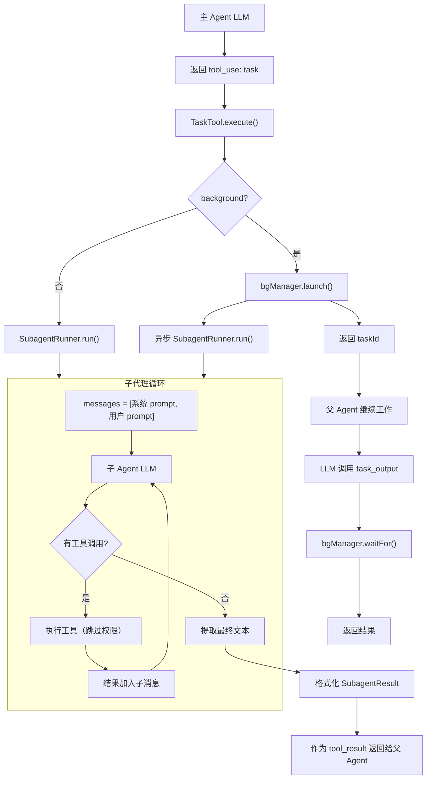

# 第七章：子代理模式

> *"一个 Agent 不够用时，就让它生出更多 Agent"*
> *—— 上下文隔离、能力分工、结果汇聚*

---

## 一、学习分析

### 1.1 子代理的核心动机

Agent 在处理复杂任务时面临一个根本矛盾：**搜索和探索需要大量上下文，但这些中间过程会污染主对话**。

```
用户: "重构这个模块的 API 设计"

Agent 需要:
  1. 搜索所有相关文件（grep 10 次）      → 产生 ~20K tokens 的搜索结果
  2. 阅读每个文件（read_file 8 次）      → 产生 ~40K tokens 的文件内容
  3. 分析依赖关系                        → 内部推理
  4. 制定方案                            → ~2K tokens 的结果

问题: 步骤 1-2 产生的 60K tokens 污染了主上下文，后续对话全部为此买单
```

**解决方案**：把步骤 1-3 委托给**子代理**——子代理有自己独立的上下文窗口，做完后只把结果（2K tokens）返回给主代理。

### 1.2 七级演进模型

learn-claude-code 展示了子代理模式从简到繁的七级演进，每级解决一个新问题：

```
Level 1: 基础子代理 (s04)
    └── 问题: 上下文污染
    └── 方案: 独立消息列表 + 只返回摘要

Level 2: 持久化任务 (s07)
    └── 问题: 压缩后丢失任务状态
    └── 方案: 磁盘级任务图 + 依赖关系

Level 3: 后台执行 (s08)
    └── 问题: 长命令阻塞 Agent
    └── 方案: 守护线程 + 通知队列

Level 4: 团队协作 (s09)
    └── 问题: 一次性子代理无法持续工作
    └── 方案: 持久队友 + JSONL 消息总线

Level 5: 协议通信 (s10)
    └── 问题: 队友间缺乏结构化协调
    └── 方案: 计划审批 + 优雅关停 协议

Level 6: 自治代理 (s11)
    └── 问题: 队友空闲时不知道干什么
    └── 方案: 空闲轮询 + 自动认领任务

Level 7: 工作区隔离 (s12)
    └── 问题: 并行修改同一文件冲突
    └── 方案: Git worktree 目录隔离
```

### 1.3 基础子代理模式（Level 1）

所有项目共享的核心模式：

```typescript
// 转写自 learn-claude-code s04 + Claude Code Task 工具

async function runSubagent(
    prompt: string,
    tools: ToolSchema[],
    executeTool: ToolExecutor,
    llm: LLMClient,
    maxTurns = 30,
): Promise<string> {
    // 关键: 全新的消息列表 — 无父代理历史
    const messages: Message[] = [
        { role: "user", content: prompt },
    ];

    for (let turn = 0; turn < maxTurns; turn++) {
        const response = await llm.complete(messages, tools);
        messages.push({ role: "assistant", content: response.content });

        if (response.stopReason !== "tool_use") break;

        // 执行工具，结果加入子代理上下文
        for (const toolUse of response.toolCalls) {
            const output = await executeTool(toolUse.name, toolUse.args);
            messages.push({
                role: "tool",
                toolCallId: toolUse.id,
                content: output,
            });
        }
    }

    // 只返回最终文本 — 中间过程全部丢弃
    const lastAssistant = messages.filter(m => m.role === "assistant").pop();
    return extractText(lastAssistant);
}
```

**三个核心约束**：

| 约束 | 目的 |
|------|------|
| 子代理不能使用 Task 工具 | 防止无限递归 |
| 子代理只返回最终文本 | 避免中间过程污染父上下文 |
| 子代理有独立的消息列表 | 上下文隔离 |

### 1.4 Claude Code 的 Task 工具实现

Claude Code 的逆向分析揭示了其 Task 工具的关键细节：

**工具定义**（完整 YAML）：

```yaml
name: Task
description: >
  Launch a new agent to handle complex, multi-step tasks autonomously.

  Available agent types:
  - general-purpose: Searching, research, multi-step tasks. (Tools: *)

  When to use:
  - Searching for a keyword/file and not confident you'll find it quickly
  - Executing custom slash commands

  When NOT to use:
  - Reading a specific file → use Read
  - Searching for "class Foo" → use Glob
  - Searching within 2-3 known files → use Read

  Usage notes:
  1. Launch multiple agents concurrently whenever possible
  2. Result is not visible to user — summarize it yourself
  3. Each invocation is stateless
  4. Agent outputs should generally be trusted

input_schema:
  properties:
    description: { type: string }
    prompt: { type: string }
    subagent_type: { type: string }
  required: [description, prompt, subagent_type]
```

**工具限制**——子代理默认**没有写工具**：

```typescript
// Claude Code 子代理工具过滤（正常模式下）
const SUBAGENT_EXCLUDED_TOOLS = ["Bash", "Edit", "MultiEdit", "Write", "Task"];

// Prompt 中明确告知模型：
// "IMPORTANT: The agent can not use Bash, Edit, Write, so can not modify files.
//  If you want to use these tools, use them directly instead of going through the agent."
```

**设计意图**：子代理主要用于**研究和搜索**，而非修改文件。这是一个深思熟虑的安全决策——让写操作留在主 Agent 中（受权限系统保护）。

**并发**：Claude Code 支持在一轮中启动最多 **5 个并行子代理**。

### 1.5 Kode-Agent 的完整子代理系统

Kode-Agent 实现了最复杂的子代理系统：

**Agent 类型注册**：

```typescript
// Kode-Agent 的 agent loader
interface AgentConfig {
    type: string;              // "explore" | "code" | "plan" | 自定义
    systemPrompt: string;       // 特定于此类型的系统 prompt
    tools: string[] | "*";      // 可用工具白名单
    disallowedTools?: string[]; // 黑名单
    model: string | "inherit";  // 使用的模型
    forkContext: boolean;        // 是否携带父上下文
    permissionMode: string;     // 权限模式
}

// 内置 agent 类型示例
const EXPLORE_AGENT: AgentConfig = {
    type: "explore",
    systemPrompt: "You are a fast agent specialized for exploring codebases...",
    tools: "*",
    disallowedTools: ["Task", "ExitPlanMode", "Edit", "Write", "NotebookEdit"],
    model: "inherit",
    forkContext: true,
    permissionMode: "delegate",
};
```

**Fork Context 机制**——Kode-Agent 独有的"历史继承"：

```typescript
// 子代理可以看到父代理在 Task 调用之前的对话历史
function buildForkContextForAgent(
    parentMessages: Message[],
    taskToolUseBlock: ToolUseBlock,
): Message[] {
    // 1. 找到父消息中 task tool_use 的位置
    const forkPoint = findToolUsePosition(parentMessages, taskToolUseBlock);

    // 2. forkContextMessages = 分叉点之前的所有消息
    const forkContextMessages = parentMessages.slice(0, forkPoint);

    // 3. 注入分叉标记
    const forkMarker = {
        role: "tool" as const,
        content: `### FORKING CONVERSATION CONTEXT ###
### ENTERING SUB-AGENT ROUTINE ###
Entered sub-agent context

PLEASE NOTE:
- Messages above are from the main thread prior to sub-agent execution (context only).
- Context messages may include tool_use for tools NOT available to you.
- Only complete the specific sub-agent task assigned below.`,
    };

    // 4. 拼接: 父历史 + 分叉标记 + 任务 prompt
    return [...forkContextMessages, forkMarker, { role: "user", content: prompt }];
}
```

**与 Claude Code 的差异**：Claude Code 的子代理只收到 prompt，完全没有父历史。Kode-Agent 的 `forkContext: true` 让子代理能看到父代理之前的对话，这对于需要理解"上下文背景"的任务很有用。

**后台执行**：

```typescript
// Kode-Agent 支持后台子代理
interface BackgroundAgentTask {
    type: "async_agent";
    agentId: string;
    description: string;
    prompt: string;
    status: "running" | "completed" | "failed" | "killed";
    startedAt: number;
    completedAt?: number;
    error?: string;
    resultText?: string;
    messages: Message[];
}

// 父代理通过 TaskOutputTool 查询结果
// TaskOutputTool: task_id → 轮询或阻塞等待完成
```

**子代理恢复**：

```typescript
// Kode-Agent 支持恢复已完成的子代理继续工作
// input.resume = agentId → 从 transcript 加载历史消息
const baseMessages = getAgentTranscript(input.resume);
// 在此基础上继续对话
```

### 1.6 持久队友与消息总线（Level 4-5）

learn-claude-code s09-s10 引入了一种全新的多代理范式——**持久队友**：

```typescript
// 转写自 s09 的 MessageBus 模式

interface MessageBus {
    send(from: string, to: string, content: string, type: MessageType): void;
    broadcast(from: string, content: string, type: MessageType): void;
    readInbox(name: string): InboxMessage[];
}

type MessageType =
    | "message"
    | "broadcast"
    | "shutdown_request"
    | "shutdown_response"
    | "plan_approval"
    | "plan_approval_response";

interface InboxMessage {
    from: string;
    content: string;
    type: MessageType;
    timestamp: string;
}

// JSONL 存储: .team/inbox/{name}.jsonl
// 读取时清空（drain-on-read）
```

**队友生命周期**：

```
spawn(name, role, prompt) → Thread 启动
    ↓
WORK 状态: LLM 循环 + 工具执行
    ↓ (stop_reason == "end_turn" 或调用 idle)
IDLE 状态: 轮询 inbox（每 5 秒）
    ↓ (inbox 有新消息 或 发现未认领任务)
WORK 状态: 继续 LLM 循环
    ↓ (收到 shutdown_request 并同意)
退出 Thread
```

**计划审批协议**（s10）：

```
队友: send(lead, plan_text, "plan_approval")
    ↓
Leader 看到 inbox 中的 plan_approval
    ↓
Leader: send(teammate, "approved"/"rejected", "plan_approval_response")
    ↓
队友: readInbox() → 看到审批结果 → 执行/修改计划
```

### 1.7 自治代理与任务认领（Level 6）

s11 让队友能在空闲时**自主发现并认领工作**：

```typescript
// 转写自 s11 的 idle/claim 机制

async function idleCycle(
    name: string,
    bus: MessageBus,
    taskDir: string,
    timeoutMs = 60_000,
): Promise<"inbox" | "task" | "timeout"> {
    const deadline = Date.now() + timeoutMs;

    while (Date.now() < deadline) {
        // 1. 检查收件箱
        const messages = bus.readInbox(name);
        if (messages.length > 0) return "inbox";

        // 2. 扫描未认领的任务
        const unclaimed = scanUnclaimedTasks(taskDir);
        if (unclaimed.length > 0) {
            claimTask(unclaimed[0], name);
            return "task";
        }

        // 3. 等待 5 秒后重试
        await sleep(5000);
    }

    return "timeout"; // 超时 → 关闭
}

function scanUnclaimedTasks(taskDir: string): Task[] {
    return loadTasks(taskDir).filter(t =>
        t.status === "pending"
        && !t.assignee
        && t.blockedBy.length === 0
    );
}
```

**身份恢复**——上下文压缩后重新注入身份：

```typescript
// s11 的关键细节：压缩可能导致队友"忘记自己是谁"
function makeIdentityBlock(name: string, role: string, teamName: string): Message {
    return {
        role: "user",
        content: `You are ${name}, a ${role} teammate in team "${teamName}".
Your inbox is at .team/inbox/${name}.jsonl.
Use send_message to communicate with teammates.`,
    };
}

// 当消息列表过短时（压缩后），重新注入身份
if (messages.length <= 3) {
    messages.splice(0, 0, makeIdentityBlock(name, role, teamName));
}
```

### 1.8 Git Worktree 隔离（Level 7）

s12 解决并行文件修改冲突的终极方案——每个任务在独立的 Git worktree 中执行：

```typescript
// 转写自 s12 的 worktree 机制

interface Worktree {
    name: string;
    path: string;
    branch: string;
    boundTask?: string;
    status: "active" | "removed" | "kept";
}

function createWorktree(name: string, baseBranch = "main"): Worktree {
    const worktreePath = path.join(process.cwd(), ".worktrees", name);
    const branch = `wt/${name}`;

    // git worktree add -b wt/{name} .worktrees/{name} {baseBranch}
    execSync(`git worktree add -b ${branch} ${worktreePath} ${baseBranch}`);

    return { name, path: worktreePath, branch, status: "active" };
}

function runInWorktree(worktree: Worktree, command: string): string {
    // 在 worktree 路径下执行命令
    return execSync(command, { cwd: worktree.path }).toString();
}

function removeWorktree(worktree: Worktree, completeTask = false): void {
    if (completeTask && worktree.boundTask) {
        // 标记关联任务为完成
        updateTaskStatus(worktree.boundTask, "completed");
    }
    execSync(`git worktree remove ${worktree.path}`);
    worktree.status = "removed";
}
```

**与子代理的结合**：在 s09-s11 的团队模式中，每个队友可以绑定一个 worktree——队友 A 在 `wt/feature-a` 中工作，队友 B 在 `wt/feature-b` 中工作，互不干扰。完成后通过 `git merge` 合并成果。

### 1.9 子代理的权限处理

三个项目对子代理权限的处理策略各不相同：

| 项目 | 子代理权限策略 |
|------|---------------|
| Claude Code | 默认无写工具（Read/Grep/Glob/Ls 只读集）；`dangerouslySkipPermissions` 下可写 |
| Kode-Agent | `permissionMode: "dontAsk"` — 不弹审批窗；继承 `agentConfig.permissionMode` |
| learn-claude-code | 无权限系统；通过工具白名单限制（explore/plan → 只读工具集） |

**关键设计决策**：子代理**不应该弹出审批窗口**。用户启动一个子任务后，不希望被中断审批多次。解决方案：
- 限制子代理的工具集（只给只读工具）
- 或使用 `dontAsk` / `delegate` 模式自动处理

---

## 二、思考提炼

### 2.1 核心设计原则

**原则 1：上下文隔离是非可选的**

子代理必须有独立的消息列表。如果让子代理共享父上下文，所有中间搜索结果都会留在主上下文中——这比没有子代理还糟糕。

**原则 2：结果压缩是关键**

子代理的价值 = 它做了 N 步工作，但只返回一个摘要。如果返回全部中间结果，隔离就失去意义。Claude Code 的做法是只返回最后一条 assistant 消息的文本块。

**原则 3：禁止递归**

子代理不能创建子代理。这不是技术限制（可以做到），而是设计约束——递归子代理会导致不可控的 token 消耗和执行深度。

**原则 4：写操作留在主代理**

Claude Code 的默认策略：子代理只能读、搜索、思考，不能写文件或执行命令。写操作留在主代理中（有权限系统保护 + 用户可见）。这是一个优秀的安全默认值。

**原则 5：并发是自然的扩展**

"搜索 A 并搜索 B"天然可以并行。LLM 在一轮中返回多个 Task 工具调用时，这些子代理应该并行启动。Claude Code 支持最多 5 个并发子代理。

**原则 6：无状态 vs 有状态是设计选择**

| 模式 | 适用场景 | 复杂度 |
|------|---------|--------|
| 无状态（每次全新） | 搜索、研究、一次性任务 | 低 |
| 可恢复（resume） | 被中断的长任务 | 中 |
| 持久队友（spawn→idle→work） | 持续协作、团队任务 | 高 |

大多数 Agent CLI 工具只需要无状态模式。持久队友是高级功能。

### 2.2 最优架构选择

| 设计维度 | 最优选择 | 理由 |
|----------|---------|------|
| 上下文隔离 | **全新消息列表** | 最简且最干净 |
| 结果格式 | **只返回最终文本** | 最大化压缩比 |
| 工具限制 | **默认只读 + 可配置** | 安全默认 + 灵活性 |
| 递归 | **明确禁止** | 防止失控 |
| 并发 | **支持并行启动** | LLM 天然会请求多个 Task |
| 后台执行 | **可选的异步模式** | 长任务不阻塞主循环 |
| Agent 类型 | **配置化的类型注册表** | 新增类型不改代码 |
| 权限 | **子代理不弹窗** | 不打断用户 |

---

## 三、最优设计方案

### 3.1 类型定义

```typescript
// ── 子代理类型注册 ────────────────────────────────────────

interface SubagentType {
    name: string;
    description: string;
    systemPrompt: string;
    tools: string[] | "*";          // 可用工具白名单
    disallowedTools: string[];      // 黑名单（始终包含 "task"）
    model: ModelRole | "inherit";   // 使用的模型角色
    maxTurns: number;
}

// ── 子代理执行结果 ────────────────────────────────────────

interface SubagentResult {
    status: "completed" | "failed" | "max_turns";
    content: string;                 // 最终文本
    toolUseCount: number;
    durationMs: number;
    usage: TokenUsage;
}

// ── 后台任务 ──────────────────────────────────────────────

interface BackgroundTask {
    id: string;
    description: string;
    status: "running" | "completed" | "failed";
    startedAt: number;
    completedAt?: number;
    result?: SubagentResult;
    error?: string;
    abortController: AbortController;
}

// ── Task 工具输入 ─────────────────────────────────────────

const TaskInputSchema = z.object({
    description: z.string().describe("A short (3-5 word) description"),
    prompt: z.string().describe("The task for the agent to perform"),
    agentType: z.string().default("general").describe("Agent type to use"),
    background: z.boolean().optional().describe("Run in background"),
});

type TaskInput = z.infer<typeof TaskInputSchema>;
```

### 3.2 子代理类型注册表

```typescript
class SubagentRegistry {
    private types: Map<string, SubagentType> = new Map();

    register(type: SubagentType): void {
        if (!type.disallowedTools.includes("task")) {
            type.disallowedTools.push("task");
        }
        this.types.set(type.name, type);
    }

    get(name: string): SubagentType {
        const t = this.types.get(name);
        if (!t) throw new Error(`Unknown agent type: "${name}"`);
        return t;
    }

    list(): SubagentType[] {
        return Array.from(this.types.values());
    }

    /**
     * 生成 Task 工具的 description（动态包含可用类型列表）
     */
    generateTaskToolDescription(): string {
        const typeList = this.list()
            .map(t => `  - ${t.name}: ${t.description}`)
            .join("\n");

        return [
            "Launch a new agent to handle complex, multi-step tasks autonomously.",
            "",
            "Available agent types:",
            typeList,
            "",
            "Usage notes:",
            "1. Launch multiple agents concurrently when tasks are independent",
            "2. Result is not visible to the user — summarize it in your response",
            "3. Each invocation is stateless",
            "4. Prefer this tool for broad searches to reduce main context usage",
            "",
            "When NOT to use:",
            "- Reading a specific known file → use read_file",
            "- Searching for a known symbol → use grep",
        ].join("\n");
    }
}

// ── 预定义类型 ────────────────────────────────────────────

function createDefaultSubagentRegistry(): SubagentRegistry {
    const registry = new SubagentRegistry();

    registry.register({
        name: "general",
        description: "General-purpose agent for research, search, and multi-step tasks (read-only tools)",
        systemPrompt: [
            "You are a sub-agent. Complete the assigned task using available tools.",
            "Do what has been asked; nothing more, nothing less.",
            "In your final response, share relevant file names and code snippets.",
            "NEVER create files unless absolutely necessary.",
        ].join("\n"),
        tools: "*",
        disallowedTools: ["task", "write_file", "edit_file"],
        model: "inherit",
        maxTurns: 30,
    });

    registry.register({
        name: "explore",
        description: "Fast agent for codebase exploration (read-only, no file modifications)",
        systemPrompt: [
            "You are a fast exploration agent. Find relevant code quickly.",
            "Use grep and glob to search, read_file to examine.",
            "Report findings concisely with file paths and line numbers.",
        ].join("\n"),
        tools: ["bash", "read_file", "glob", "grep"],
        disallowedTools: ["task"],
        model: "quick",
        maxTurns: 15,
    });

    registry.register({
        name: "code",
        description: "Coding agent with full tool access (can modify files)",
        systemPrompt: [
            "You are a coding sub-agent with full tool access.",
            "Implement the requested changes carefully.",
            "Verify changes with appropriate tests or lint checks.",
        ].join("\n"),
        tools: "*",
        disallowedTools: ["task"],
        model: "main",
        maxTurns: 50,
    });

    return registry;
}
```

### 3.3 子代理执行引擎

```typescript
class SubagentRunner {
    constructor(
        private llmClient: LLMClient,
        private toolRegistry: ToolRegistry,
        private subagentRegistry: SubagentRegistry,
    ) {}

    /**
     * 同步执行子代理——阻塞直到完成
     */
    async run(input: TaskInput): Promise<SubagentResult> {
        const agentType = this.subagentRegistry.get(input.agentType);
        const startTime = Date.now();
        let toolUseCount = 0;
        let totalUsage = emptyUsage();

        // ── 构建子代理工具集 ─────────────────────────────
        const tools = this.filterTools(agentType);
        const toolSchemas = tools.map(t => ({
            name: t.name,
            description: t.description,
            parameters: zodToJsonSchema(t.schema),
        }));

        // ── 构建子代理消息（完全隔离）────────────────────
        const messages: Message[] = [
            { role: "system", content: agentType.systemPrompt },
            { role: "user", content: input.prompt },
        ];

        // ── 选择模型 ────────────────────────────────────
        const modelRole: ModelRole = agentType.model === "inherit" ? "subagent" : agentType.model as ModelRole;

        // ── 子代理循环 ──────────────────────────────────
        for (let turn = 0; turn < agentType.maxTurns; turn++) {
            let responseText = "";
            const toolCalls: ToolCallInfo[] = [];

            for await (const event of this.llmClient.streamForRole(modelRole, messages, toolSchemas)) {
                switch (event.type) {
                    case "text_delta":
                        responseText += event.text;
                        break;
                    case "tool_call_done":
                        toolCalls.push(event.call);
                        break;
                    case "message_done":
                        totalUsage = addUsage(totalUsage, event.usage);
                        break;
                }
            }

            messages.push({
                role: "assistant",
                content: responseText || null,
                toolCalls: toolCalls.length > 0 ? toolCalls : undefined,
            });

            if (toolCalls.length === 0) {
                return {
                    status: "completed",
                    content: responseText,
                    toolUseCount,
                    durationMs: Date.now() - startTime,
                    usage: totalUsage,
                };
            }

            // ── 执行工具（子代理不弹权限窗）──────────────
            for (const tc of toolCalls) {
                toolUseCount++;
                let output: string;
                try {
                    output = await this.executeToolForSubagent(tc.name, tc.args, tools);
                } catch (err: any) {
                    output = `Error: ${err.message ?? String(err)}`;
                }
                messages.push({ role: "tool", content: output, toolCallId: tc.id });
            }
        }

        // maxTurns 耗尽
        const lastAssistant = messages.filter(m => m.role === "assistant").pop();
        return {
            status: "max_turns",
            content: typeof lastAssistant?.content === "string" ? lastAssistant.content : "",
            toolUseCount,
            durationMs: Date.now() - startTime,
            usage: totalUsage,
        };
    }

    /**
     * 过滤子代理可用的工具
     */
    private filterTools(agentType: SubagentType): ToolDef[] {
        const allTools = this.toolRegistry.listDefs();
        const disallowed = new Set(agentType.disallowedTools);

        let filtered: ToolDef[];
        if (agentType.tools === "*") {
            filtered = allTools.filter(t => !disallowed.has(t.name));
        } else {
            const allowed = new Set(agentType.tools);
            filtered = allTools.filter(t => allowed.has(t.name) && !disallowed.has(t.name));
        }

        return filtered;
    }

    /**
     * 子代理的工具执行——跳过权限检查
     */
    private async executeToolForSubagent(
        name: string,
        args: Record<string, unknown>,
        availableTools: ToolDef[],
    ): Promise<string> {
        const tool = availableTools.find(t => t.name === name);
        if (!tool) return `Error: Tool "${name}" not available to sub-agent`;

        const parsed = tool.schema.safeParse(args);
        if (!parsed.success) return `Error: Invalid input: ${parsed.error.message}`;

        try {
            const raw = await tool.execute(parsed.data);
            return normalizeToSize(raw, 30_000);
        } catch (err: any) {
            return `Error: ${err.message ?? String(err)}`;
        }
    }
}
```

### 3.4 后台任务管理器

```typescript
class BackgroundTaskManager {
    private tasks: Map<string, BackgroundTask> = new Map();

    /**
     * 启动后台子代理
     */
    launch(
        id: string,
        input: TaskInput,
        runner: SubagentRunner,
    ): BackgroundTask {
        const ac = new AbortController();

        const task: BackgroundTask = {
            id,
            description: input.description,
            status: "running",
            startedAt: Date.now(),
            abortController: ac,
        };

        // 异步执行，不阻塞
        runner.run(input).then(
            (result) => {
                task.status = "completed";
                task.completedAt = Date.now();
                task.result = result;
            },
            (err) => {
                task.status = "failed";
                task.completedAt = Date.now();
                task.error = err.message ?? String(err);
            },
        );

        this.tasks.set(id, task);
        return task;
    }

    /**
     * 查询任务状态
     */
    get(id: string): BackgroundTask | undefined {
        return this.tasks.get(id);
    }

    /**
     * 等待任务完成
     */
    async waitFor(id: string, timeoutMs = 60_000): Promise<BackgroundTask> {
        const deadline = Date.now() + timeoutMs;
        while (Date.now() < deadline) {
            const task = this.tasks.get(id);
            if (!task) throw new Error(`Task "${id}" not found`);
            if (task.status !== "running") return task;
            await new Promise(r => setTimeout(r, 1000));
        }
        throw new Error(`Task "${id}" timed out after ${timeoutMs}ms`);
    }

    /**
     * 列出所有任务
     */
    listRunning(): BackgroundTask[] {
        return Array.from(this.tasks.values()).filter(t => t.status === "running");
    }

    /**
     * 取消任务
     */
    kill(id: string): void {
        const task = this.tasks.get(id);
        if (task && task.status === "running") {
            task.abortController.abort();
            task.status = "failed";
            task.error = "Killed by user";
            task.completedAt = Date.now();
        }
    }
}
```

### 3.5 Task 工具定义

```typescript
// ── 注册为标准工具 ────────────────────────────────────────

function createTaskTool(
    runner: SubagentRunner,
    bgManager: BackgroundTaskManager,
    subagentRegistry: SubagentRegistry,
): ToolDef {
    return {
        name: "task",
        description: subagentRegistry.generateTaskToolDescription(),
        schema: TaskInputSchema,
        isReadOnly: false,

        async execute(input: TaskInput): Promise<string> {
            const id = randomUUID();

            if (input.background) {
                const task = bgManager.launch(id, input, runner);
                return JSON.stringify({
                    status: "launched",
                    taskId: task.id,
                    message: `Background task "${input.description}" started. Use task_output to check results.`,
                });
            }

            const result = await runner.run(input);

            return [
                `## Sub-agent result (${result.status})`,
                "",
                result.content,
                "",
                `[${result.toolUseCount} tool calls | ${(result.durationMs / 1000).toFixed(1)}s | ${result.usage.inputTokens + result.usage.outputTokens} tokens]`,
            ].join("\n");
        },
    };
}

// ── TaskOutput 工具（查询后台任务）─────────────────────────

function createTaskOutputTool(bgManager: BackgroundTaskManager): ToolDef {
    return {
        name: "task_output",
        description: "Check the result of a background task launched with the task tool.",
        schema: z.object({
            taskId: z.string().describe("The task ID returned by the task tool"),
            wait: z.boolean().optional().describe("Block until task completes"),
            timeoutMs: z.number().optional().describe("Max wait time in ms"),
        }),
        isReadOnly: true,

        async execute(input: { taskId: string; wait?: boolean; timeoutMs?: number }): Promise<string> {
            if (input.wait) {
                const task = await bgManager.waitFor(input.taskId, input.timeoutMs ?? 60_000);
                if (task.result) return task.result.content;
                return `Task failed: ${task.error}`;
            }

            const task = bgManager.get(input.taskId);
            if (!task) return `Error: Task "${input.taskId}" not found`;

            if (task.status === "running") {
                const elapsed = ((Date.now() - task.startedAt) / 1000).toFixed(0);
                return `Task "${task.description}" is still running (${elapsed}s elapsed)`;
            }

            if (task.result) return task.result.content;
            return `Task failed: ${task.error}`;
        },
    };
}
```

### 3.6 接入 Agent 循环

```typescript
// ── 创建并注册 ────────────────────────────────────────────

const subagentRegistry = createDefaultSubagentRegistry();
const subagentRunner = new SubagentRunner(llmClient, toolRegistry, subagentRegistry);
const bgManager = new BackgroundTaskManager();

// 注册 task 和 task_output 工具
toolRegistry.register(createTaskTool(subagentRunner, bgManager, subagentRegistry));
toolRegistry.register(createTaskOutputTool(bgManager));

// Agent 核心循环（第一章）不需要任何修改
// task 只是一个普通的工具——LLM 调用它时，SubagentRunner 内部启动一个新的循环
```

**核心设计优势**：子代理对核心循环完全透明——它就是一个工具。`agentLoop` 不知道也不需要知道 `task` 工具内部有一个完整的 LLM 循环。这是**循环不变，能力叠加**的又一个体现。

### 3.7 并发子代理支持

```typescript
// 当 LLM 在一轮中返回多个 task 工具调用时，可以并行执行

// 修改第一章 agentLoop 中的工具执行段：
// 原来: 逐个执行
// 升级: 只读工具 + task 工具并行执行

async function executeToolBatch(
    toolCalls: ToolCallInfo[],
    registry: ToolRegistry,
): Promise<Map<string, string>> {
    const results = new Map<string, string>();

    // 分类：可并行 vs 必须串行
    const parallel: ToolCallInfo[] = [];
    const sequential: ToolCallInfo[] = [];

    for (const tc of toolCalls) {
        const tool = registry.get(tc.name);
        if (tool?.isReadOnly || tc.name === "task") {
            parallel.push(tc);
        } else {
            sequential.push(tc);
        }
    }

    // 并行执行只读工具和 task
    if (parallel.length > 0) {
        const promises = parallel.map(async (tc) => {
            const output = await registry.execute(tc.name, tc.args);
            results.set(tc.id, output);
        });
        await Promise.all(promises);
    }

    // 串行执行写工具
    for (const tc of sequential) {
        const output = await registry.execute(tc.name, tc.args);
        results.set(tc.id, output);
    }

    return results;
}
```

### 3.8 完整流程图



### 3.9 扩展路线图

| 阶段 | 扩展 | 修改点 |
|------|------|--------|
| **当前** | 同步/异步子代理 + 类型注册 + 后台管理 | 本章实现 |
| **+Fork Context** | 子代理可选继承父上下文 | `SubagentRunner.run()` 接受可选的 `parentMessages` |
| **+Resume** | 从 transcript 恢复子代理状态 | `SubagentRunner` 增加 `resume(agentId)` |
| **+持久队友** | spawn/idle/work 生命周期 | 新增 `TeammateManager` + `MessageBus` |
| **+协议通信** | 计划审批、优雅关停 | `MessageBus` 增加请求-响应协议 |
| **+自治代理** | 空闲轮询 + 自动认领任务 | `idleCycle()` + 任务看板集成 |
| **+Worktree 隔离** | 每个子代理在独立 Git worktree 中工作 | 新增 `WorktreeManager` |
| **+子代理进度** | 实时汇报子代理执行进度 | `SubagentRunner` yield 进度事件 |
| **+结果合成** | 多个子代理结果通过 LLM 合成一个摘要 | 使用 quick 模型做结果综合 |

---

## 四、关键源码索引

| 文件 | 说明 |
|------|------|
| `origin/Kode-Agent-main/src/tools/agent/TaskTool/TaskTool.tsx` | 完整 TaskTool：同步/异步、fork context、resume |
| `origin/Kode-Agent-main/src/tools/agent/TaskTool/prompt.ts` | Task 工具 prompt + agent 类型列表 + 工具过滤 |
| `origin/Kode-Agent-main/src/tools/agent/TaskTool/constants.ts` | 子代理禁用工具列表 |
| `origin/Kode-Agent-main/src/tools/system/TaskOutputTool/TaskOutputTool.tsx` | 后台任务查询工具 |
| `origin/Kode-Agent-main/src/utils/session/backgroundTasks.ts` | 后台任务数据结构和管理 |
| `origin/Kode-Agent-main/src/utils/agent/loader.ts` | Agent 类型配置加载 |
| `origin/Kode-Agent-main/src/utils/agent/transcripts.ts` | 子代理 transcript 持久化 |
| `origin/learn-claude-code-main/agents/s04_subagent.py` | 基础子代理模式：独立消息 + 摘要返回 |
| `origin/learn-claude-code-main/agents/s07_task_system.py` | 磁盘级任务图（依赖、状态） |
| `origin/learn-claude-code-main/agents/s08_background_tasks.py` | 后台命令执行 + 通知队列 |
| `origin/learn-claude-code-main/agents/s09_agent_teams.py` | 持久队友 + JSONL 消息总线 |
| `origin/learn-claude-code-main/agents/s10_team_protocols.py` | 计划审批 + 优雅关停协议 |
| `origin/learn-claude-code-main/agents/s11_autonomous_agents.py` | 自治代理：空闲轮询 + 任务认领 |
| `origin/learn-claude-code-main/agents/s12_worktree_task_isolation.py` | Git worktree 目录隔离 |
| `origin/learn-claude-code-main/skills/agent-builder/references/subagent-pattern.py` | 子代理参考实现：类型注册 |
| `origin/claude-code-reverse-main/results/tools/Task.tool.yaml` | Claude Code Task 工具定义 |
| `origin/claude-code-reverse-main/v1/merged-chunks/claude-code-6.mjs` | Task 工具实现：工具过滤、结果提取 |
