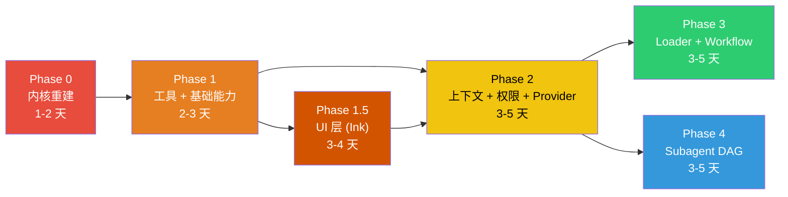

# 第九章：agent-kit 重构设计方案

> *"不是再造一个 Claude Code，而是造一个能生成 Claude Code 的框架"*
> *—— Plugin + Loader + Workflow + DAG Subagent*

---

## 〇、设计定位

### read.md 的三个核心目标

```
1. Plugin 机制 + Loader  → 像 webpack 一样，用 plugin 注册能力，用 loader 处理资源
2. 工作流编排 + Prompt 管理 → 提供基础 SOP，可生成不同场景的工作流，内置 code 场景
3. Subagent DAG 图管理   → 子代理不是扁平列表，而是有依赖关系的图
```

### 定位差异

| | Claude Code | Kode-Agent | **agent-kit** |
|---|---|---|---|
| 本质 | 产品 | 复刻品 | **框架/工具包** |
| 用户 | 终端用户 | 开发者 | **框架开发者 + 终端用户** |
| 扩展方式 | CLAUDE.md | Fork 修改 | **Plugin + Loader + Workflow** |
| 工具集 | 固定 15 个 | 固定 ~10 个 | **可插拔，按场景加载** |
| 场景 | 代码 | 代码 | **代码 + 任意 SOP** |

这意味着 agent-kit 的核心不是"一个 Agent"，而是"一个能组装出各种 Agent 的内核"。

---

## 一、总体架构

```
┌──────────────────────────────────────────────────────────────┐
│  CLI / API 入口                                              │
│  (commander / programmatic API)                              │
├──────────────────────────────────────────────────────────────┤
│                                                              │
│  ┌─────────────────────────────────────────────────────┐     │
│  │  AgentKernel（核心引擎）                              │     │
│  │  ├── AgentLoop       事件驱动循环                     │     │
│  │  ├── ContextManager  上下文 + 冷热存储                 │     │
│  │  ├── PromptEngine    模块化 Prompt 组装                │     │
│  │  ├── PermissionGate  权限决策引擎                      │     │
│  │  └── EventBus        内部事件总线                      │     │
│  └──────────────┬──────────────────────────────────────┘     │
│                 │                                            │
│  ┌──────────────┴──────────────────────────────────────┐     │
│  │  PluginManager（插件管理器）                           │     │
│  │  ├── register(plugin)    注册插件                     │     │
│  │  ├── resolve(hooks)      解析钩子                     │     │
│  │  └── lifecycle           插件生命周期                  │     │
│  └──────────────┬──────────────────────────────────────┘     │
│                 │                                            │
│  ┌──────────────┴──────────────────────────────────────┐     │
│  │  Plugin 类型                                          │     │
│  │                                                       │     │
│  │  ToolPlugin      注册工具 (read_file, bash, ...)      │     │
│  │  ProviderPlugin  注册 LLM 适配器 (openai, anthropic)  │     │
│  │  LoaderPlugin    注册资源加载器 (file, url, db, ...)   │     │
│  │  WorkflowPlugin  注册工作流 SOP (code, research, ...) │     │
│  │  PromptPlugin    注册 Prompt 模块                      │     │
│  └───────────────────────────────────────────────────────┘   │
│                                                              │
│  ┌───────────────────────────────────────────────────────┐   │
│  │  Subagent DAG Engine                                   │   │
│  │  ├── DAGScheduler   拓扑排序 + 并发调度                 │   │
│  │  ├── AgentNode      每个节点是一个轻量 AgentKernel      │   │
│  │  └── MessageBus     节点间通信                          │   │
│  └───────────────────────────────────────────────────────┘   │
│                                                              │
├──────────────────────────────────────────────────────────────┤
│  Built-in Plugins（内置插件包）                               │
│  ├── @agent-kit/tools-code     code 场景工具集               │
│  ├── @agent-kit/provider-openai  OpenAI 适配器               │
│  ├── @agent-kit/workflow-code   code 场景 SOP + Prompt       │
│  └── @agent-kit/loader-file    文件系统 Loader               │
└──────────────────────────────────────────────────────────────┘
```

---

## 二、核心概念定义

### 2.1 Plugin 接口

Plugin 是 agent-kit 的第一公民。所有能力扩展都通过 Plugin 注入。

```typescript
interface Plugin {
    name: string;
    version: string;
    description?: string;

    /** 插件初始化，接收内核上下文 */
    setup(ctx: PluginContext): void | Promise<void>;

    /** 插件卸载 */
    teardown?(): void | Promise<void>;
}

interface PluginContext {
    /** 注册工具 */
    registerTool(tool: ToolDef): void;

    /** 注册 LLM Provider 适配器 */
    registerProvider(provider: ProviderAdapter): void;

    /** 注册 Loader */
    registerLoader(loader: LoaderDef): void;

    /** 注册 Prompt 模块 */
    registerPromptModule(module: PromptModule): void;

    /** 注册工作流 SOP */
    registerWorkflow(workflow: WorkflowDef): void;

    /** 注册子代理类型 */
    registerSubagentType(type: SubagentTypeDef): void;

    /** 注册 UI 插槽 */
    registerToolRenderer(toolName: string, renderer: ToolRendererDef): void;
    registerPermissionRenderer(toolName: string, renderer: PermissionRendererDef): void;
    registerContentRenderer(blockType: string, renderer: ContentRendererDef): void;
    registerMarkdownExtension(extension: MarkdownExtensionDef): void;
    registerInputMode(mode: InputModeDef): void;
    registerStatusBarItem(item: StatusBarItemDef): void;

    /** 订阅内核事件 */
    on(event: string, handler: (...args: any[]) => void): void;

    /** 获取配置 */
    getConfig(): Config;

    /** 获取 logger */
    getLogger(): Logger;
}
```

### 2.2 Loader 概念

Loader 负责将不同来源/格式的资源转换为 Agent 可消费的统一格式。类似 webpack loader 的链式处理。

```typescript
interface LoaderDef {
    name: string;

    /** 匹配规则：哪些资源使用这个 loader */
    test: RegExp | ((resource: ResourceRef) => boolean);

    /** 加载资源，返回统一的文本内容 */
    load(resource: ResourceRef, ctx: LoaderContext): Promise<LoaderResult>;
}

interface ResourceRef {
    type: "file" | "url" | "db" | "api" | "custom";
    uri: string;
    metadata?: Record<string, unknown>;
}

interface LoaderResult {
    content: string;
    metadata?: Record<string, unknown>;
    cacheable?: boolean;
    ttl?: number;
}

// 用法示例：Agent 需要读取一个 PDF
// → Loader 链：pdf-loader → text-loader → 返回纯文本
// Agent 需要读取一个 URL
// → Loader 链：url-loader → html-to-text-loader → 返回纯文本
// Agent 需要查询数据库
// → Loader 链：db-loader → table-formatter-loader → 返回格式化文本
```

### 2.3 Workflow SOP

Workflow 定义了一个场景（如"代码开发"、"文案撰写"、"数据分析"）下 Agent 的行为模式。

```typescript
interface WorkflowDef {
    name: string;                  // e.g., "code", "research", "data-analysis"
    description: string;

    /** 该工作流需要的工具列表 */
    requiredTools: string[];

    /** 该工作流的 Prompt 模块列表 */
    promptModules: string[];

    /** 该工作流的默认 Prompt 覆盖 */
    promptOverrides?: Record<string, string>;

    /** 该工作流支持的子代理图 */
    subagentGraph?: DAGDef;

    /** 工作流激活时的钩子 */
    onActivate?(ctx: WorkflowContext): void | Promise<void>;

    /** 工作流停用时的钩子 */
    onDeactivate?(): void | Promise<void>;
}

// 例：内置的 "code" 工作流
const codeWorkflow: WorkflowDef = {
    name: "code",
    description: "Software engineering workflow (Claude Code style)",
    requiredTools: ["bash", "read_file", "write_file", "edit_file", "glob", "grep", "todo_write"],
    promptModules: ["identity-code", "behavior-code", "environment", "security"],
    subagentGraph: {
        nodes: [
            { id: "planner", type: "readonly" },
            { id: "coder",   type: "readwrite" },
            { id: "reviewer", type: "readonly" },
        ],
        edges: [
            { from: "planner", to: "coder" },
            { from: "coder",   to: "reviewer" },
        ],
    },
};
```

### 2.4 Subagent DAG

子代理之间的关系用 DAG 描述，支持并发调度和依赖管理。

```typescript
interface DAGDef {
    nodes: DAGNode[];
    edges: DAGEdge[];
}

interface DAGNode {
    id: string;
    type: string;              // 引用 SubagentTypeDef 的 name
    config?: Record<string, unknown>;
}

interface DAGEdge {
    from: string;              // source node id
    to: string;                // target node id
    condition?: string;        // 条件表达式（可选）
}

// DAGScheduler 负责：
// 1. 拓扑排序确定执行顺序
// 2. 同层无依赖节点并发执行
// 3. 节点执行结果传递给下游
// 4. 失败节点阻塞下游 or 跳过（可配置）
```

### 2.5 UI 插槽系统

UI 层不是封闭的，而是通过**六种插槽**向 Plugin 开放渲染能力。这使得新增一个工具时，可以同时定义它在终端中的显示方式——就像 webpack 的 loader 既处理资源又决定资源如何呈现。

```
┌─────────────────────────────────────────────────────────────────┐
│  REPL Screen                                                     │
│                                                                   │
│  ┌──── Slot: StatusBar ─────────────────────────────────────┐    │
│  │ ↑12k ↓3.2k · $0.042 · [custom: git:main] · [custom: …] │    │
│  └──────────────────────────────────────────────────────────┘    │
│                                                                   │
│  ┌──── Slot: Message Renderers ─────────────────────────────┐    │
│  │  AssistantText → Slot: Markdown Extensions               │    │
│  │  ToolUse       → Slot: Tool Renderers (per tool)         │    │
│  │  ToolResult    → Slot: Tool Renderers (per tool)         │    │
│  │  ToolError     → Slot: Tool Renderers (per tool)         │    │
│  │  CustomBlock   → Slot: Content Renderers (per type)      │    │
│  └──────────────────────────────────────────────────────────┘    │
│                                                                   │
│  ┌──── Slot: Permission Renderers ──────────────────────────┐    │
│  │  BashPermission / FileEditPermission / [custom: ...]     │    │
│  └──────────────────────────────────────────────────────────┘    │
│                                                                   │
│  ┌──── Slot: Input Modes ───────────────────────────────────┐    │
│  │  › prompt  |  ! bash  |  # note  |  [custom: …]         │    │
│  └──────────────────────────────────────────────────────────┘    │
│                                                                   │
└─────────────────────────────────────────────────────────────────┘
```

#### 插槽 1：Tool Renderer（工具渲染器）

每个工具可以自定义三种渲染方式：工具调用时的参数预览、执行中的进度展示、执行完成后的结果展示。如果没有注册，使用默认的 JSON 渲染。

```typescript
import type { ReactNode } from "react";

interface ToolRendererDef {
    /** 工具名（与 ToolDef.name 匹配） */
    toolName: string;

    /** 工具调用预览（显示在 ⏺ 后面） */
    renderToolUse?(args: Record<string, unknown>): ReactNode;

    /** 工具结果展示（显示在 ⎿ 后面） */
    renderToolResult?(result: ToolResult): ReactNode;

    /** 给 assistant 看的结果（可以比 UI 展示更详细） */
    renderResultForAssistant?(result: ToolResult): string;
}

// 示例：bash 工具注册自定义渲染器
const bashRenderer: ToolRendererDef = {
    toolName: "bash",

    renderToolUse(args) {
        // 显示 "$ command" 而不是 JSON
        return <Text dimColor>$ {args.command as string}</Text>;
    },

    renderToolResult(result) {
        if (!result.success) {
            return <ToolError error={result.error} maxLines={10} />;
        }
        // 分离 stdout/stderr，截断长输出
        const { stdout, stderr } = parseBashOutput(result.output);
        return (
            <Box flexDirection="column">
                {stdout && <Truncate text={stdout} maxLines={25} />}
                {stderr && <Truncate text={stderr} maxLines={10} dimColor />}
            </Box>
        );
    },
};

// 示例：grep 工具注册自定义渲染器
const grepRenderer: ToolRendererDef = {
    toolName: "grep",

    renderToolUse(args) {
        return <Text dimColor>/{args.pattern as string}/ in {args.path as string}</Text>;
    },

    renderToolResult(result) {
        if (!result.success) return <ToolError error={result.error} />;
        const { fileCount, matchCount } = parseGrepOutput(result.output);
        return (
            <Text>
                Found <Text bold>{matchCount}</Text> matches in{" "}
                <Text bold>{fileCount}</Text> files
            </Text>
        );
    },
};

// 示例：edit_file 工具注册自定义渲染器
const editFileRenderer: ToolRendererDef = {
    toolName: "edit_file",

    renderToolUse(args) {
        return <Text dimColor>{args.file_path as string}</Text>;
    },

    renderToolResult(result) {
        if (!result.success) return <ToolError error={result.error} />;
        // 展示 diff 而不是纯文本
        const { filePath, oldContent, newContent } = parseEditResult(result.output);
        return <Diff oldText={oldContent} newText={newContent} filePath={filePath} />;
    },
};
```

#### 插槽 2：Permission Renderer（权限渲染器）

每个工具可以自定义权限对话框中展示的内容。

```typescript
interface PermissionRendererDef {
    /** 工具名 */
    toolName: string;

    /** 渲染权限请求的详细内容 */
    renderPermissionBody(args: Record<string, unknown>, theme: Theme): ReactNode;

    /** 自定义审批选项（可选，默认使用通用选项） */
    getApprovalOptions?(args: Record<string, unknown>): ApprovalOption[];

    /** 风险评估（可选，默认 "moderate"） */
    assessRisk?(args: Record<string, unknown>): "low" | "moderate" | "high";
}

// 示例：bash 工具的权限渲染
const bashPermissionRenderer: PermissionRendererDef = {
    toolName: "bash",

    renderPermissionBody(args, theme) {
        return (
            <Box flexDirection="column">
                <Text color={theme.warning}>$ {args.command as string}</Text>
                {args.description && (
                    <Text color={theme.secondaryText}>{args.description as string}</Text>
                )}
            </Box>
        );
    },

    getApprovalOptions(args) {
        const cmd = args.command as string;
        const prefix = cmd.split(" ")[0];
        return [
            { label: "Yes", value: "allow_once" },
            { label: `Yes, allow all \`${prefix}\` commands`, value: `allow_prefix:${prefix}` },
            { label: "Yes, allow this exact command", value: `allow_exact:${cmd}` },
            { label: "No (esc to add instructions)", value: "deny" },
        ];
    },

    assessRisk(args) {
        const cmd = args.command as string;
        if (/rm\s+-rf|sudo|chmod\s+777|>\s*\//.test(cmd)) return "high";
        if (/mv|cp|mkdir|npm|pip|brew/.test(cmd)) return "moderate";
        return "low";
    },
};
```

#### 插槽 3：Content Renderer（内容块渲染器）

Agent 的回复中可能包含自定义内容块（如图表、表格、交互元素）。Plugin 可以注册新的内容块类型及其渲染方式。

```typescript
interface ContentRendererDef {
    /** 内容块类型标识（对应 ContentBlock.type） */
    blockType: string;

    /** 渲染内容块 */
    render(block: ContentBlock, theme: Theme): ReactNode;
}

// 示例：注册一个 "progress" 内容块渲染器
const progressRenderer: ContentRendererDef = {
    blockType: "progress",

    render(block, theme) {
        const { current, total, label } = block.data as ProgressData;
        const pct = Math.round((current / total) * 100);
        const filled = Math.round(pct / 5);
        const bar = "█".repeat(filled) + "░".repeat(20 - filled);
        return (
            <Text>
                {label} <Text color={theme.brand}>{bar}</Text> {pct}%
            </Text>
        );
    },
};

// 示例：注册一个 "table" 内容块渲染器
const tableRenderer: ContentRendererDef = {
    blockType: "table",

    render(block, theme) {
        const { headers, rows } = block.data as TableData;
        return <Table headers={headers} rows={rows} theme={theme} />;
    },
};
```

#### 插槽 4：Markdown Extension（Markdown 扩展）

允许 Plugin 扩展 Markdown 解析器，识别自定义语法并渲染。

```typescript
interface MarkdownExtensionDef {
    name: string;

    /** 正则匹配自定义语法 */
    pattern: RegExp;

    /** 将匹配到的文本转换为自定义 token */
    parse(match: RegExpMatchArray): MarkdownCustomToken;

    /** 渲染自定义 token */
    render(token: MarkdownCustomToken, theme: Theme): ReactNode;
}

interface MarkdownCustomToken {
    type: string;
    raw: string;
    data: Record<string, unknown>;
}

// 示例：支持 :::warning 自定义块
const admonitionExtension: MarkdownExtensionDef = {
    name: "admonition",

    pattern: /^:::(warning|info|danger|tip)\n([\s\S]*?)^:::/gm,

    parse(match) {
        return {
            type: "admonition",
            raw: match[0],
            data: { level: match[1], content: match[2].trim() },
        };
    },

    render(token, theme) {
        const { level, content } = token.data as { level: string; content: string };
        const colors: Record<string, string> = {
            warning: theme.warning,
            info: theme.brand,
            danger: theme.error,
            tip: theme.success,
        };
        return (
            <Box borderStyle="single" borderColor={colors[level]} paddingX={1}>
                <Text bold color={colors[level]}>{level.toUpperCase()}</Text>
                <Text> {content}</Text>
            </Box>
        );
    },
};

// 示例：支持 @file(path) 内联引用
const fileRefExtension: MarkdownExtensionDef = {
    name: "file-ref",

    pattern: /@file\(([^)]+)\)/g,

    parse(match) {
        return {
            type: "file-ref",
            raw: match[0],
            data: { path: match[1] },
        };
    },

    render(token, theme) {
        const { path } = token.data as { path: string };
        return <Text color={theme.suggestion} underline>{path}</Text>;
    },
};
```

#### 插槽 5：Input Mode（输入模式）

Plugin 可以注册新的输入模式，让用户通过不同前缀进入不同交互模式。

```typescript
interface InputModeDef {
    /** 模式名 */
    name: string;

    /** 输入前缀字符 */
    prefix: string;

    /** 边框颜色 */
    borderColor(theme: Theme): string;

    /** 模式标签（显示在输入框旁） */
    label?: string;

    /** 输入提交时的处理方式 */
    onSubmit(text: string, ctx: InputModeContext): void | Promise<void>;

    /** 自定义自动补全（可选） */
    getCompletions?(partial: string): CompletionItem[];
}

// 内置 3 种模式
const promptMode: InputModeDef = {
    name: "prompt",
    prefix: "›",
    borderColor: (t) => t.inputBorder,
    onSubmit: (text, ctx) => ctx.agent.run(text),
};

const bashMode: InputModeDef = {
    name: "bash",
    prefix: "!",
    borderColor: (t) => t.warning,
    label: "Shell",
    onSubmit: (text, ctx) => ctx.agent.executeTool("bash", { command: text }),
    getCompletions: (partial) => getShellCompletions(partial),
};

const noteMode: InputModeDef = {
    name: "note",
    prefix: "#",
    borderColor: (t) => t.secondaryBorder,
    label: "Note",
    onSubmit: (text, ctx) => ctx.agent.addToMemory(text),
};

// 示例：Plugin 注册一个 "sql" 输入模式
const sqlMode: InputModeDef = {
    name: "sql",
    prefix: "?",
    borderColor: (t) => t.brand,
    label: "SQL",
    onSubmit: (text, ctx) => ctx.agent.executeTool("query_db", { sql: text }),
    getCompletions: (partial) => getSqlCompletions(partial),
};
```

#### 插槽 6：Status Bar Item（状态栏项）

Plugin 可以向状态栏添加自定义信息块。

```typescript
interface StatusBarItemDef {
    /** 唯一 ID */
    id: string;

    /** 排列优先级（数字越小越靠左） */
    priority: number;

    /** 渲染状态栏项 */
    render(ctx: StatusBarContext, theme: Theme): ReactNode;
}

// 示例：Git 分支状态
const gitStatusItem: StatusBarItemDef = {
    id: "git-branch",
    priority: 50,

    render(ctx, theme) {
        const branch = ctx.getState<string>("git.branch");
        const dirty = ctx.getState<boolean>("git.dirty");
        if (!branch) return null;
        return (
            <Text color={dirty ? theme.warning : theme.secondaryText}>
                {dirty ? "●" : ""} {branch}
            </Text>
        );
    },
};

// 示例：后台任务计数
const backgroundTasksItem: StatusBarItemDef = {
    id: "background-tasks",
    priority: 80,

    render(ctx, theme) {
        const count = ctx.getState<number>("tasks.background") ?? 0;
        if (count === 0) return null;
        return (
            <Text color={theme.brand}>⏳ {count} task{count > 1 ? "s" : ""}</Text>
        );
    },
};
```

#### UI Registry（UI 注册表）

所有插槽通过 `UIRegistry` 统一管理，REPL 组件通过 Registry 查找对应的渲染器。

```typescript
class UIRegistry {
    private toolRenderers     = new Map<string, ToolRendererDef>();
    private permRenderers     = new Map<string, PermissionRendererDef>();
    private contentRenderers  = new Map<string, ContentRendererDef>();
    private markdownExts:       MarkdownExtensionDef[] = [];
    private inputModes        = new Map<string, InputModeDef>();
    private statusBarItems:     StatusBarItemDef[] = [];

    // ── 注册 ──
    registerToolRenderer(r: ToolRendererDef): void       { this.toolRenderers.set(r.toolName, r); }
    registerPermissionRenderer(r: PermissionRendererDef): void { this.permRenderers.set(r.toolName, r); }
    registerContentRenderer(r: ContentRendererDef): void  { this.contentRenderers.set(r.blockType, r); }
    registerMarkdownExtension(ext: MarkdownExtensionDef): void { this.markdownExts.push(ext); }
    registerInputMode(mode: InputModeDef): void           { this.inputModes.set(mode.name, mode); }
    registerStatusBarItem(item: StatusBarItemDef): void    { this.statusBarItems.push(item); this.statusBarItems.sort((a, b) => a.priority - b.priority); }

    // ── 查找 ──
    getToolRenderer(toolName: string): ToolRendererDef | undefined   { return this.toolRenderers.get(toolName); }
    getPermissionRenderer(toolName: string): PermissionRendererDef | undefined { return this.permRenderers.get(toolName); }
    getContentRenderer(blockType: string): ContentRendererDef | undefined { return this.contentRenderers.get(blockType); }
    getMarkdownExtensions(): MarkdownExtensionDef[]       { return this.markdownExts; }
    getInputModes(): InputModeDef[]                       { return Array.from(this.inputModes.values()); }
    getStatusBarItems(): StatusBarItemDef[]                { return this.statusBarItems; }
}
```

#### 渲染流程：插槽解析

```
AgentEvent 到达 REPL
   │
   ├── type: "text_delta"
   │     └── Markdown.tsx
   │           ├── marked.lexer(text) → tokens
   │           ├── 遍历 tokens：
   │           │   ├── 标准 token → 内置渲染（heading/code/list/...）
   │           │   └── 未识别 → 遍历 markdownExts.pattern 匹配
   │           │        └── 匹配成功 → ext.parse() → ext.render()
   │           └── 渲染到 Ink
   │
   ├── type: "tool_call_start"
   │     └── ToolUse.tsx
   │           ├── UIRegistry.getToolRenderer(toolName)
   │           ├── 找到 → renderer.renderToolUse(args)
   │           └── 未找到 → 默认 JSON.stringify(args).slice(0,60)
   │
   ├── type: "tool_call_complete"
   │     └── ToolResult.tsx
   │           ├── UIRegistry.getToolRenderer(toolName)
   │           ├── 找到 → renderer.renderToolResult(result)
   │           └── 未找到 → 默认 Truncate(result.output)
   │
   ├── type: "permission_request"
   │     └── PermissionDialog.tsx
   │           ├── UIRegistry.getPermissionRenderer(toolName)
   │           ├── 找到 → renderer.renderPermissionBody(args)
   │           │        + renderer.getApprovalOptions(args)
   │           │        + renderer.assessRisk(args)
   │           └── 未找到 → 默认 FallbackPermissionDialog
   │
   └── type: "custom_content"
         └── ContentBlock.tsx
               ├── UIRegistry.getContentRenderer(block.type)
               ├── 找到 → renderer.render(block)
               └── 未找到 → <Text>{JSON.stringify(block)}</Text>
```

#### 完整 Plugin 示例：一个工具从定义到渲染

```typescript
// 一个完整的 Plugin：同时注册工具逻辑 + UI 渲染
const databasePlugin: Plugin = {
    name: "@agent-kit/tools-database",
    version: "0.1.0",

    setup(ctx) {
        // 1. 注册工具本身
        ctx.registerTool({
            name: "query_db",
            description: "Execute a SQL query against the project database",
            inputSchema: z.object({
                sql: z.string().describe("The SQL query to execute"),
                database: z.string().optional().describe("Database name"),
            }),
            isReadOnly: true,
            async execute(input) {
                const result = await runQuery(input.sql, input.database);
                return { success: true, output: JSON.stringify(result) };
            },
        });

        // 2. 注册工具结果的 UI 渲染方式
        ctx.registerToolRenderer({
            toolName: "query_db",
            renderToolUse(args) {
                return <Text dimColor>SQL: {args.sql as string}</Text>;
            },
            renderToolResult(result) {
                if (!result.success) return <ToolError error={result.error} />;
                const rows = JSON.parse(result.output);
                return <Table headers={Object.keys(rows[0])} rows={rows} />;
            },
        });

        // 3. 注册工具的权限审批样式
        ctx.registerPermissionRenderer({
            toolName: "query_db",
            renderPermissionBody(args, theme) {
                return (
                    <Box flexDirection="column">
                        <Text color={theme.brand}>SQL Query:</Text>
                        <Text>{args.sql as string}</Text>
                    </Box>
                );
            },
            assessRisk(args) {
                const sql = (args.sql as string).toLowerCase();
                if (/drop|delete|truncate|alter/.test(sql)) return "high";
                if (/insert|update/.test(sql)) return "moderate";
                return "low";
            },
        });

        // 4. 注册一个输入模式
        ctx.registerInputMode({
            name: "sql",
            prefix: "?",
            borderColor: (t) => t.brand,
            label: "SQL",
            onSubmit: (text, modeCtx) => modeCtx.agent.executeTool("query_db", { sql: text }),
        });

        // 5. 注册状态栏项
        ctx.registerStatusBarItem({
            id: "db-connection",
            priority: 60,
            render(sCtx, theme) {
                const connected = sCtx.getState<boolean>("db.connected");
                return <Text color={connected ? theme.success : theme.error}>
                    {connected ? "●" : "○"} DB
                </Text>;
            },
        });
    },
};
```

---

## 三、目录结构

```
src/
├── index.ts                            # 公共 API 导出
├── main.ts                             # CLI 入口（commander）
│
├── kernel/                             # ── 核心引擎 ──
│   ├── agent.ts                        # AgentLoop：事件驱动循环
│   ├── session.ts                      # Session：会话容器
│   ├── events.ts                       # AgentEvent：事件协议 (discriminated union)
│   └── errors.ts                       # 错误分类（retryable/fatal/context_overflow）
│
├── plugin/                             # ── 插件系统 ──
│   ├── types.ts                        # Plugin / PluginContext 接口
│   ├── manager.ts                      # PluginManager：注册/生命周期/钩子
│   └── builtin.ts                      # 内置插件加载入口
│
├── tool/                               # ── 工具系统 ──
│   ├── types.ts                        # ToolDef 接口 + ToolResult
│   ├── registry.ts                     # ToolRegistry：注册/查找/schema 导出
│   ├── executor.ts                     # ToolExecutor：校验/权限/执行/截断
│   └── normalize.ts                    # normalizeToSize 输出截断
│
├── provider/                           # ── LLM 适配层 ──
│   ├── types.ts                        # ProviderAdapter 接口 + StreamEvent (discriminated union)
│   ├── registry.ts                     # ProviderRegistry：按 profile 路由
│   ├── client.ts                       # LLMClient：统一调用入口（重试/回退）
│   ├── cost.ts                         # CostTracker：成本追踪
│   └── adapters/                       # 具体适配器（每个都是可独立的 plugin）
│       ├── openai.ts                   # OpenAI 兼容适配器
│       └── anthropic.ts               # Anthropic 原生适配器
│
├── context/                            # ── 上下文管理 ──
│   ├── manager.ts                      # ContextManager：统一入口
│   ├── message.ts                      # Message：内部中性消息格式
│   ├── token.ts                        # TokenTracker：token 计数
│   ├── compact.ts                      # CompactEngine：micro/auto/manual 压缩
│   ├── freshness.ts                    # FileFreshnessService：文件热度追踪
│   └── transcript.ts                   # TranscriptLogger：JSONL 持久化
│
├── prompt/                             # ── Prompt 引擎 ──
│   ├── types.ts                        # PromptModule 接口
│   ├── engine.ts                       # PromptEngine：模块注册 + 动态组装
│   └── modules/                        # 内置 Prompt 模块
│       ├── identity.ts                 # 身份声明
│       ├── behavior.ts                 # 行为规范
│       ├── environment.ts              # 环境信息
│       ├── security.ts                 # 安全约束
│       └── reminder.ts                 # Reminder 注入
│
├── permission/                         # ── 权限系统 ──
│   ├── types.ts                        # PermissionMode / Rule 接口
│   ├── engine.ts                       # PermissionEngine：决策引擎
│   ├── store.ts                        # RuleStore：规则存储
│   └── path.ts                         # 敏感路径检测
│
├── loader/                             # ── Loader 系统 ──
│   ├── types.ts                        # LoaderDef / ResourceRef 接口
│   ├── pipeline.ts                     # LoaderPipeline：链式加载
│   └── loaders/                        # 内置 Loader
│       ├── file.ts                     # 文件系统 Loader
│       ├── url.ts                      # URL Loader
│       └── text.ts                     # 纯文本透传
│
├── workflow/                           # ── 工作流系统 ──
│   ├── types.ts                        # WorkflowDef 接口
│   ├── manager.ts                      # WorkflowManager：激活/切换工作流
│   └── builtin/                        # 内置工作流
│       └── code.ts                     # Code 场景 SOP（复刻 Claude Code）
│
├── subagent/                           # ── 子代理 DAG ──
│   ├── types.ts                        # DAGDef / DAGNode / SubagentTypeDef 接口
│   ├── scheduler.ts                    # DAGScheduler：拓扑排序 + 并发调度
│   ├── runner.ts                       # SubagentRunner：单代理执行
│   └── bus.ts                          # MessageBus：节点间通信
│
├── config/                             # ── 配置系统 ──
│   ├── schema.ts                       # Zod schema（重命名，更清晰）
│   └── loader.ts                       # TOML 加载 + 层级合并 + AGENT.MD
│
├── ui/                                 # ── 终端 UI (Ink + React) ──
│   ├── app.tsx                         # 根组件：Ink render 入口
│   ├── theme.ts                        # 主题系统：dark/light/daltonized
│   ├── registry.ts                     # UIRegistry：插槽注册表（六种插槽）
│   ├── slots.ts                        # 插槽类型定义（ToolRenderer/PermissionRenderer/...）
│   ├── hooks/
│   │   ├── use-agent.ts                # Agent 生命周期 hook
│   │   ├── use-text-input.ts           # 文本输入 hook（光标/换行/粘贴）
│   │   ├── use-completion.ts           # 自动补全 hook（斜杠命令/文件路径）
│   │   ├── use-shortcuts.ts            # 快捷键 hook
│   │   └── use-registry.ts             # UIRegistry React Context hook
│   ├── components/
│   │   ├── Logo.tsx                    # 启动横幅
│   │   ├── PromptInput.tsx             # 输入框（多行/模式切换/插槽：InputMode）
│   │   ├── Spinner.tsx                 # 处理中动画（✻ + 随机动词）
│   │   ├── StatusBar.tsx               # 底部状态栏（插槽：StatusBarItem）
│   │   ├── Select.tsx                  # 选择器（权限选项/斜杠命令）
│   │   ├── Markdown.tsx                # Markdown 渲染（插槽：MarkdownExtension）
│   │   ├── Diff.tsx                    # 统一 diff 渲染（增/删/行号）
│   │   ├── Truncate.tsx                # 长输出截断（首25行 + ... + 尾25行）
│   │   └── ContentBlock.tsx            # 自定义内容块（插槽：ContentRenderer）
│   ├── messages/
│   │   ├── AssistantText.tsx           # Assistant 文本消息（→ Markdown）
│   │   ├── ToolUse.tsx                 # 工具调用（插槽：ToolRenderer.renderToolUse）
│   │   ├── ToolResult.tsx              # 工具结果（插槽：ToolRenderer.renderToolResult）
│   │   ├── ToolError.tsx               # 工具错误（红色 + 截断10行）
│   │   └── SystemNotice.tsx            # 系统通知（压缩/中断/错误）
│   ├── permissions/
│   │   ├── PermissionDialog.tsx        # 权限框（插槽：PermissionRenderer）
│   │   └── FallbackPermission.tsx      # 无自定义渲染器时的兜底
│   └── screens/
│       └── REPL.tsx                    # 主 REPL 屏幕（Static + Transient 布局）
│
└── utils/                              # ── 工具函数 ──
    ├── logger.ts                       # 结构化日志
    └── abort.ts                        # AbortController 工具
```

---

## 四、Phase 分解

### Phase 0：内核重建（修正基础 + 建立抽象）

**目标**：不增加新功能，重构现有代码使其成为可扩展的内核。

**工期**：1-2 天

#### 改动清单

| # | 任务 | 改动 | 原因 |
|---|------|------|------|
| 0.1 | StreamEvent → discriminated union | 重写 `provider/types.ts` | 消灭 7 个 `undefined` 位置参数 |
| 0.2 | 内部消息格式 | 新建 `context/message.ts` | 不绑定 OpenAI 格式 |
| 0.3 | Plugin 接口 | 新建 `plugin/types.ts` + `plugin/manager.ts` | 框架核心 |
| 0.4 | Tool 接口 | 新建 `tool/types.ts` + `tool/registry.ts` | 为工具注入做准备 |
| 0.5 | Provider 接口 | 新建 `provider/types.ts` + `provider/registry.ts` | 抽离 OpenAI 硬编码 |
| 0.6 | 现有 LLMClient → OpenAI 适配器 | 拆分到 `provider/adapters/openai.ts` | 适配器模式 |
| 0.7 | 错误分类 | 新建 `kernel/errors.ts` | retryable / fatal / context_overflow |
| 0.8 | AgentLoop 重写 | 重写 `kernel/agent.ts` | 基于 Plugin/Tool/Provider 抽象 |
| 0.9 | 移除 API Key 硬编码 | 修改 `.agent/config.toml` | 安全 |
| 0.10 | 修复 maxTurns 类型 | 修改 `.agent/config.toml` | `"50"` → `50` |
| 0.11 | 消除 env var 解析重复 | 合并到 `config/loader.ts` | 单一职责 |

#### 关键设计：StreamEvent discriminated union

```typescript
// Before: 7 个位置参数
class StreamEvent {
    constructor(
        type, textDelta?, error?, finishReason?,
        toolCallDelta?, toolCall?, usage?, toolCalls?
    ) {}
}

// After: discriminated union，每种事件只包含自己需要的字段
type StreamEvent =
    | { type: "text_delta";         text: string }
    | { type: "tool_call_start";    callId: string; name: string }
    | { type: "tool_call_delta";    callId: string; argumentsDelta: string }
    | { type: "tool_call_complete"; toolCall: ToolCall }
    | { type: "message_complete";   finishReason: string; usage?: TokenUsage; toolCalls?: ToolCall[] }
    | { type: "error";              error: string; retryable: boolean };
```

#### 关键设计：内部中性消息格式

```typescript
// 不绑定 OpenAI 也不绑定 Anthropic，表达两者超集
interface Message {
    role: "system" | "user" | "assistant" | "tool_result";
    content: ContentBlock[];
    metadata?: MessageMetadata;
}

type ContentBlock =
    | { type: "text"; text: string; cacheControl?: { type: "ephemeral" } }
    | { type: "tool_use"; id: string; name: string; input: Record<string, unknown> }
    | { type: "tool_result"; toolUseId: string; content: string; isError?: boolean }
    | { type: "image"; source: ImageSource }
    | { type: "thinking"; text: string };

// 在 Provider 适配层做格式转换
// Message → OpenAI format (tool_calls / tool_call_id)
// Message → Anthropic format (content blocks)
```

---

### Phase 1：工具 + 基础能力（最小可用 Agent）

**目标**：Agent 能读文件、写文件、执行命令——与 Claude Code 基本功能对齐。

**工期**：2-3 天

#### 改动清单

| # | 任务 | 文件 |
|---|------|------|
| 1.1 | ToolDef 接口 + Zod schema → JSON Schema | `tool/types.ts` |
| 1.2 | ToolRegistry（注册/查找/schema 导出） | `tool/registry.ts` |
| 1.3 | ToolExecutor（校验→权限→执行→截断） | `tool/executor.ts` |
| 1.4 | normalizeToSize | `tool/normalize.ts` |
| 1.5 | bash 工具 | 内置 tool plugin |
| 1.6 | read_file 工具 | 内置 tool plugin |
| 1.7 | write_file 工具 | 内置 tool plugin |
| 1.8 | edit_file 工具 | 内置 tool plugin |
| 1.9 | glob + grep 工具 | 内置 tool plugin |
| 1.10 | 作为 Plugin 注册所有工具 | `plugin/builtin.ts` |
| 1.11 | Agent 循环接入工具执行 | `kernel/agent.ts` |
| 1.12 | 基础 Prompt 模块化 | `prompt/engine.ts` + modules |

#### 关键设计：工具作为 Plugin

```typescript
// 每个工具不再是独立文件，而是通过 Plugin 注册
const codeToolsPlugin: Plugin = {
    name: "@agent-kit/tools-code",
    version: "0.1.0",
    setup(ctx) {
        ctx.registerTool(bashTool);
        ctx.registerTool(readFileTool);
        ctx.registerTool(writeFileTool);
        ctx.registerTool(editFileTool);
        ctx.registerTool(globTool);
        ctx.registerTool(grepTool);
    },
};

// ToolDef 接口
interface ToolDef<TInput = Record<string, unknown>> {
    name: string;
    description: string;               // 这就是 prompt
    inputSchema: z.ZodType<TInput>;     // Zod schema → 自动生成 JSON Schema
    isReadOnly: boolean;                // 用于权限判断 + 缓存决策
    execute(input: TInput, ctx: ToolContext): Promise<ToolResult>;
}

interface ToolContext {
    cwd: string;
    abortSignal?: AbortSignal;
    permissions: PermissionEngine;
    loader: LoaderPipeline;              // 可以用 loader 来加载资源
}

type ToolResult =
    | { success: true;  output: string }
    | { success: false; error: string };
```

---

### Phase 1.5：UI 层重建（复刻 Claude Code 交互）

**目标**：用 React + Ink 替换 Readline TUI，完整复刻 Claude Code 的终端交互体验。

**工期**：3-4 天

**新增依赖**：

```json
{
  "ink": "^5.1.0",
  "ink-text-input": "^6.0.0",
  "react": "^18.3.1",
  "@types/react": "^18.3.0",
  "cli-highlight": "^2.1.11",
  "marked": "^15.0.0",
  "wrap-ansi": "^9.0.0",
  "cli-truncate": "^4.0.0",
  "figures": "^6.1.0",
  "ansi-escapes": "^7.0.0"
}
```

#### 改动清单

| # | 任务 | 文件 |
|---|------|------|
| 1.5.1 | 主题系统（dark/light + 色彩变量） | `ui/theme.ts` |
| 1.5.2 | Ink 根组件 + render 入口 | `ui/app.tsx` |
| 1.5.3 | REPL 主屏幕（Static + Transient 布局） | `ui/screens/REPL.tsx` |
| 1.5.4 | 启动横幅 Logo | `ui/components/Logo.tsx` |
| 1.5.5 | 输入框（多行/Option+Enter/粘贴检测） | `ui/components/PromptInput.tsx` |
| 1.5.6 | 文本输入 hook + 光标管理 | `ui/hooks/use-text-input.ts` |
| 1.5.7 | 自动补全（斜杠命令 + 文件路径） | `ui/hooks/use-completion.ts` |
| 1.5.8 | Spinner（✻动画 + 随机动词） | `ui/components/Spinner.tsx` |
| 1.5.9 | Markdown 终端渲染（代码高亮/列表/链接） | `ui/components/Markdown.tsx` |
| 1.5.10 | Diff 渲染（行号 + 增删着色） | `ui/components/Diff.tsx` |
| 1.5.11 | 输出截断组件 | `ui/components/Truncate.tsx` |
| 1.5.12 | 消息组件族（AssistantText/ToolUse/ToolResult/ToolError） | `ui/messages/*.tsx` |
| 1.5.13 | 权限对话框（圆角边框 + 选项） | `ui/permissions/*.tsx` |
| 1.5.14 | 状态栏（token/cost/快捷键提示） | `ui/components/StatusBar.tsx` |
| 1.5.15 | Select 选择器 | `ui/components/Select.tsx` |
| 1.5.16 | Agent 生命周期 hook | `ui/hooks/use-agent.ts` |
| 1.5.17 | 快捷键 hook（ESC 中断/2×ESC 撤销/Option+M 切模型） | `ui/hooks/use-shortcuts.ts` |
| 1.5.18 | UIRegistry 插槽注册表 | `ui/registry.ts` + `ui/slots.ts` |
| 1.5.19 | UIRegistry React Context + hook | `ui/hooks/use-registry.ts` |
| 1.5.20 | 自定义内容块渲染组件 | `ui/components/ContentBlock.tsx` |
| 1.5.21 | 内置工具渲染器（bash/grep/edit_file/read_file） | 随各 tool plugin 注册 |
| 1.5.22 | 内置权限渲染器（bash/file_edit/file_write） | 随各 tool plugin 注册 |
| 1.5.23 | main.ts 切换到 Ink render | `main.ts` |

#### 关键设计：REPL 布局（复刻 Claude Code 的 Static + Transient 模式）

Claude Code 的核心 UI 创新是用 Ink 的 `<Static>` 组件将已完成的消息"固定"在终端滚动历史中，而当前正在进行的消息在 transient 区域实时更新。

```tsx
// ui/screens/REPL.tsx
import { Box, Static, Text, useApp } from "ink";

interface REPLProps {
    agent: AgentKernel;
    theme: Theme;
}

export function REPL({ agent, theme }: REPLProps) {
    const [staticItems, setStaticItems] = useState<UIMessage[]>([]);
    const [transientItems, setTransientItems] = useState<UIMessage[]>([]);
    const [isLoading, setIsLoading] = useState(false);
    const [permissionRequest, setPermissionRequest] = useState<PermReq | null>(null);

    // 消息完成后从 transient → static
    const commitMessage = useCallback((msg: UIMessage) => {
        setStaticItems(prev => [...prev, msg]);
        setTransientItems(prev => prev.filter(m => m.id !== msg.id));
    }, []);

    return (
        <>
            {/* 已完成的消息：固定在滚动历史中，不会被重绘 */}
            <Static items={staticItems}>
                {(item) => <MessageRenderer key={item.id} message={item} theme={theme} />}
            </Static>

            {/* 当前进行中的消息：实时更新区域 */}
            {transientItems.map(item => (
                <MessageRenderer key={item.id} message={item} theme={theme} />
            ))}

            {/* 处理中指示器 */}
            {isLoading && <Spinner theme={theme} />}

            {/* 权限对话框（覆盖层） */}
            {permissionRequest && (
                <PermissionDialog
                    request={permissionRequest}
                    theme={theme}
                    onResolve={handlePermission}
                />
            )}

            {/* 输入框 */}
            <PromptInput
                theme={theme}
                modelId={agent.currentModelId}
                onSubmit={handleSubmit}
                disabled={isLoading}
            />

            {/* 底部状态栏 */}
            <StatusBar
                theme={theme}
                tokenUsage={agent.tokenUsage}
                cost={agent.cost}
                isLoading={isLoading}
            />
        </>
    );
}
```

#### 关键设计：主题系统

```typescript
// ui/theme.ts
export interface Theme {
    // 品牌色
    brand:           string;    // 主品牌色

    // 边框
    inputBorder:     string;    // 输入框边框
    permissionBorder: string;   // 权限框边框
    secondaryBorder: string;    // 次要边框

    // 文本
    text:            string;    // 主要文本
    secondaryText:   string;    // 次要文本（dim）
    suggestion:      string;    // 补全建议

    // 状态
    success:         string;    // 成功（绿）
    error:           string;    // 错误（红）
    warning:         string;    // 警告（黄）

    // Diff
    diff: {
        added:        string;   // 新增行
        removed:      string;   // 删除行
        addedDimmed:  string;   // 新增行（暗）
        removedDimmed: string;  // 删除行（暗）
    };
}

export const darkTheme: Theme = {
    brand:           "#FFC233",
    inputBorder:     "#818cf8",
    permissionBorder: "#b1b9f9",
    secondaryBorder: "#6b7280",
    text:            "#e5e7eb",
    secondaryText:   "#9ca3af",
    suggestion:      "#60a5fa",
    success:         "#4eba65",
    error:           "#ff6b80",
    warning:         "#ffc107",
    diff: {
        added:        "#4eba65",
        removed:      "#ff6b80",
        addedDimmed:  "#2d6a3a",
        removedDimmed: "#993344",
    },
};

export const lightTheme: Theme = { /* ... 亮色方案 ... */ };
```

#### 关键设计：Spinner（复刻 Claude Code 的处理中动画）

```tsx
// ui/components/Spinner.tsx
import { Text, Box } from "ink";
import { useState, useEffect } from "react";

const SYMBOLS = ["·", "✢", "✳", "∗", "✻", "✽"];

const VERBS = [
    "Accomplishing", "Brewing", "Calculating", "Cogitating",
    "Computing", "Conjuring", "Crafting", "Deliberating",
    "Generating", "Hatching", "Ideating", "Manifesting",
    "Mulling", "Percolating", "Pondering", "Processing",
    "Ruminating", "Synthesizing", "Thinking", "Working",
];

export function Spinner({ theme, detail }: { theme: Theme; detail?: string }) {
    const [symbolIdx, setSymbolIdx] = useState(0);
    const [verb] = useState(() => VERBS[Math.floor(Math.random() * VERBS.length)]);
    const [elapsed, setElapsed] = useState(0);

    useEffect(() => {
        const symbolTimer = setInterval(() => {
            setSymbolIdx(i => (i + 1) % SYMBOLS.length);
        }, 120);
        const elapsedTimer = setInterval(() => {
            setElapsed(e => e + 1);
        }, 1000);
        return () => { clearInterval(symbolTimer); clearInterval(elapsedTimer); };
    }, []);

    return (
        <Box>
            <Text color={theme.brand}>{SYMBOLS[symbolIdx]} {verb}…</Text>
            <Text color={theme.secondaryText}>
                {" "}({elapsed}s · <Text bold>esc</Text> to interrupt)
            </Text>
            {detail && <Text color={theme.secondaryText}> {detail}</Text>}
        </Box>
    );
}
```

#### 关键设计：工具执行显示（三阶段状态圈）

```tsx
// ui/messages/ToolUse.tsx
import { Text, Box } from "ink";

type ToolStatus = "queued" | "running" | "success" | "error" | "canceled";

const STATUS_SYMBOL = "⏺";

function statusColor(status: ToolStatus, theme: Theme): string {
    switch (status) {
        case "queued":   return theme.secondaryText;
        case "running":  return theme.brand;         // 闪烁效果通过 interval 切换 dim
        case "success":  return theme.success;
        case "error":    return theme.error;
        case "canceled": return theme.warning;
    }
}

export function ToolUse({ name, status, args, theme }: ToolUseProps) {
    const argsPreview = JSON.stringify(args).slice(0, 60);

    return (
        <Box>
            <Text color={statusColor(status, theme)}>{STATUS_SYMBOL} </Text>
            <Text bold>{name}</Text>
            {status === "queued" && (
                <Text color={theme.secondaryText}> {argsPreview}…</Text>
            )}
        </Box>
    );
}

// ui/messages/ToolResult.tsx
export function ToolResult({ toolName, output, theme }: ToolResultProps) {
    return (
        <Box flexDirection="column" paddingLeft={2}>
            <Text color={theme.secondaryText}>{"  ⎿  "}</Text>
            <Truncate text={output} maxLines={50} theme={theme} />
        </Box>
    );
}
```

#### 关键设计：权限对话框

```tsx
// ui/permissions/PermissionDialog.tsx
import { Box, Text } from "ink";

export function PermissionDialog({ request, theme, onResolve }: PermDialogProps) {
    return (
        <Box
            borderStyle="round"
            borderColor={riskColor(request.riskLevel, theme)}
            flexDirection="column"
            paddingX={1}
        >
            {/* 标题栏 */}
            <Box>
                <Text bold color={theme.permissionBorder}>
                    {request.toolName}
                </Text>
                <Text color={theme.secondaryText}>
                    {" "}— Risk: {request.riskLevel}
                </Text>
            </Box>

            {/* 工具特定内容 */}
            <Box paddingY={1}>
                {request.type === "bash" && (
                    <Text>$ {request.command}</Text>
                )}
                {request.type === "edit_file" && (
                    <Diff
                        oldText={request.oldString}
                        newText={request.newString}
                        filePath={request.filePath}
                        theme={theme}
                    />
                )}
                {request.type === "write_file" && (
                    <Truncate text={request.content} maxLines={20} theme={theme} />
                )}
            </Box>

            {/* 选项 */}
            <Select
                options={[
                    { label: "Yes", value: "allow_once" },
                    { label: `Yes, don't ask again for ${request.toolName}`, value: "allow_session" },
                    { label: "Yes, always allow this", value: "allow_permanent" },
                    { label: "No (esc to add instructions)", value: "deny" },
                ]}
                onSelect={(value) => onResolve(value)}
                theme={theme}
            />
        </Box>
    );
}

function riskColor(level: "low" | "moderate" | "high", theme: Theme): string {
    switch (level) {
        case "low":      return theme.success;
        case "moderate": return theme.warning;
        case "high":     return theme.error;
    }
}
```

#### 关键设计：Markdown 终端渲染

```tsx
// ui/components/Markdown.tsx
import { Text } from "ink";
import { marked } from "marked";
import highlight from "cli-highlight";

export function Markdown({ text, theme, width }: MarkdownProps) {
    const tokens = marked.lexer(text);
    return <>{tokens.map((token, i) => renderToken(token, i, theme, width))}</>;
}

function renderToken(token: marked.Token, key: number, theme: Theme, width: number): JSX.Element {
    switch (token.type) {
        case "heading":
            if (token.depth === 1) return <Text key={key} bold italic underline>{token.text}</Text>;
            if (token.depth === 2) return <Text key={key} bold>{token.text}</Text>;
            return <Text key={key} bold dimColor>{token.text}</Text>;

        case "paragraph":
            return <Text key={key} wrap="wrap">{token.text}</Text>;

        case "code":
            try {
                const highlighted = highlight(token.text, { language: token.lang || "text" });
                return <Text key={key}>{highlighted}</Text>;
            } catch {
                return <Text key={key} color={theme.secondaryText}>{token.text}</Text>;
            }

        case "codespan":
            return <Text key={key} color="#60a5fa">`{token.text}`</Text>;

        case "blockquote":
            return <Text key={key} dimColor italic>│ {token.text}</Text>;

        case "list":
            return (
                <Box key={key} flexDirection="column">
                    {token.items.map((item, j) => (
                        <Text key={j}>
                            {token.ordered ? ` ${j + 1}. ` : " • "}
                            {item.text}
                        </Text>
                    ))}
                </Box>
            );

        case "strong":
            return <Text key={key} bold>{token.text}</Text>;

        case "em":
            return <Text key={key} italic>{token.text}</Text>;

        case "link":
            return <Text key={key} color="#60a5fa">{token.text} ({token.href})</Text>;

        default:
            return <Text key={key}>{(token as any).raw || ""}</Text>;
    }
}
```

#### 关键设计：输入框（多行 + 模式切换）

```tsx
// ui/components/PromptInput.tsx
import { Box, Text } from "ink";

type InputMode = "prompt" | "bash" | "note";

const MODE_CONFIG = {
    prompt: { prefix: "›",  borderColor: (t: Theme) => t.inputBorder,     label: "" },
    bash:   { prefix: "!",  borderColor: (t: Theme) => t.warning,         label: "Shell" },
    note:   { prefix: "#",  borderColor: (t: Theme) => t.secondaryBorder, label: "Note" },
};

export function PromptInput({ theme, modelId, onSubmit, disabled }: PromptInputProps) {
    const [mode, setMode] = useState<InputMode>("prompt");
    const [value, setValue] = useState("");
    const config = MODE_CONFIG[mode];

    const handleSubmit = (text: string) => {
        if (!text.trim()) return;
        onSubmit(text, mode);
        setValue("");
    };

    return (
        <Box borderStyle="round" borderColor={config.borderColor(theme)}>
            <Box>
                <Text bold color={theme.success}>you</Text>
                <Text color={theme.secondaryText}> [{modelId}]</Text>
                <Text bold> {config.prefix} </Text>
            </Box>
            <TextInput
                value={value}
                onChange={setValue}
                onSubmit={handleSubmit}
                multiline
                placeholder={disabled ? "Waiting..." : "Type a message..."}
            />
        </Box>
    );
}
// Option+Enter → 换行（由 useTextInput hook 处理）
// Enter → 提交
// Tab → 触发自动补全
```

#### 关键设计：状态栏

```tsx
// ui/components/StatusBar.tsx
export function StatusBar({ theme, tokenUsage, cost, isLoading }: StatusBarProps) {
    return (
        <Box justifyContent="space-between">
            <Text color={theme.secondaryText}>
                {tokenUsage && `↑${formatTokens(tokenUsage.prompt)} ↓${formatTokens(tokenUsage.completion)}`}
                {cost !== undefined && ` · $${cost > 0.5 ? cost.toFixed(2) : cost.toFixed(4)}`}
            </Text>
            <Text color={theme.secondaryText}>
                {isLoading
                    ? "esc to interrupt · 2×esc undo"
                    : "option+enter: newline · option+m: model · /help"
                }
            </Text>
        </Box>
    );
}

function formatTokens(n: number): string {
    if (n >= 1000) return `${(n / 1000).toFixed(1)}k`;
    return String(n);
}
```

#### 关键设计：main.ts 切换到 Ink

```typescript
// main.ts 核心改动
import { render } from "ink";
import React from "react";
import { App } from "./ui/app.js";

// Interactive 模式改用 Ink render
async function runInteractive(opts: { model?: string }) {
    const config = loadAndValidate();
    const kernel = new AgentKernel(config);
    await kernel.initialize();          // 加载 plugins

    if (opts.model) kernel.setModel(opts.model);

    const { waitUntilExit } = render(
        React.createElement(App, { kernel, theme: darkTheme })
    );
    await waitUntilExit();
}

// Single-shot 模式保持简单输出（无 Ink）
async function runSingle(message: string, opts: { model?: string }) {
    const config = loadAndValidate();
    const kernel = new AgentKernel(config);
    await kernel.initialize();

    for await (const event of kernel.run(message)) {
        // 简单的文本输出，不需要完整 UI
        if (event.type === "text_delta") process.stdout.write(event.text);
        if (event.type === "error") console.error(event.error);
    }
}
```

#### UI 层与 AgentKernel 的通信协议

UI 层不直接调用 Agent 的内部方法，而是通过**事件 + 回调**解耦：

```
AgentKernel ──yield AgentEvent──→ UI (REPL.tsx)
                                   │
UI ──────── onSubmit(text) ────────→ AgentKernel.run(text)
UI ──────── onPermission(decision)─→ AgentKernel.resolvePermission()
UI ──────── onAbort() ─────────────→ AgentKernel.abort()
UI ──────── onSlashCommand(cmd) ───→ AgentKernel.handleCommand()
```

这意味着 AgentKernel 的 AgentEvent 需要增加以下事件类型：

```typescript
// 新增的 UI 相关事件
type AgentEvent =
    | { type: "agent_start";      modelId: string }
    | { type: "text_delta";       text: string }
    | { type: "text_complete";    text: string }
    | { type: "tool_call_start";  callId: string; name: string; args: Record<string, unknown> }
    | { type: "tool_call_complete"; callId: string; name: string; result: ToolResult }
    | { type: "tool_call_error";  callId: string; name: string; error: string }
    // ↓ 新增
    | { type: "permission_request"; id: string; toolName: string; detail: PermissionDetail; riskLevel: RiskLevel }
    | { type: "context_compact";  summary: string; tokensBefore: number; tokensAfter: number }
    | { type: "cost_update";      totalCost: number; turnCost: number }
    | { type: "model_switch";     fromModel: string; toModel: string }
    | { type: "agent_end";        turnCount: number; usage: TokenUsageSummary; cost: number }
    | { type: "agent_error";      error: string; retryable: boolean };
```

---

### Phase 2：上下文 + 权限 + 多 Provider（日常可用）

**目标**：长对话不崩溃、有安全保障、支持 Anthropic 原生。

**工期**：3-5 天

#### 改动清单

| # | 任务 | 文件 |
|---|------|------|
| 2.1 | TokenTracker | `context/token.ts` |
| 2.2 | micro_compact | `context/compact.ts` |
| 2.3 | auto_compact + 文件回温 | `context/compact.ts` |
| 2.4 | TranscriptLogger (JSONL) | `context/transcript.ts` |
| 2.5 | FileFreshnessService | `context/freshness.ts` |
| 2.6 | Todo 工具（外部记忆） | 内置 tool plugin |
| 2.7 | PermissionEngine | `permission/engine.ts` |
| 2.8 | RuleStore | `permission/store.ts` |
| 2.9 | 敏感路径检测 | `permission/path.ts` |
| 2.10 | TUI 审批流程 | `ui/tui.ts` |
| 2.11 | Anthropic 适配器 | `provider/adapters/anthropic.ts` |
| 2.12 | Prompt Cache 支持 | `provider/adapters/anthropic.ts` |
| 2.13 | CostTracker | `provider/cost.ts` |
| 2.14 | 错误分类恢复（retry/compact/fatal） | `kernel/agent.ts` |
| 2.15 | AbortController 中断 | `kernel/agent.ts` |

#### 关键设计：PermissionEngine 接入 ToolExecutor

```typescript
// ToolExecutor 在执行前检查权限
class ToolExecutor {
    async execute(name: string, input: unknown): Promise<ToolResult> {
        const tool = this.registry.get(name);

        // 1. 输入校验
        const parsed = tool.inputSchema.safeParse(input);
        if (!parsed.success) return { success: false, error: parsed.error.message };

        // 2. 权限检查
        const decision = await this.permissions.check(name, parsed.data);
        if (decision === "deny") return { success: false, error: "Permission denied" };
        if (decision === "ask") {
            const approved = await this.ui.confirm(`Allow ${name}?`);
            if (!approved) return { success: false, error: "User rejected" };
        }

        // 3. 执行
        const result = await tool.execute(parsed.data, this.toolContext);

        // 4. 输出截断
        if (result.success) {
            result.output = normalizeToSize(result.output, 30_000);
        }

        return result;
    }
}
```

---

### Phase 3：Loader + Workflow + Prompt 管理（框架级）

**目标**：实现 `read.md` 的 Loader 和 Workflow 愿景。

**工期**：3-5 天

#### 改动清单

| # | 任务 | 文件 |
|---|------|------|
| 3.1 | LoaderDef 接口 | `loader/types.ts` |
| 3.2 | LoaderPipeline（链式加载） | `loader/pipeline.ts` |
| 3.3 | 内置 File Loader | `loader/loaders/file.ts` |
| 3.4 | 内置 URL Loader | `loader/loaders/url.ts` |
| 3.5 | WorkflowDef 接口 | `workflow/types.ts` |
| 3.6 | WorkflowManager（激活/切换） | `workflow/manager.ts` |
| 3.7 | 内置 Code Workflow（复刻 Claude Code） | `workflow/builtin/code.ts` |
| 3.8 | Prompt 模块动态加载 | `prompt/engine.ts` |
| 3.9 | `/workflow` 斜杠命令 | `main.ts` |
| 3.10 | 配置文件中的 workflow 声明 | `config/schema.ts` |

#### 关键设计：Workflow 激活流程

```typescript
class WorkflowManager {
    private active: WorkflowDef | null = null;

    async activate(name: string): Promise<void> {
        const workflow = this.workflows.get(name);
        if (!workflow) throw new Error(`Unknown workflow: ${name}`);

        // 1. 停用当前工作流
        if (this.active) {
            await this.active.onDeactivate?.();
        }

        // 2. 检查必要工具是否已注册
        for (const tool of workflow.requiredTools) {
            if (!this.toolRegistry.has(tool)) {
                throw new Error(`Workflow "${name}" requires tool "${tool}" but it is not registered`);
            }
        }

        // 3. 激活 Prompt 模块
        this.promptEngine.setActiveModules(workflow.promptModules);
        if (workflow.promptOverrides) {
            this.promptEngine.applyOverrides(workflow.promptOverrides);
        }

        // 4. 激活子代理图
        if (workflow.subagentGraph) {
            this.dagScheduler.loadGraph(workflow.subagentGraph);
        }

        // 5. 钩子
        await workflow.onActivate?.(this.workflowContext);
        this.active = workflow;
    }
}
```

#### 关键设计：Loader 链式处理

```typescript
class LoaderPipeline {
    private loaders: LoaderDef[] = [];

    register(loader: LoaderDef): void {
        this.loaders.push(loader);
    }

    async load(resource: ResourceRef): Promise<LoaderResult> {
        // 找到匹配的 loader
        const loader = this.loaders.find(l =>
            typeof l.test === "function" ? l.test(resource) : l.test.test(resource.uri)
        );

        if (!loader) {
            throw new Error(`No loader found for resource: ${resource.uri}`);
        }

        return loader.load(resource, this.context);
    }
}

// 工具可以通过 loader 来加载资源，而不是硬编码 fs.readFile
const readFileTool: ToolDef = {
    name: "read_file",
    // ...
    async execute(input, ctx) {
        const result = await ctx.loader.load({
            type: "file",
            uri: input.path,
        });
        return { success: true, output: result.content };
    },
};
```

---

### Phase 4：Subagent DAG（高级功能）

**目标**：实现 `read.md` 的 DAG 图管理机制。

**工期**：3-5 天

#### 改动清单

| # | 任务 | 文件 |
|---|------|------|
| 4.1 | DAG 数据结构 + 拓扑排序 | `subagent/types.ts` |
| 4.2 | DAGScheduler | `subagent/scheduler.ts` |
| 4.3 | SubagentRunner（单代理执行） | `subagent/runner.ts` |
| 4.4 | MessageBus（节点间通信） | `subagent/bus.ts` |
| 4.5 | task 工具 | 内置 tool plugin |
| 4.6 | task_output 工具 | 内置 tool plugin |
| 4.7 | 后台任务管理 | `subagent/background.ts` |
| 4.8 | Context 隔离（forkContext） | `context/manager.ts` |

#### 关键设计：DAG Scheduler

```typescript
class DAGScheduler {
    private graph: DAGDef;

    async execute(trigger: DAGTrigger): Promise<DAGResult> {
        const order = this.topologicalSort();
        const completed = new Map<string, NodeResult>();
        const levels = this.groupByLevel(order);

        for (const level of levels) {
            // 同一层级的节点可以并发执行
            const results = await Promise.allSettled(
                level.map(nodeId => this.executeNode(nodeId, completed))
            );

            for (let i = 0; i < level.length; i++) {
                const result = results[i];
                if (result.status === "fulfilled") {
                    completed.set(level[i], result.value);
                } else {
                    completed.set(level[i], { status: "failed", error: result.reason });
                }
            }
        }

        return { nodeResults: completed };
    }

    private async executeNode(
        nodeId: string,
        upstreamResults: Map<string, NodeResult>,
    ): Promise<NodeResult> {
        const node = this.graph.nodes.find(n => n.id === nodeId)!;

        // 收集上游结果作为输入
        const inputs = this.graph.edges
            .filter(e => e.to === nodeId)
            .map(e => ({ from: e.from, result: upstreamResults.get(e.from)! }));

        // 创建隔离的子代理
        const runner = new SubagentRunner(node, inputs);
        return runner.run();
    }
}
```

---

## 五、配置文件重设计

```toml
# .agent/config.toml

# ── 基础设置 ──────────────────────────────────────────────
default_model = "default"
max_turns = 50
approval = "confirm"              # auto | confirm | deny

# ── 激活的工作流 ──────────────────────────────────────────
workflow = "code"                  # 当前激活的工作流

# ── 模型配置 ──────────────────────────────────────────────
[models.default]
name = "gemini-2.5-flash"
temperature = 0.7
context_window = 128000
# api_key → 通过 MODEL_DEFAULT_API_KEY 环境变量提供
# base_url → 通过 MODEL_DEFAULT_BASE_URL 环境变量提供

[models.claude]
name = "claude-sonnet-4-20250514"
provider = "anthropic"             # 指定适配器
context_window = 200000

# ── 角色绑定 ──────────────────────────────────────────────
[model_bindings]
main = "default"
compact = "default"
subagent = "default"

# ── 插件 ──────────────────────────────────────────────────
[plugins]
tools = ["@agent-kit/tools-code"]
providers = ["openai", "anthropic"]
loaders = ["file", "url"]
workflows = ["code"]

# ── 权限规则 ──────────────────────────────────────────────
[[permission_rules]]
action = "allow"
tool = "read_file"
pattern = "**"

[[permission_rules]]
action = "deny"
tool = "write_file"
pattern = "**/.env"
```

---

## 六、与现有代码的映射

| 现有文件 | 处置 | 新位置 |
|---------|------|--------|
| `src/main.ts` | **保留，修改** | `src/main.ts`（增加 plugin 加载、workflow 命令） |
| `src/agent/agent.ts` | **重写** | `src/kernel/agent.ts`（基于抽象接口） |
| `src/agent/session.ts` | **重写** | `src/kernel/session.ts`（持有 PluginManager） |
| `src/agent/events.ts` | **重写** | `src/kernel/events.ts`（discriminated union） |
| `src/client/llm_client.ts` | **拆分** | `src/provider/client.ts` + `src/provider/adapters/openai.ts` |
| `src/client/model_registry.ts` | **移动** | `src/provider/registry.ts` |
| `src/client/response.ts` | **重写** | `src/provider/types.ts`（discriminated union） |
| `src/config/config.ts` | **重命名+扩展** | `src/config/schema.ts`（增加 plugin/workflow 配置） |
| `src/config/loader.ts` | **保留，修改** | `src/config/loader.ts`（合并 env var 解析） |
| `src/context/manager.ts` | **重写** | `src/context/manager.ts`（增强版） |
| `src/ui/tui.ts` | **删除，重写** | `src/ui/` 全目录（Ink + React 组件树） |
| `src/utils/errors.ts` | **移动+扩展** | `src/kernel/errors.ts` |

---

## 七、执行顺序与依赖关系



**依赖关系**：
- Phase 0 是所有后续阶段的前置（重建抽象层）
- Phase 1 依赖 Phase 0（需要 Tool/Provider 接口）
- Phase 1.5 依赖 Phase 1（UI 需要渲染工具调用和结果）
- Phase 2 依赖 Phase 1 + 1.5（权限审批需要 UI 对话框，上下文压缩需要 tool result）
- Phase 3 和 Phase 4 可以并行，都依赖 Phase 2
- **Phase 0 + 1 完成后 agent-kit 就可用了**（能跑、能做事，但 UI 还是简单文本）
- **Phase 0 + 1 + 1.5 完成后交互体验对齐 Claude Code**
- **Phase 0 + 1 + 1.5 + 2 完成后日常可用**（不崩溃、有安全保障）
- **全部完成后实现 read.md 的完整愿景**

---

## 八、每个 Phase 的验收标准

| Phase | 验收标准 |
|-------|---------|
| **0** | 所有 `any` 消除、StreamEvent 是 union、Plugin 接口定义完毕、`npm run typecheck` 零错误 |
| **1** | `agent chat` 可以读文件、写文件、执行 bash 命令、搜索代码（临时用简单文本输出） |
| **1.5** | Ink 渲染启动横幅、流式 Markdown、工具执行三阶段动画（⏺→✻→⎿）、权限对话框、多行输入、快捷键、状态栏 |
| **2** | 50+ 轮对话不崩溃、Anthropic 模型可用、危险操作弹出审批框、状态栏显示 token 用量和成本 |
| **3** | 可以通过 `/workflow code` 切换到代码模式、自定义 Loader 可以加载 URL 内容 |
| **4** | 可以定义子代理 DAG、并发执行无依赖节点、节点结果正确传递 |

---

## 九、关键技术决策

| 决策点 | 选项 | **选择** | 理由 |
|--------|------|---------|------|
| 内部消息格式 | OpenAI / Anthropic / 自定义 | **自定义中性** | Plugin 框架不应绑定特定 SDK |
| Plugin 加载 | 静态 import / 动态 import | **动态 import + 静态 builtin** | 内置 plugin 静态引入保证类型安全，自定义 plugin 动态加载 |
| 工具输入校验 | Zod / JSON Schema / 手动 | **Zod → 自动转 JSON Schema** | 开发时 Zod 类型安全，运行时转 JSON Schema 给 LLM |
| Loader 链 | 单 loader / 链式 | **单 loader（先）** | 简化实现，需要时再加链式 |
| DAG 调度 | 自实现 / 现有库 | **自实现** | 需求简单（拓扑排序 + 并发），不值得引入依赖 |
| Workflow 存储 | 代码 / 配置文件 / 混合 | **代码定义，配置激活** | 工作流逻辑用 TS 写有类型安全，哪个生效用配置控制 |
| API Key 管理 | config / env / keychain | **env var 优先** | config.toml 不写密钥，只写模型名称 |
| **终端 UI 框架** | Readline / Ink (React) / Blessed | **Ink 5 + React 18** | Claude Code 同款技术栈，声明式 UI，Flexbox 布局，组件化 |
| **Markdown 渲染** | 自实现 / marked + cli-highlight | **marked lexer + cli-highlight** | marked 只用 lexer（不用 renderer），自定义 token→Ink 映射 |
| **主题系统** | 硬编码 / CSS 变量式 | **TypeScript 对象 + dark/light** | 类型安全，运行时可切换，支持色盲友好变体 |
| **输入模式** | 单一 / 多模式 | **prompt + bash + note 三模式** | 复刻 Claude Code 的 `›` / `!` / `#` 前缀切换 |
| **Static/Transient 渲染** | 全量重绘 / 增量 | **Ink Static 组件** | 已完成消息固定在滚动历史中不重绘，当前消息实时更新 |
